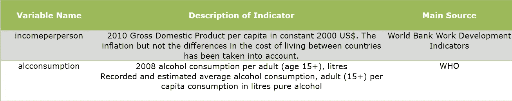
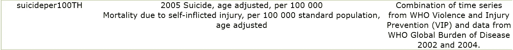
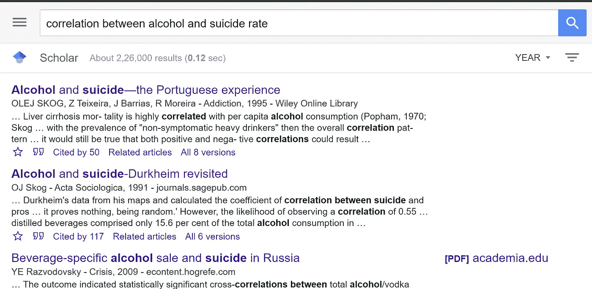

# 数据分析系列 C1 W1

> 原文：<https://medium.com/analytics-vidhya/data-visualization-week-1-338c59932798?source=collection_archive---------30----------------------->

# 课程 1:第 1 周

选择研究问题、密码本和其他基础知识

下面是关于如何做数据分析的系列教程，我们先从**描述性**分析 **&** 开始，稍后将转移到**预测性**分析

以下是如何从头开始一个项目的步骤，基本上首先你需要决定是自己制作/收集数据还是使用现有数据。这里我将使用现有的数据集

知识术语
码本:描述数据如何在计算机文件中排列，以及如何测量(即单位等)。)

**步骤 1** :选择一个数据集进行工作
在回顾了给定的五本代码书后，我选择了 [GapMinder](https://d396qusza40orc.cloudfront.net/phoenixassets/data-management-visualization/GapMinder%20Codebook%20.pdf) 进行工作，其他数据集也非常有趣，但我发现 GapMinder 非常吸引人，可以探索新的见解。

**第二步**:确定感兴趣的话题
我见过被酒精消费困扰的人。我想知道自杀率和饮酒量之间是否有任何关联，幸运的是，GapMinder 数据集是我可以用来进一步研究的东西。

**步骤 3** :准备一个你自己的码本(数据集(如果有的话)的主码本的子集)

**第三步**:确定您希望探索的与您的原始主题相关的第二个主题
因为我也在我的代码簿中包含了“就业率”变量，原因是我希望探索饮酒是否与就业率有任何关联。

**第四步**:将记录第二个话题的变量/项目/问题添加到你的个人密码本
我已经在第二步和第三步中完成了。我加上了“就业率”

**第五步**:文献回顾，看看在这个话题上已经做了哪些研究。我从 google scholar 上搜索，虽然大多数是付费内容，但我浏览了大多数的摘要，我发现其他人进行的研究听起来我的假设是真的。

有许多研究与我的假设有关，“人均饮酒量每增加 1 升，男性自杀率就会同时增加 1.9%。”在“**酒精和自杀——葡萄牙人的经历**”的摘要中陈述[https://online library . Wiley . com/doi/ABS/10.1046/j . 1360-0443.10534 . x](https://onlinelibrary.wiley.com/doi/abs/10.1046/j.1360-0443.1995.90810534.x)

第六步:根据你的文献回顾，提出一个假设，说明你认为这些主题之间可能存在的联系。请确保将您选择的特定变量整合到假设中。
那些研究太直接了，以至于饮酒和自杀率之间可能有直接关系。

初步假设:
一个国家的酒精消费水平可能与自杀率直接相关。

次要假设:
一个国家的酒精消费水平可能与就业率直接相关。

关于本课程的连续两周系列，请参见此处的****。****

**参考文献:
【1】酒精与自杀——葡萄牙人的经历
[https://doi.org/10.1046/j.1360-0443.1995.90810534.x](https://doi.org/10.1046/j.1360-0443.1995.90810534.x)**

**[2]前苏联的男性自杀和酒精消费
[https://doi.org/10.1111/j.1600-0447.1994.tb01520.x](https://doi.org/10.1111/j.1600-0447.1994.tb01520.x)**

**[3]1965-1999 年俄罗斯的自杀和饮酒情况
[https://www . tandfonline . com/doi/ABS/10.1080/09687630801931804](https://doi.org/10.1080/09687630801931804)**