# 数据分析系列 C1 W2

> 原文：<https://medium.com/analytics-vidhya/data-visualization-week-2-df9d85b7a543?source=collection_archive---------30----------------------->

# 课程 1:第 2 周

***频率分布和数据汇总。***

我之前已经在[第一周](/@harshit120299/data-visualization-week-1-338c59932798)定义了如何开始探索性数据分析。在第二周，我们需要决定用什么语言来处理 SAS 或 Python，我不知道他们为什么不参考 R，一些国家没有 R 可能这就是原因。这里我选择了 **python** ，现在这里我应该**将数据集**加载到内存中，并计算**频率分布。**

***频率分布*** 显示变量/特征的可能响应以及收到响应的频率。

我在博客的最后附上了程序的截图，这是我为这个频率分布写的。堆栈溢出没有答案，所以我添加了一个，所以你可以从这个[链接](https://stackoverflow.com/questions/12207326/frequency-table-for-a-single-variable/62317008#62317008)复制代码。

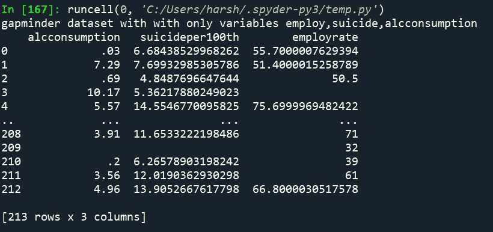

**这是我们为研究问题**选择的三个变量

这三个变量有太多可能的值，所以我必须把它折叠在一个范围内，我已经在所有频率分布截图中提到了我是如何做到的。

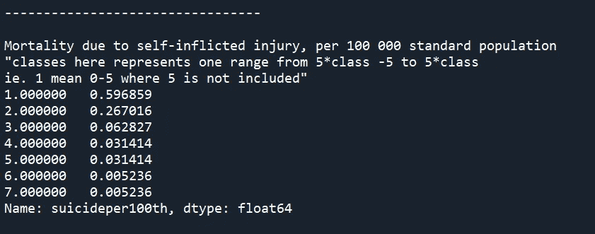

这是频率分布。每 10 万人中的自杀率

从频率分布中可以清楚地看到，约 60%的国家因自我伤害造成的死亡率为每 100，000 人中有 0-5 人

其中大约 0 . 5%的国家每 100，000 人中有 30-35 人因自我伤害而死亡

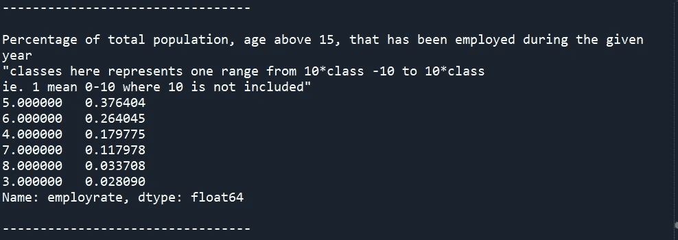

这是频率分布。就业率

这里可以清楚地看到，大约 38%的国家拥有 40-50%的就业人口

大约 2%的国家拥有 20-30%的就业人口

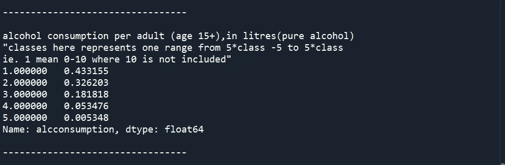

这是频率分布。酒精消费量

这里可以看到，43%的国家人均纯酒精消费量为 0-5 升，0.5%的国家人均纯酒精消费量为 40-50 升

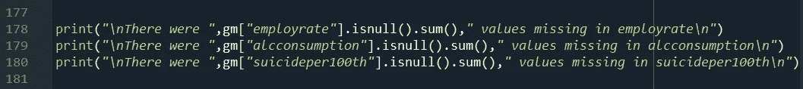

程序找出这三个变量中缺失值的数量

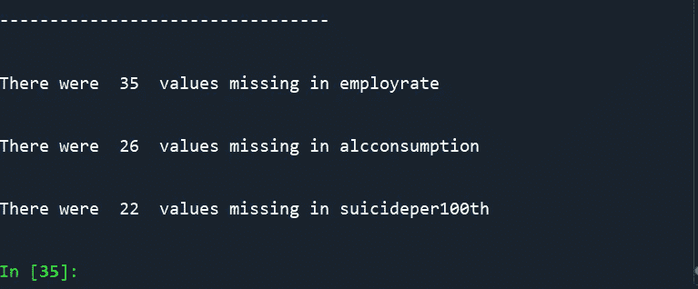

每个变量中找到的缺失值的数量

***频数分布程序
(如需了解此代码请参考我的栈溢出帖子)这里是— >*** [***链接***](https://stackoverflow.com/questions/12207326/frequency-table-for-a-single-variable/62317008#62317008)

*为本课程续周三辑参见* [***此处***](/@harshit120299) ***。***

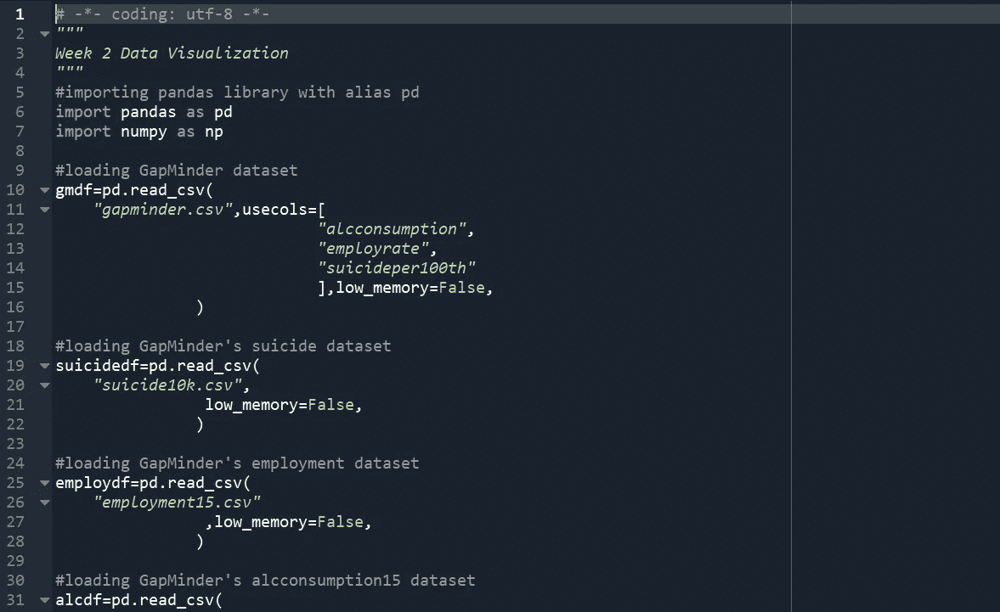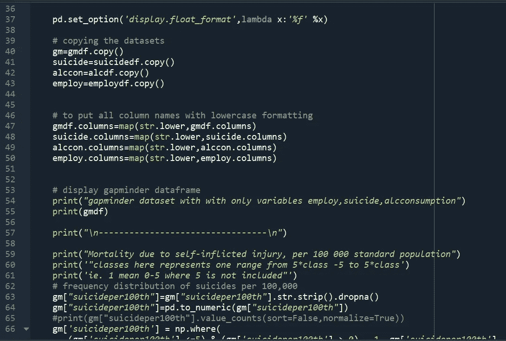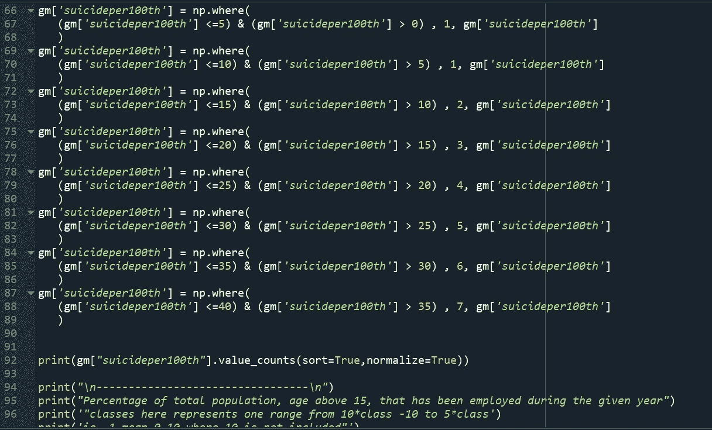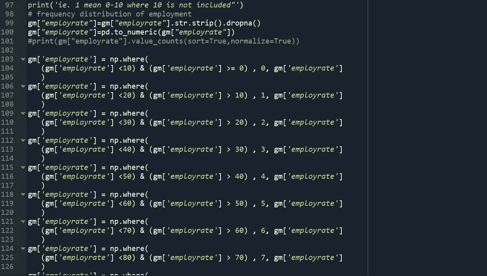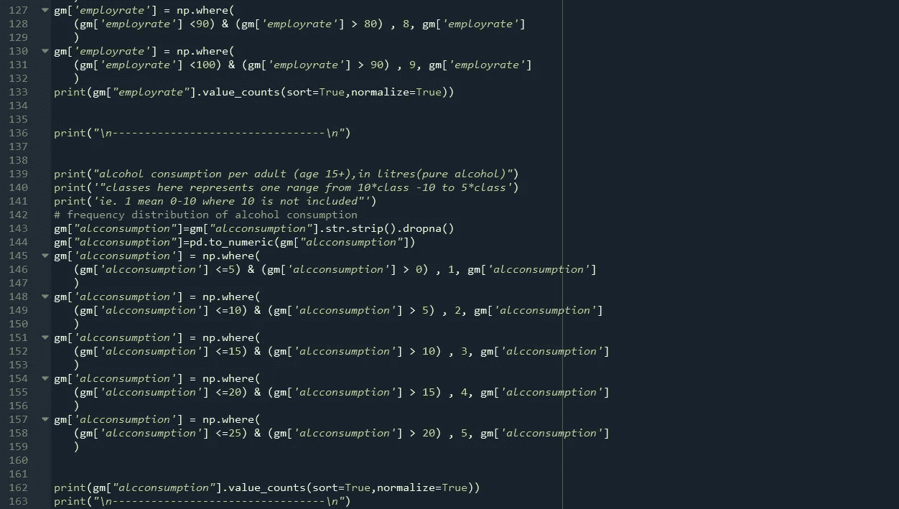