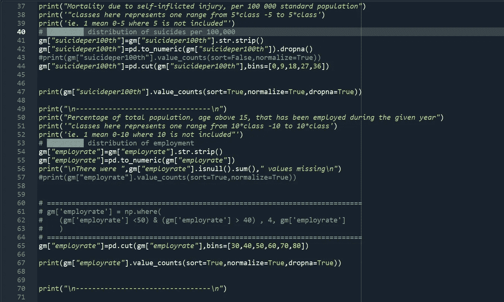
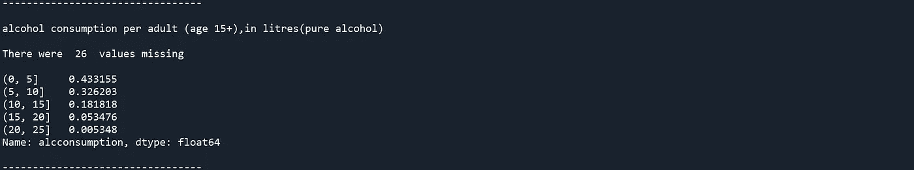

# 数据分析系列 C1 W3

> 原文：<https://medium.com/analytics-vidhya/data-visualization-week-3-343b50592ae9?source=collection_archive---------21----------------------->

# 课程 1:第 3 周

***分组*** 或 ***宁滨*** 数据带 ***切*** 和***q 切******熊猫*** 功能

*“在这里和那里徘徊了几个星期，了解了什么是数据科学的正确职业道路，我知道只有一个最好的开始方式，可能你已经听过很多次了。”*

上周我做了一个*三个变量的频率分布表 ***【就业率】【酒精消费量】&【第 100 个自杀者】。*** 那一次我没有使用熊猫的 cut & qcut 函数，原因很简单，我不知道它们，但我很高兴我自己做了这些，现在当我知道我可以使用这些 cut 和 qcut 函数时，我又用这些函数做了一次，相信我这比编写几十行代码要容易得多，我可以简单地用一行代码替换使用 ***cut & qcut 函数*** 。*

********

*我们选择变量的数据框架*

**

*变量“就业率”的频率分布*

**

*可变“酒精消耗量”的频率分布*

**

*变量“第 100 个自杀者”的频率分布*

**

*对宁滨或分组使用剪切*

*使用 cut 函数代替我上周做的那些 numpy 操作是一件很棒的事情，但是现在你知道如何学习了。你将和我一起踏上学习数据可视化的旅程。*

*当处理连续的数字数据时，将数据归入多个存储桶以供进一步分析通常很有帮助。宁滨有几个不同的术语，包括分桶、离散宁滨、离散化或量化。Pandas 使用`cut`和`qcut`函数支持这些方法。本文将简要描述为什么您可能想要绑定您的数据，以及如何使用 pandas 函数将连续数据转换为一组离散的桶。像许多熊猫的功能一样，`cut`和`qcut`可能看起来很简单，但是这些功能包含了很多功能。即使对于更有经验的用户，我想你也会学到一些对你自己的分析有用的技巧。*

**你可以从这个**站点阅读更多关于 cut & qcut 功能的内容。*上面最后一段* *是来自这个网站的介绍部分，让你从熊猫身上学习***&****qcut****的功能。****

*****总结:*** *从变量* ***【就业率】【酒精消耗量】&【自杀率 100】****的频率分布可以清楚地看到，约 40%的国家的就业率在* **和* **左右 而在**左右的国家有 53%****0–9****每 100k 人因自伤死亡。 那里已经丢失了几个值，例如。* ***35 个值*******employarate*******26 个值*******【ALC consumption】****&**********

*****对于本课程的续周三系列请参见* [***此处***](/@harshit120299) ***。*******