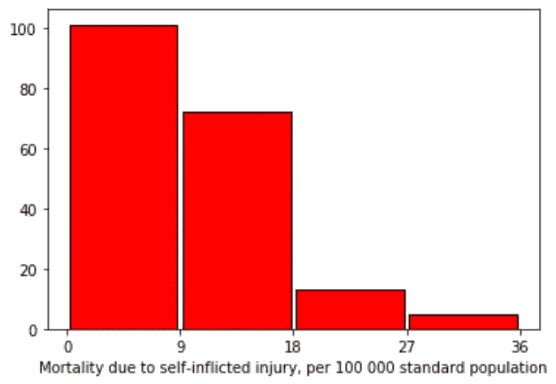

# 数据分析系列 C1 W4

> 原文：<https://medium.com/analytics-vidhya/data-visualization-week-4-72afecb14cbb?source=collection_archive---------19----------------------->

# 课程 1:第 4 周

## *用* ***可视化数据单变量*** *和* ***双变量*** *图形*

**双变量分析**是指双变量数据的分析(即**两个变量**)。这是最简单的统计分析形式之一，用于找出两组值之间是否存在关系。它通常涉及变量 x 和 y。

*   [**单变量分析**](https://www.statisticshowto.com/univariate/) 是分析一个(“uni”)变量。
*   **双变量分析**是对两个变量的分析。
*   [**多变量分析**](https://www.statisticshowto.com/probability-and-statistics/multivariate-analysis/) 是对两个以上变量的分析。

变量“酒精消耗量”的单变量图表

变量“就业率”的单变量图表

变量“自杀者 100k”的单变量图表

摘要:
***可变“酒精消耗量”*** :-可以清楚地看到，大多数国家的酒精消耗量为 0-5 升，最少的国家为 20-25 升。

*:-大多数国家的就业率为 50-60%，最少的国家就业率为 30-40%，没有一个国家的就业率低于 30%或高于 80%。*

****变量“每 10 万人中的自杀者”*** :大多数国家每 10 万人中的死亡率为 0-9 人，最少的县自杀率最高，即每 10 万人中的死亡率为 27-36 人。*

**

*变量“酒精消费”和“第 100 次自杀”的二元图表*

**

*变量“酒精消耗量”和“就业率”的二元图*

**

*变量“就业率”和“酒精消耗量”的二元图*

*总结:
***变量“alcconsumption”和“第 100 个自杀者”*** : -
数据看起来没有太强的相关性但看起来更像是正相关。也就是说，自杀率与饮酒量相关的基本假设似乎成立，但没有多少可信度。*

****变量“alcconsumption”和“employ rate”***:-
数据看起来相关性很弱，但更像是负相关。也就是说，自杀率与饮酒量相关的第二个假设似乎成立，但也没有多少可信度。*

*在这个分析过程中，我想到了一个新的假设****就业率****与 ***【自杀率】，*** 似乎也是负相关的。***

*****下面是第四周的代码:
请忽略评论下面的文字，那些是我保存下来以备再用的一堆杂物。*****

***为本课程续周四辑参见* [***此处***](/@harshit120299) ***。*****