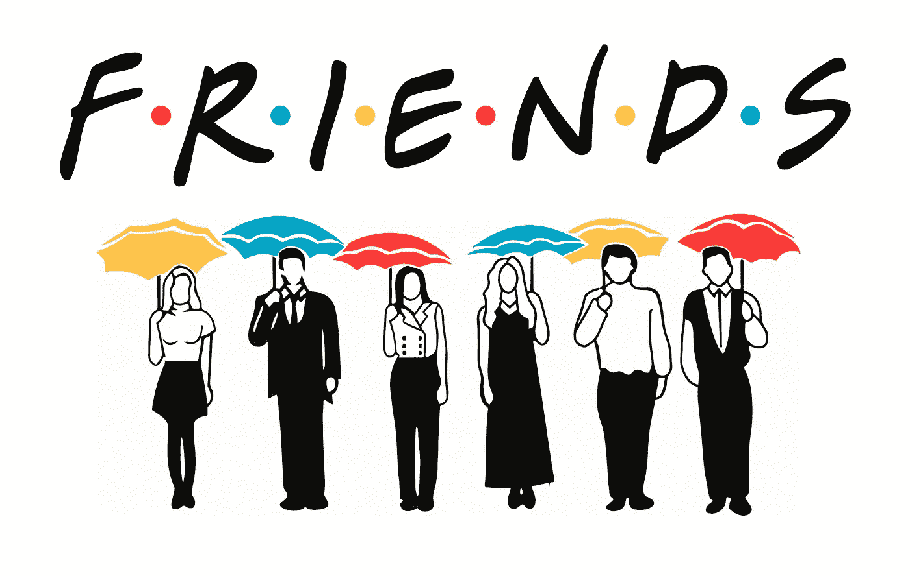
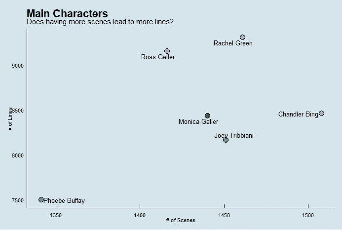
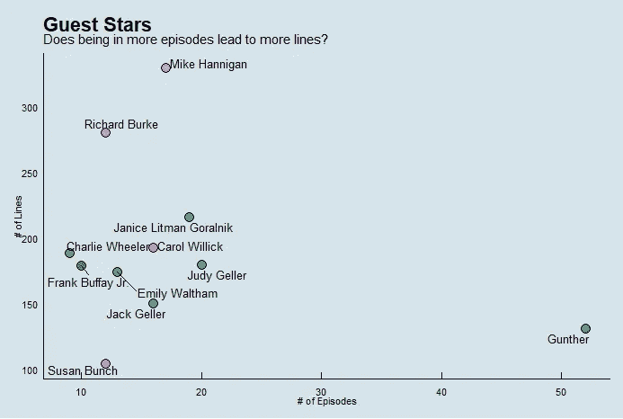
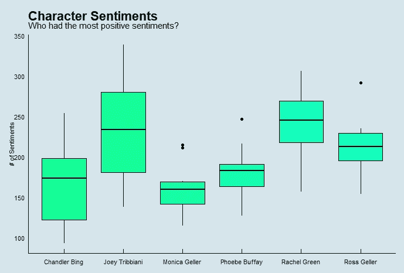
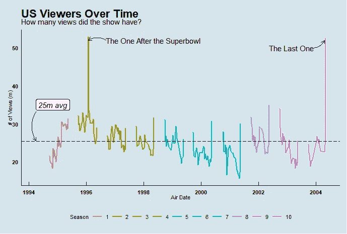
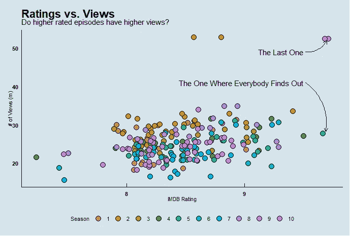

# 与朋友一起实现数据可视化

> 原文：<https://medium.com/analytics-vidhya/data-visualization-with-friends-426ebc733886?source=collection_archive---------12----------------------->

# **简介**

认识我很久的人都知道我爱看*老友记*。这不仅有趣和娱乐，而且让这些我非常熟悉的角色出现在我的电视屏幕上也是一种安慰。我经常发现自己跟着表演背诵台词，这有时会让房间里的其他人快速发笑。

当我在 Github 上的[整洁星期二](https://github.com/rfordatascience/tidytuesday)挑战中发现了*朋友*电视节目的数据集时，我非常兴奋地探索这些数据，看看会出现什么。使用 R，我能够发现一些有趣的见解，同时还可以用 ggplot2 制作一些很酷的可视化效果。让我们开始吧。

# 人物

虽然每个主要角色似乎都有相当多的屏幕时间，但我很好奇是否出现更多的场景会导致更多的台词。下面是一个散点图，显示了每个角色的场景数和他们的行数。

图片来自 [quilloanalytics](/@quilloanalytics)

正如我们所看到的，更多的场景并不一定导致更多的线条。钱德勒出演的剧集数量最多，但台词数量却不多。此外，瑞秋有最多的台词，但只有第二多的场景。有趣的是，与其他演员相比，菲比的场景和台词数量要少得多。

虽然我们喜欢所有的主角，但如果没有在整个系列中出现的许多令人敬畏的客串明星，这部剧就不会一样。一些客串明星回来出演了好几集，而另一些只出现了一次。类似于我之前的问题，我想知道更多的剧集是否会导致更多的台词。下面是另一个散点图来分析这个问题。

图片由 [quilloanalytics](/@quilloanalytics) 提供

正如我们在上面看到的，巩特尔出现在最多的剧集中，但也有第二少的台词。可爱的迈克在客串明星中拥有最高的台词数，但在剧集数量上却和其他人一样。

因为这是一部喜剧，我们可以假设剧本包含了大部分积极的情感。为了更深入地研究这个问题，我对每一行进行了标记化，并将它们分解成单独的单词。然后将这些单词与来自“ [bing](https://www.cs.uic.edu/~liub/FBS/sentiment-analysis.html) ”的单词列表进行比较，以确定它们是有积极情绪还是消极情绪。

图片由 [quilloanalytics](/@quilloanalytics) 提供

看起来所有的角色都有积极的情绪，乔伊的范围最大。瑞秋的平均情绪最高，而莫妮卡的平均情绪最低。

# 这些插曲

在点播流媒体成为日常事物之前，人们必须在电视上播放新一集的同时实际呆在家里。下面是一个折线图，显示了整个系列在美国的观看次数。

图片来自 [quilloanalytics](/@quilloanalytics)

该节目在整个系列中平均有 2500 万次观看。有两次活动的浏览量超过了 5000 万。第一次是在 1996 年超级碗 XXX 之后播出的两集背靠背的剧集。第二个是系列的大结局，它最终结束了罗斯和瑞秋的故事情节。

最后，我很想知道浏览量和 IMDB 评分之间是否有任何关系。

图片来自 [quilloanalytics](/@quilloanalytics)

这部剧在整个系列中都有很高的收视率。虽然似乎没有按季节划分的收视率模式，但大多数剧集的收视率似乎都在 8 到 9 之间徘徊。收视率最高的两集是该剧的大结局，以及大部分朋友发现莫妮卡和钱德勒关系的爆笑一集。

# 结论

即使我已经看过这个节目很多很多次了，我仍然能够从数据中学到一些新的东西。

如果你有兴趣看看图表背后的代码，你可以在这里访问整个`rmd` 文件:[https://github.com/erikar39/Friends-EDA](https://github.com/erikar39/Friends-EDA)

# 参考

*   [https://ggplot2.tidyverse.org/reference/ggplot.html](https://ggplot2.tidyverse.org/reference/ggplot.html)
*   [https://dplyr.tidyverse.org/](https://dplyr.tidyverse.org/)
*   [https://rdrr.io/cran/ggthemes/man/theme_economist.html](https://rdrr.io/cran/ggthemes/man/theme_economist.html)
*   [https://cran . r-project . org/web/packages/gg repel/vignettes/gg repel . html](https://cran.r-project.org/web/packages/ggrepel/vignettes/ggrepel.html)