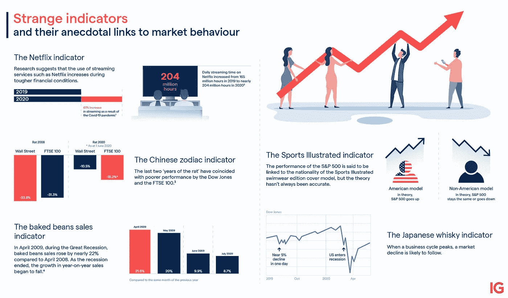
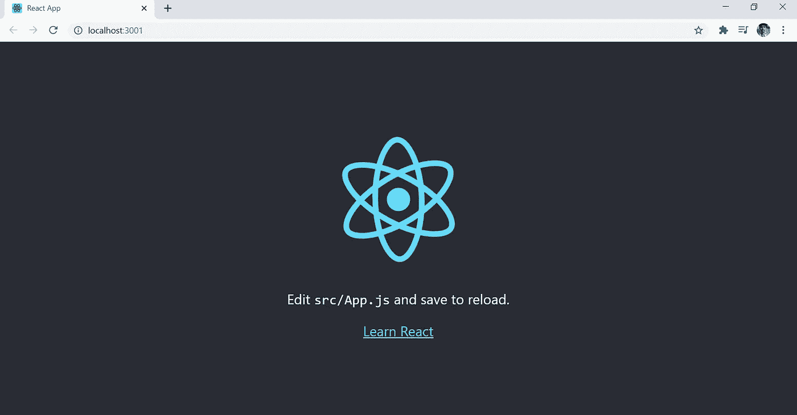
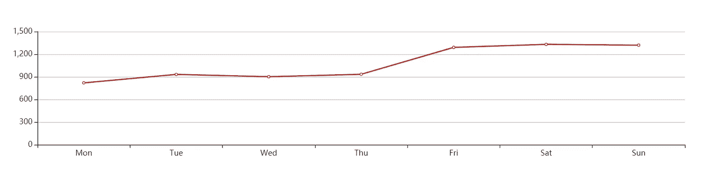
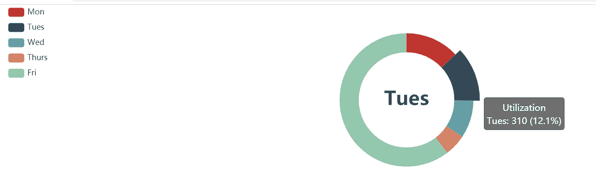
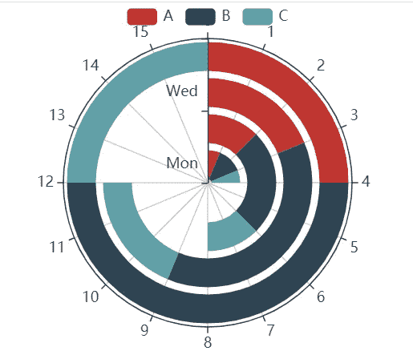

# 使用 React & ECharts 实现数据可视化

> 原文：<https://medium.com/analytics-vidhya/data-visualization-with-react-echarts-1fa5c765e523?source=collection_archive---------2----------------------->

随着数据工程领域的技术创新，术语**数据可视化**具有重要意义，因为它是工业 4.0 和 5.0 的重要组成部分之一。

数据可视化是指以图形、图表或其他可视格式来表示数据或信息，这有助于用图像来传达复杂数据之间的关系。主要目标是:

*   对信息的快速理解
*   识别新兴趋势/集群，并根据我们看到的情况迅速采取行动
*   识别数字资产中的关系和模式
*   可以与他人分享我们的故事(成果)
*   不同细节层次的分析



来自 ig.com 的图片:从不同的角度展示可视化在不同领域的重要性

本文帮助您用 React 和 ECharts 绘制和理解虚拟数据的一些基本可视化。

[**React**](https://reactjs.org/) 是一个开源的 JavaScript 库，由脸书维护，用于构建用户界面或 UI 组件。

[**ECharts**](https://echarts.apache.org/examples/en/) 是一个强大的可视化 JavaScript 库，基于 [zrender](https://github.com/ecomfe/zrender) 提供了一种添加直观、交互式和高度可定制图表的简单方法。

## 先决条件

开始之前，请确保您已经安装了 node.js，否则您可以从 [Node.js](https://nodejs.org/en/download/) 的官方网站安装

## 安装

让我们使用 npm 包创建 React 项目。打开命令提示符/终端，运行以下命令:

```
npx create-react-app visualization
```

成功执行命令后，测试 web 服务器是否运行正常:

*   首先，将目录更改为项目文件夹

```
cd visualization
```

*   然后跑

```
npm start
```

下面的页面将显示在浏览器上，这意味着您的 web 开发服务器工作正常。



接下来，我们需要通过执行以下命令在项目中安装和添加 ECharts:

```
npm install — save echarts-**for**-reactnpm install — save echarts
```

## 折线图

打开 src 文件夹中的 App.js 文件，用以下代码替换默认代码:

再次运行“npm start”命令，然后它会在浏览器上显示下图。



线图

## 圆形分格统计图表

对于饼图，您可以使用以下代码再次更改 App.js 代码:

重新加载浏览器，你会得到浏览器上的饼状图。



圆形分格统计图表

## 极区图

与折线图和饼图绘制类似，您也可以创建极坐标图。



极区图

## 收尾工作

电子海图提供了各种各样可视化类型。类似于折线图、饼图和极坐标图，您可以在 [EChart 官方网站](https://echarts.apache.org/examples/en/#chart-type-line)中找到不同类型的图，并查看[示例](https://echarts.apache.org/examples/en/#chart-type-line)。你只需要选择可视化类型，复制 JSON，放入 App.js 文件。

你可以在 GitHub repository 中找到上面的项目。

[](https://github.com/muhammad-usman-108/React-Data-Visualization) [## 穆罕默德-奥斯曼-108/反应-数据-可视化

### 绘制不同类型的图表以可视化数据-Muhammad-usman-108/React-Data-Visualization

github.com](https://github.com/muhammad-usman-108/React-Data-Visualization)