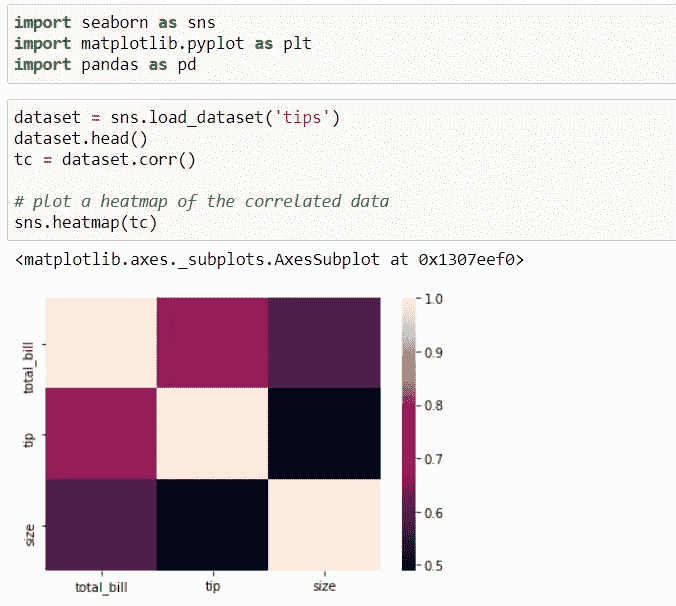
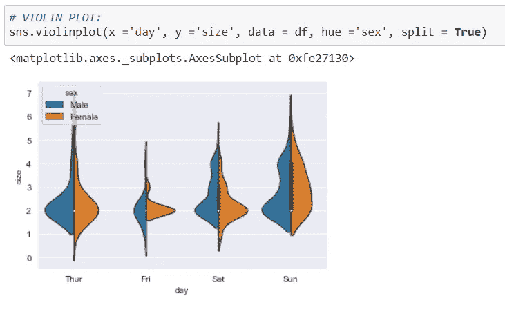

# 使用 Seaborn 实现数据可视化

> 原文：<https://medium.com/analytics-vidhya/data-visualization-with-seaborn-be98c30e3365?source=collection_archive---------22----------------------->


# 什么是 Seaborn？？

> Seaborn 是一个基于 matplotlib 的 Python 可视化库。它为绘制有吸引力的统计图形提供了一个高级界面。


# 如何安装 Seaborn？？

如果您已经在系统上安装了 Python 和 PIP，请使用以下命令进行安装:

```
C:\Users\*Your Name*>pip install seaborn
```

# 锡伯恩的地块类型:

# 1-分布图:

分布图也称为 Distplot，它将一个数组作为输入，并绘制一条与数组中点的分布相对应的曲线。distplot 绘制观察值的单变量分布。

> distplot()函数将 matplotlib hist 函数与 seaborn kdeplot()和 rugplot()函数结合在一起。

**让我们来看看下面的例子:**

**例 1:**


**例- 2:**


**有 3 种类型的分布图，即:**

1.  接合图
2.  配对图
3.  rugplot

> 除了提供不同种类的可视化绘图，seaborn 还包含一些内置的数据集。我们将在本文中使用 tips 数据集。“小费”数据集包含关于可能在餐馆就餐的人的信息，以及他们是否留下小费、他们的年龄、性别等等。让我们看一看。

## 1-联合地块:

> 它用于用二元和一元图形绘制两个变量的图。它基本上结合了两个不同的情节。

**语法:**

```
jointplot(x, y[, data, kind, stat_func, ...])
```

示例:


## 2 对图:

> 它表示整个数据帧中的成对关系，并支持一个名为 **hue** 的附加参数，用于分类分离。

**语法:**

```
pairplot(data[, hue, hue_order, palette, …])
```

**例如:**


## 3-皱纹图:

> 它将数组中的数据点绘制为轴上的棒。就像 distplot 一样，它只包含一列。它不是绘制直方图，而是在整个图上创建破折号。

**语法:**

```
rugplot(a[, height, axis, ax])
```

**举例:**


# 二维矩阵图:

矩阵图可以通过绘制热图来理解。

让我们看看下面的例子，以便更好地理解它:



# 3-分类图:

> 由`seaborn`库提供的分类图可用于可视化两个或更多分类变量的计数分布。

**让我们看看以下类型的分类图:**

**单条图:**


**双群体图:**


**三条形图:**


**4 计数图:**


**5-小提琴剧情:**



> 因此，在 seaborn 的帮助下，我们可以绘制各种图表，并使我们的图表更加有趣和可视化。
> 
> 谢谢你！！
> 
> 继续学习！！👍