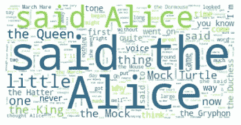
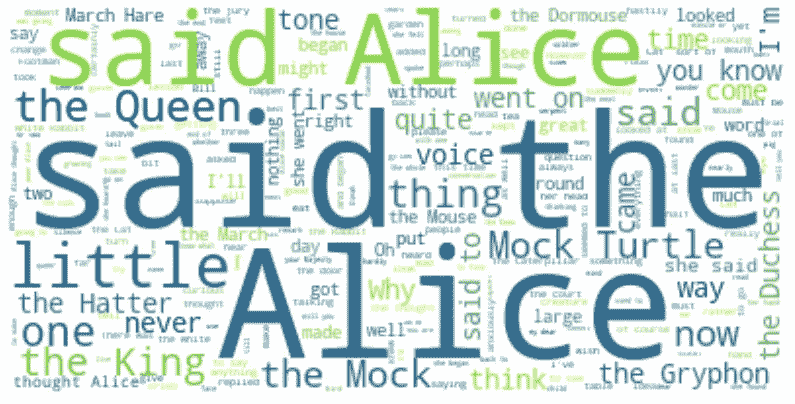
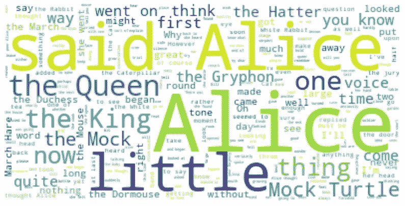
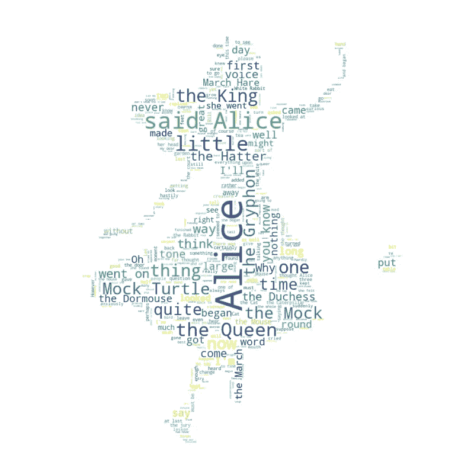

# 数据可视化:使用 Python 的单词云

> 原文：<https://medium.com/analytics-vidhya/data-visualization-word-clouds-with-python-fbb6395be18f?source=collection_archive---------7----------------------->


图片来源:[http://www . busitelce . com/data-visualization/30 字大数据云](http://www.busitelce.com/data-visualisation/30-word-cloud-of-big-data)

# 单词云

> 单词云(也称为文本云或标签云)的工作方式很简单:特定单词在文本数据源(如演讲、博客帖子或数据库)中出现得越多，它在单词云中出现得就越大、越粗

> 首先，我们先把所有的 ***初级库*** 导入。

```
**import numpy as np** # useful for many scientific computing in Python **import pandas as pd** # primary data structure library **from PIL import Image** # converting images into arrays **import matplotlib.pyplot as plt** # for visualizing the data
```

> **Python** 包已经存在于 Python 中，用于生成词云。这个名为 **word_cloud** 的软件包是由 **Andreas Mueller** 开发的。点击此 [**链接**](https://github.com/amueller/word_cloud/) 可以了解更多关于该套餐的信息。

```
# install wordcloud
**!pip install wordcloud**
```

现在让我们导入这个包和它的停用词集。

```
**from wordcloud import WordCloud, STOPWORDS**
```

> **字云**常用于对文本数据进行高层分析和可视化。因此，让我们离开移民数据集，使用一个涉及分析文本数据的示例。让我们试着分析一篇由路易斯·卡罗尔写的名为《爱丽丝漫游奇境记》的短篇小说。

让我们继续下载一个**。txt** 文件的小说。

```
# download file and save as alice_novel.txt
**!wget --quiet** [**https://s3-api.us-geo.objectstorage.softlayer.net/cf-courses-data/CognitiveClass/DV0101EN/labs/Data_Files/alice_novel.txt**](https://s3-api.us-geo.objectstorage.softlayer.net/cf-courses-data/CognitiveClass/DV0101EN/labs/Data_Files/alice_novel.txt)# open the file and read it into a variable alice_novel
**alice_novel = open('alice_novel.txt', 'r').read()
**    
**print ('File downloaded and saved!')**
```

> 接下来，我们使用从' **word_cloud'** 导入的**停用词**。我们使用函数' **set'** 删除任何多余的**停用词**，并创建一个**词云对象**，生成一个**词云**。为了简单起见，我们只使用**小说**中的**前 2000 个单词**来生成一个**单词云**。

```
**stopwords = set(STOPWORDS)**# instantiate a word cloud object
**alice_wc = WordCloud(
    background_color='white',
    max_words=2000,
    stopwords=stopwords
)**# generate the word cloud
**alice_wc.generate(alice_novel)**
```

> 厉害！既然**字** **云**已经创建好了，我们来可视化一下。

```
**import matplotlib.pyplot as plt**# display the word cloud
**plt.imshow(alice_wc, interpolation='bilinear')
plt.axis('off')
plt.show()**
```



> 有意思！所以在**前 2000 字的**小说中，最常见的词是**爱丽丝**、**称**、**小**、**女王**等等。让我们调整云的大小，这样我们可以更好地看到不太常用的单词。

```
**fig = plt.figure()
fig.set_figwidth(14)** # set width
**fig.set_figheight(18)** # set height# display the cloud
**plt.imshow(alice_wc, interpolation='bilinear')
plt.axis('off')
plt.show()**
```



> 好多了！然而，**表示**并不是一个真正的信息词。因此，让我们将它添加到我们的停用词中，并重新生成云。

```
**stopwords.add('said')** # add the words said to stopwords# re-generate the word cloud
**alice_wc.generate(alice_novel)**# display the cloud
**fig = plt.figure()
fig.set_figwidth(14)** # set width **fig.set_figheight(18)** # set height**plt.imshow(alice_wc, interpolation='bilinear')
plt.axis('off')
plt.show(**
```



> 太棒了。这看起来真的很有趣！你可以用 ***word_cloud*** 包实现的另一件很酷的事情是将文字叠加到任何形状的遮罩上。让我们用一个爱丽丝和她的兔子的面具。我们已经为你创建了这个面具，所以让我们下载它，并把它命名为 ***alice_mask.png*** 。

```
# download image
**!wget --quiet** [**https://s3-api.us-geo.objectstorage.softlayer.net/cf-courses-data/CognitiveClass/DV0101EN/labs/Images/alice_mask.png**](https://s3-api.us-geo.objectstorage.softlayer.net/cf-courses-data/CognitiveClass/DV0101EN/labs/Images/alice_mask.png)    
# save mask to alice_mask
**alice_mask = np.array(Image.open('alice_mask.png'))
**    
**print('Image downloaded and saved!')**
```

我们来看看口罩是什么样子的。

```
**fig = plt.figure()
fig.set_figwidth(14)** # set width **fig.set_figheight(18)** # set height**plt.imshow(alice_mask, cmap=plt.cm.gray, interpolation='bilinear')
plt.axis('off')
plt.show()**
```


> 使用` ***word_cloud*** `包，根据蒙版塑造**字云**很简单。为了简单起见，我们将继续使用小说中的前 2000 个单词。

```
# instantiate a word cloud object
**alice_wc = WordCloud(background_color='white', max_words=2000, mask=alice_mask, stopwords=stopwords)**# generate the word cloud
**alice_wc.generate(alice_novel)**# display the word cloud
**fig = plt.figure()
fig.set_figwidth(14) # set width
fig.set_figheight(18) # set height****plt.imshow(alice_wc, interpolation='bilinear')
plt.axis('off')
plt.show()**
```



*真让人印象深刻！*

# 密码

[**点击此处**](https://colab.research.google.com/drive/1_ykmeh9IPaXhuqA6bQ3-UcIEUTRuLeFB?usp=sharing) 访问此链接运行代码并自行查看结果。

# 感谢阅读

更多这样的内容请点击这里并关注我。