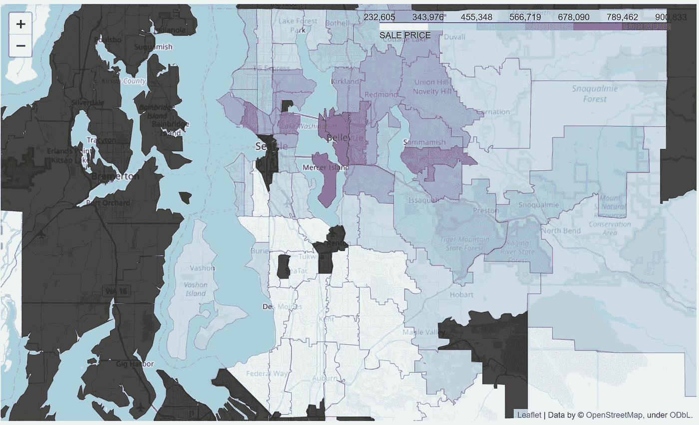

# 邮政编码的数据可视化

> 原文：<https://medium.com/analytics-vidhya/data-visualizations-for-zip-codes-2bbf1e16cab0?source=collection_archive---------6----------------------->

如何对涉及位置或邮政编码的要素进行可视化？如果你想显示不同社区的平均房价，会发生什么？在本教程中，我将向您展示如何收集必要的工具，并生成下面的数据可视化。


为了开发上面的数据可视化，我们将在 Python 中使用 Folium。在本教程中，我们将使用 King County 地区销售价格的数据集。我们将用于编码目的的数据集可以在这个[链接](https://github.com/andypeng93/Flatiron-Housing-Price-Project)中找到。这个数据集用于我们在熨斗学校数据科学训练营的房价项目。对于这个项目，我们必须创建一个模型来预测房价。然而，如果你想摆弄原始数据集，你可以通过 [Kaggle](https://www.kaggle.com/harlfoxem/housesalesprediction) 找到它。

# **入门**

首先，我们需要导入我们的数据集 kc_house_data.csv。假设我们的数据已经被清理，这就是数据应该的样子。

```
import pandas as pd
df = pd.read_csv('kc_house_data.csv')
dfmap = df[['price', 'zipcode']]
dfmap.head()
```


上述数据框包含每个唯一邮政编码的多种房价。因此，我们需要创建一个包含我们想要的信息的合适的数据框架。在这个新的数据框中，我们总共需要四列。这四列是平均价格、邮政编码、经度和纬度。

```
#Create the dataframe containing the data we want.
dfmap.zipcode = dfmap.zipcode.astype(int)
zipcode_means = []
for i in dfmap.zipcode.unique().tolist():
    val = dfmap[dfmap['zipcode'] == i]['price'].mean()
    lat = dfmap[dfmap['zipcode'] == i]['lat'].mean()
    long = dfmap[dfmap['zipcode'] == i]['long'].mean()
    zipcode_means.append([str(i), val, lat, long])
xall = []
yall = []
latall = []
longall = []
for val in zipcode_means:
    xall.append(val[0])
    yall.append(val[1])
    latall.append(val[2])
    longall.append(val[3])
tdf = pd.DataFrame(list(zip(xall, yall, latall, longall)), columns = ['Zipcode', 'Price', 'Latitude', 'Longitude'])
```

上面的代码首先遍历 dfmap 数据框，计算每个唯一邮政编码的平均房价、纬度和经度。

# **映射**

现在我们有了数据框，我们可以开始开发地图的基础。为了构建地图的基础，我们将运行下面的代码。

```
import folium
map = folium.Map(location=[47.5112, -122.257], default_zoom_start=15)
map
```


我们现在有了从纬度 47.5112 和经度-122.257 的位置开始的地图基础。根据您希望地图从哪里开始，您可以更改位置坐标。请注意，上图中没有代表每个邮政编码的边框。

要创建边界，我们需要为 King County 区域找到相应的 geoJSON 文件。幸运的是，我能够找到一个包含邮政编码、形状长度和面积的 [KML 文件](https://gis-kingcounty.opendata.arcgis.com/datasets/e6c555c6ae7542b2bdec92485892b6e6_113/data)。然而，由于我下载的文件是 KML 文件，我不得不使用一个在线的[转换器](https://mygeodata.cloud/converter/kml-to-geojson)将 KML 转换成 geoJSON。在开始编码之前，我们需要进入 geoJSON 文件，找出 geoJSON 文件中邮政编码的位置。


geoJSON 文件中邮政编码的位置是“feature.properties.ZIPCODE”。现在是时候将我们收集的信息输入到函数 choropleth 的参数中了。

```
map.choropleth(geo_data="zip_codes.geojson",
               data=tdf, 
               columns=['Zipcode', 'Price'], 
               key_on='feature.properties.ZIPCODE', 
               fill_color='BuPu',fill_opacity=0.7,line_opacity=0.2,
               legend_name='SALE PRICE')
```

*   geo_data 是 geoJSON 文件的路径，该文件包含邮政编码区域的坐标。在这种情况下，它将是我们之前获得的 geoJSON 文件。
*   数据是我们在上面清理过的数据集。
*   columns 表示我们要绘制的数据集的列。注意 Zipcode 列是数字格式还是字符串格式是很重要的。根据 geo_data 中的邮政编码是数字格式还是字符串格式，数据中的邮政编码列需要与之匹配。
*   key_on 是包含 geoJSON 文件中邮政编码值的路径，我们在上面提到了“feature.properties.ZIPCODE”。
*   fill_color 是显示区域的颜色模式。
*   fill_opacity 是填充颜色时边界区域的透明度级别。
*   line_opacity 是边界线的透明度级别。
*   图例名称是数据图例的标题。

运行上面的代码会得到如下所示的地图。我们可以看到图例显示在右上角，标题为销售价格。我们选择的颜色“BuPu”给了我们地图上的蓝紫色。地图的黑色部分代表 geoJSON 文件中的邮政编码，但不在 tdf 数据集中。



接下来，我们将在地图上显示标记

1.  邮政区码
2.  平均房价

为此，我们需要地图上的坐标来显示标记。如果您没有它的坐标，您可以使用这个[链接](https://public.opendatasoft.com/explore/dataset/us-zip-code-latitude-and-longitude/export/?q=wa)来获取相应邮政编码的坐标。但是，为了便于使用，我们已经准备好了要使用的数据帧。为了在地图上显示标记，我们将使用标记功能。

```
from folium.plugins import MarkerCluster
marker_cluster = MarkerCluster().add_to(map) # create marker clustersfor i in range((tdf.shape[0])):
    location = [tdf['Latitude'][i], tdf['Longitude'][i]]
    tooltip = "Zipcode: {}".format(tdf["Zipcode"][i])
    folium.Marker(location, 
                  popup="""
                  <i>Mean sales price: </i> <br> <b>${}</b> 
                  """.format(round(tdf['Price'][i],2)),
                  tooltip=tooltip).add_to(marker_cluster)
map
```

*   位置是标记的纬度和经度坐标。
*   弹出窗口是当您单击标记时显示的文本。
*   工具提示是将鼠标悬停在标记上时显示的文本。

运行下面的代码后，我们可以看到，当我们将鼠标悬停在标记上时，会显示邮政编码。通过点击标记，将显示文本平均销售价格和计算的平均价格。


我们刚刚学习了如何用邮政编码数据制作交互式数据可视化。leav 中有很多特性我们还没有探索，以后可以探索。有关 leav 文档，请参考此[链接](https://python-visualization.github.io/folium/modules.html)。我希望本教程能够帮助您在未来的数据分析中使用与邮政编码、纬度和经度相关的数据。