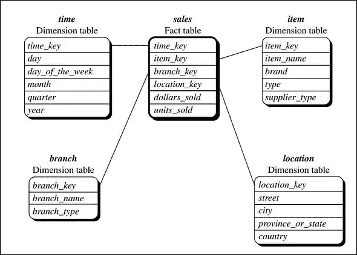

# 数据仓库和 OLAP

> 原文：<https://medium.com/analytics-vidhya/data-warehouse-and-olap-5dfefd400937?source=collection_archive---------4----------------------->

## 数据仓库和 OLAP 操作的简明综合指南


# 什么是数据仓库？

> "数据仓库是面向主题的、集成的、时变的、非易失性的数据集合，用于支持管理层的决策过程[Inm96]. "——w·h·英蒙

数据仓库到底是什么？简单地说，它是一个决策支持数据库，与组织的运营数据库分开维护。它是从多个来源收集的信息的存储库，存储在一个统一的模式下，通常位于一个站点。数据仓库被进一步标识为语义一致的数据存储，它充当决策支持数据模型的物理实现，并存储企业做出战略决策所需的信息。

让我们仔细看看数据仓库的每个关键特性；

*   **面向主题的**:围绕客户、供应商、产品、销售等主要主题组织数据仓库。数据仓库不是专注于组织的日常运营和事务处理，而是专注于为决策者进行数据建模和分析。
*   **集成**:数据仓库通常是通过集成多个异构数据源构建的，比如关系数据库、平面文件和在线交易记录。应用数据清理和数据集成技术来确保命名约定、编码结构、属性度量等的一致性。
*   **时变:**存储数据是为了从历史角度提供信息(例如，过去 5-10 年)。数据仓库中的每个键结构都隐式或显式地包含一个时间元素。
*   **非易失性:**数据仓库总是物理上独立的数据存储，这些数据是从操作环境中的应用程序数据转换而来的。由于这种分离，数据仓库不需要事务处理、恢复和并发控制机制。数据访问通常只需要两个操作:**数据初始加载**和**数据访问。**

# 为什么要分离数据仓库？

由于以下原因，数据仓库与操作数据库保持分离

*   操作数据库是为众所周知的任务和工作负载构建的，例如搜索特定记录、索引等。相比之下，数据仓库查询通常很复杂，它们提供了一种通用的数据形式。
*   操作数据库支持多个事务的并发处理。操作数据库需要并发控制和恢复机制，以确保数据库的健壮性和一致性。
*   操作数据库查询允许我们读取和修改操作，而 OLAP 查询只需要对存储的数据进行只读访问。
*   操作数据库维护当前数据。另一方面，数据仓库维护历史数据。

# 数据仓库建模:数据立方体和 OLAP

数据仓库和 OLAP 工具是基于一个**多维数据模型**。该模型以**数据立方体的形式查看数据。** *“什么是数据立方体？”*数据立方体允许在多个维度上建模和查看数据。它是由维度和事实定义的。

*   *维度*:维度是组织想要保留记录的视角或实体。每个维度可能有一个与之关联的表，称为维度表，它进一步描述维度。
*   *事实:*事实是数字度量。事实表包含事实或度量的名称，以及每个相关维度表的键。

数据仓库的多维模型可以以**星形模式**、**雪花模式**或**事实星座模式**的形式建模。

- *星型模式*:连接到一组维度表的中间事实表

*-雪花模式*:星型模式的细化，其中一些维度层次被规范化为一组更小的维度表，形成类似雪花的形状。

*-事实星座图*:多个事实表共享维度表，被视为恒星的集合，因此被称为星系图或事实星座图。



星形方案、雪花方案和事实星座方案

# 措施

数据立方体**度量**是一个数值函数，可以在数据立方体空间中的每一点进行评估。通过聚集对应于定义给定点的各个维度-值对的数据来计算给定点的测量值。根据所使用的聚合函数的种类，度量可以分为三类，即分布的、代数的和整体的。

*   分布式:如果将函数应用于 n 个聚合值得出的结果与将函数应用于所有未分区的数据得出的结果相同。**例如，count()、sum()、min()、max()**
*   代数的:如果可以用带 *M* 个自变量的代数函数来计算(其中 *M* 为有界整数)，每个自变量都是应用分配聚合函数得到的。**例如，avg()、min_N()、standard_deviation()**
*   整体性:如果描述一个子集合所需的存储大小没有常数限制。**如中位数()、众数()、秩()**

# OLAP 行动

由于 OLAP 服务器基于多维数据视图，因此必须对多维数据执行一些典型的 OLAP 操作。

1.  向上滚动(drill-up):通过沿层次向上爬或通过降维来汇总数据
2.  向下钻取(roll down):从较高级别的汇总到较低级别的汇总或详细数据的反向汇总，或者引入新的维度
3.  切片和切块:投影和选择
4.  透视(旋转):将立方体、可视化、3D 重定向到一系列 2D 平面

为了更好地理解这些概念，下面描述 OLAP 运算的 python 实现。

## 立方体和 OLAP 运算的逐步实现

让我们继续讨论实际应用，看看轻量级 Python 框架和工具集如何用于开发报告和分析应用程序、在线分析处理(OLAP)、多维分析和聚合数据浏览。

**数据准备**

这里使用的示例数据是国际复兴开发银行(IBRD)的资产负债表。 [CSV 文件](https://cubes.readthedocs.io/en/v1.0.1/_downloads/IBRD_Balance_Sheet__FY2010.csv)包括以类别(和子类别)、行项目、财政年度和金额(百万美元)为特征的记录。从进口开始:

```
# You can comment the below line if you are running a local python installation with Cubes installed.
!pip install cubes#install  neccessary  libraries
from sqlalchemy import create_engine
from cubes.tutorial.sql import create_table_from_csv
```

我们现在可以加载数据，创建一个表，并用 CSV 文件的内容填充它。

```
engine = create_engine(‘sqlite:///data.sqlite’)
create_table_from_csv(engine,
                      "IBRD_Balance_Sheet__FY2010.csv",
                      table_name="ibrd_balance",
                      fields=[
                          ("category", "string"),
                          ("category_label", "string"),
                          ("subcategory", "string"),
                          ("subcategory_label", "string"),
                          ("line_item", "string"),
                          ("year", "integer"),
                          ("amount", "integer")],
                      create_id=True 
```

**创建数据立方体**

立方体中的一切都发生在“分析工作空间”中。它包含多维数据集，
维护与数据存储的连接(使用多维数据集数据)，提供与外部多维数据集的连接，等等。工作区属性在配置文件 slicer.ini(默认名称)中指定。我们要做的第一件事是指定一个将托管多维数据集数据的数据存储:

```
from cubes import Workspace
workspace = Workspace()
workspace.register_default_store(“sql”, url=”sqlite:///data.sqlite”)
```

数据立方体的结构(在维度、度量和聚集方面)是在 JSON 文件中指定的。我们现在导入文件 ['tutorial_model.json'](https://cubes.readthedocs.io/en/v1.0.1/_downloads/tutorial_model.json) ，该文件包括我们之前加载的 CSV 文件的数据立方体、维度表和聚合函数的示例模型。

```
workspace.import_model(“tutorial_model.json”)
```

现在，我们可以基于上述数据立方体模型和数据表创建一个数据立方体:

```
cube = workspace.cube(“ibrd_balance”)
```

**聚合和 OLAP 运算**

让我们为数据立方体创建一个浏览器对象。 *Browser* 是一个为多维数据集执行实际聚合和其他数据查询的对象。

```
browser = workspace.browser(cube)
```

我们现在可以按照数据立方体模型的指定来计算数据立方体的集合。要计算记录总数:

```
result = browser.aggregate()
#compute the total count of records:
result.summary[“record_count”]
#compute the sum of the amount:
result.summary["amount_sum"]
```

如果我们想要按年汇总结果，我们必须使用钻取操作

```
result = browser.aggregate(drilldown=["year"])
for record in result:
    print(record)
```

现在您可以获得以下结果，

```
{‘year’: 2009, ‘amount_sum’: 550840, ‘record_count’: 31, ‘min_amount’: -1683, ‘max_amount’: 110040}
{‘year’: 2010, ‘amount_sum’: 566020, ‘record_count’: 31, ‘min_amount’: -3043, ‘max_amount’: 128577}
```

***对数据立方体进行切片*和*切割*操作**

我们还可以对数据立方体执行*切片*和*切割*操作。在立方体中，切片操作可以通过指定一个“点切割”来创建，该点切割在给定的维度中选择属性的单个值(使用立方体来调用)。PointCut())或者通过指定一个“范围切割”，为给定的维度选择一个范围的值。可以使用立方体来调用范围切割。RangeCut()函数，它将属性名、指定范围的最小值和范围的最大值作为输入。

为了只选择 2009 年的条目，我们必须对数据立方体执行切片操作，方法是根据条目类别选择显示聚合。

```
import cubes as cubes
cuts = [cubes.PointCut("year", ["2009"])]
cell = cubes.Cell(cube, cuts)
result = browser.aggregate(cell, drilldown=["item"])
for record in result:
    print(record)
```

那么我们可以得到以下结果。

```
{‘item.category’: ‘a’, ‘item.category_label’: ‘Assets’, ‘amount_sum’: 275420, ‘record_count’: 16, ‘min_amount’: 33, ‘max_amount’: 103657}
{‘item.category’: ‘e’, ‘item.category_label’: ‘Equity’, ‘amount_sum’: 40037, ‘record_count’: 4, ‘min_amount’: -1683, ‘max_amount’: 29870}
{‘item.category’: ‘l’, ‘item.category_label’: ‘Liabilities’, ‘amount_sum’: 235383, ‘record_count’: 11, ‘min_amount’: 57, ‘max_amount’: 110040}
```

这里，我们执行一个切割操作，选择年份为 2009 年、项目类别为“a”(对应于资产)的记录，并显示每个子类别级别的合计。

```
cuts = [cubes.PointCut("year", ["2009"]),cubes.PointCut("item", ["a"])]
cell = cubes.Cell(cube, cuts)
result = browser.aggregate(cell,drilldown=["item:subcategory"])
for record in result:
    print(record)
```

那么我们可以得到以下结果。

```
{‘item.category’: ‘a’, ‘item.category_label’: ‘Assets’, ‘item.subcategory’: ‘da’, ‘item.subcategory_label’: ‘Derivative Assets’, ‘amount_sum’: 123065, ‘record_count’: 4}
{‘item.category’: ‘a’, ‘item.category_label’: ‘Assets’, ‘item.subcategory’: ‘dfb’, ‘item.subcategory_label’: ‘Due from Banks’, ‘amount_sum’: 3044, ‘record_count’: 2}
{‘item.category’: ‘a’, ‘item.category_label’: ‘Assets’, ‘item.subcategory’: ‘i’, ‘item.subcategory_label’: ‘Investments’, ‘amount_sum’: 41012, ‘record_count’: 1}
{‘item.category’: ‘a’, ‘item.category_label’: ‘Assets’, ‘item.subcategory’: ‘lo’, ‘item.subcategory_label’: ‘Loans Outstanding’, ‘amount_sum’: 103657, ‘record_count’: 1}
{‘item.category’: ‘a’, ‘item.category_label’: ‘Assets’, ‘item.subcategory’: ‘nn’, ‘item.subcategory_label’: ‘Nonnegotiable’, ‘amount_sum’: 1202, ‘record_count’: 1}
{‘item.category’: ‘a’, ‘item.category_label’: ‘Assets’, ‘item.subcategory’: ‘oa’, ‘item.subcategory_label’: ‘Other Assets’, ‘amount_sum’: 2247, ‘record_count’: 3}
{‘item.category’: ‘a’, ‘item.category_label’: ‘Assets’, ‘item.subcategory’: ‘orcv’, ‘item.subcategory_label’: ‘Other Receivables’, ‘amount_sum’: 984, ‘record_count’: 2}
{‘item.category’: ‘a’, ‘item.category_label’: ‘Assets’, ‘item.subcategory’: ‘rcv’, ‘item.subcategory_label’: ‘Receivables’, ‘amount_sum’: 176, ‘record_count’: 1}
{‘item.category’: ‘a’, ‘item.category_label’: ‘Assets’, ‘item.subcategory’: ‘s’, ‘item.subcategory_label’: ‘Securities’, ‘amount_sum’: 33, ‘record_count’: 1}
```

*切块和切片相似，但工作原理稍有不同。当我们考虑切片时，过滤是为了关注某个特定的属性，另一方面，切割更像是一种缩放功能，它在所有维度上选择一个子集，但不包括维度的特定值。*

# 总结

在本文中，我们学习了数据仓库的概念，数据仓库的建模，包括数据立方体和 OLAP。

我希望你喜欢这个博客，并希望对数据仓库和 OLAP 有一个更清晰的了解。在评论区，请随意发表您的反馈。

# 参考

[1]数据挖掘。概念与技术，第 3 版[http://myweb . sabanciuv . edu/rdehkharghani/files/2016/02/The-mor gan-Kaufmann-Series-in-Data-Management-Systems-Jia Wei-Han-Micheline-Kamber-Jian-Pei-Data-Mining。-概念和技术-第三版-摩根-考夫曼-2011.pdf](http://myweb.sabanciuniv.edu/rdehkharghani/files/2016/02/The-Morgan-Kaufmann-Series-in-Data-Management-Systems-Jiawei-Han-Micheline-Kamber-Jian-Pei-Data-Mining.-Concepts-and-Techniques-3rd-Edition-Morgan-Kaufmann-2011.pdf)

【2 [。https://cubes.readthedocs.io/en/v1.0.1/tutorial.html](https://cubes.readthedocs.io/en/v1.0.1/tutorial.html)