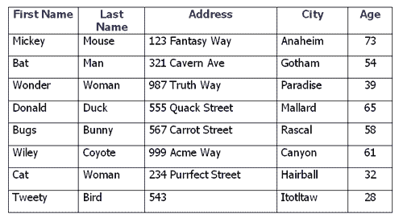
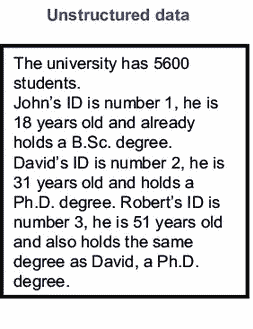
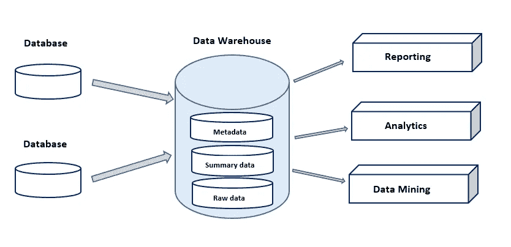

# 数据仓库。

> 原文：<https://medium.com/analytics-vidhya/data-warehousing-d7754561312f?source=collection_archive---------17----------------------->

大多数时候，数据仓库与数据库是混淆的。与数据库不同，数据不是来自数据仓库。它来源于不同的信息和管理系统。

在大多数公司中，数据以多种形式和文件类型分布在内部和外部系统中。结果是；在分析和报告时会有许多重复和不一致的地方。

当谈到商业智能的威力时，数据仓库可能是必不可少的。通过数据仓库，可以对数据进行清理、描述和组织，以插入到商业智能工具中，从而提供具有可视化表示的准确和精确的分析，以便管理人员可以做出有充分依据的决策。

在深入数据仓库之前，让我们试着把事情分解清楚。首先让我们看看什么是结构化和非结构化数据。

结构化数据:整洁、有组织的数据。它有一个已知的模式，并且能够适应表中的固定字段。

[来源](http://wanyilu587.blogspot.com/2015/02/structured-data-and-unstructured-data.html)

非结构化数据:没有模式或结构。这可能是一堆杂乱无章的数据。例如:文件、音乐、图片、元数据等…

[来源](https://www.researchgate.net/figure/Unstructured-semi-structured-and-structured-data_fig4_236860222)

**什么是数据库？**

数据库通常由定义的模式构成。它的条目被组织成一组表格，行表示一个对象或实体，列表示属性。这里要记住的关于仓库的关键因素是，数据库是用于事务的，它不执行任何数据分析。

**数据仓库。**

数据仓库将建立在许多数据库之上，它的主要特点是用于商业智能。它将使用数据库中的数据，并将创建一个针对执行数据分析而优化的层。

**数据仓库的一些优势。**

**竞争优势:**分析将允许决策者访问能够揭示客户行为和模式、趋势、需求等的数据，从而让他们能够权衡机遇和风险。

**成本效益决策:**通过减少渠道数量，帮助降低产品的总体成本。

**更高效的企业决策:**它创建了一个一致的、面向主题的和历史数据的集成数据库。这有助于将数据转化为有意义的信息，从而为决策者提供准确、一致的深度分析。

**企业智能:**增强客户服务。

**简化信息流。**

**参考文献**

数据仓库信息中心。什么是数据仓库？|数据仓库信息中心。[在线]见:<https://datawarehouseinfo.com/data-warehouse/>[2020 年 4 月 20 日访问]。

Thakur，d，n.d. *什么是数据仓库？数据仓库的好处&问题。*。[在线]Ecomputernotes.com。可从以下网址获取:<http://ecomputernotes . com/database-system/adv-database/data-warehouse>【2020 年 4 月 20 日获取】。