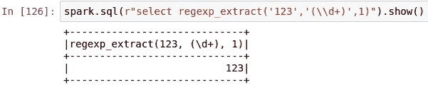

# Pyspark 中与 Regex 的数据争论

> 原文：<https://medium.com/analytics-vidhya/data-wrangling-in-pyspark-with-regex-ecda9b8f6256?source=collection_archive---------0----------------------->

Jez Timms 在 [Unsplash](https://unsplash.com?utm_source=medium&utm_medium=referral) 上拍摄的照片

这是我在星火深潜系列中的一个故事

【https://medium.com/@somanathsankaran 

正则表达式是处理数据的有力工具之一。让我们看看如何利用正则表达式来提取数据。

让我们在 sparksql 中看到以下内容

1.  pyspark 中的正则表达式
2.  火花正则函数
3.  捕获和非捕获组

**pyspark 中的正则表达式:**

Spark 在以下函数中利用正则表达式。

1.  正则表达式 _ 提取
2.  正则表达式 _ 替换
3.  rlike

**转义正则表达式**

pyspark 中的 Regex 内部使用 java regex。regex 的一个常见问题是转义反斜杠，因为它使用 java regex，我们将把原始 python 字符串传递给 spark.sql，我们可以从一个示例中看到\d 代表 regex 中的数字。让我们使用 spark regexp_extract 来匹配数字

现在我们假设这个函数将提取数字，但是由于这个字符串将被转换成 java 列，并且反斜杠在 java 中有特殊的含义，我们需要用另一个反斜杠对它进行转义，如下所示

或者我们可以使用 below 属性通过设置自动转义\或类似的转义序列

**设置 spark . SQL . parser . escapedstringliterals = true**

现在我们可以看到第一个表达式本身给出了下面的结果。

让我们继续默认火花设置的工作，我们将添加反斜杠

在继续之前，我将添加一些元字符，它们是正则表达式的构建块(将在下面详细解释)

**Regexp_extract** :

它可以通过使用大括号来提取一部分数据。Regexp_extract 需要 3 个参数

1.  数据-要从中提取数据的列或字符串
2.  pattern-我们要提取的正则表达式模式
3.  匹配组——我们需要提取的匹配部分

例如，在下面的示例中，我们需要分别提取数字和单词，并从单词“11ss”中添加 2 个 diff 列，如下所示

在 regexp_extract 中,' 11ss '表示列

因为我们想首先提取数字，所以我们添加\\d 和+来匹配多个数字，如 11 或 12 等，添加 1 是因为我们想匹配以红色突出显示的第一组匹配

然后，我们希望提取数字后的单词，因此我们使用\w+来匹配数字后的单词，因为它是第二个捕获组，用黄色大括号突出显示

**regexp_replace:**

顾名思义，它可以用替换来替换给定的模式

它接受 3 个参数

1.  数据列或字符串
2.  模式-待替换
3.  替换字符串，用来替换模式

例如，要用空格替换数字，我们可以在正则表达式下面使用

**Rlike** :

它用于检查是否找到匹配项，可以与 where 子句一起使用，而不是与 select 子句一起使用

例如，我们希望验证 amount 列是否只包含整数，否则我们应该说无效，如下所示

**捕获组:**

捕获是 regex 表达式中的概念，我们需要使用 regexp_replace 中的捕获数据替换部分。我们可以使用美元符号($)来访问捕获的组，它将从索引 0 开始到括号号

例如，我们使用了 2 个括号，当我们用$0(红色)替换时，它将使用整个组，$1 表示第一个括号(黄色)，而$2 可用于第二个组(绿色)

例如，一个常见的用例是模仿敏感数据，如带有 x 的卡片

因此，出于安全原因，我们将隐藏字符串下面的数字

sssa112ss 在这个字符串中，我们将使用上面的正则表达式用 x 替换 digit

以上正则表达式中有很多东西，我会试着解释每一部分

1.  图案部分

在 pattern 中，我们有[a-z]+它将匹配 a 到 z 中带有一个或多个重复项的任何内容，如“s”或 ss 等(黄色)(捕获组 1)

\d+匹配匹配数字(红色)(捕获组 2)

[a-z]+它将匹配 a 到 z 中带有一个或多个重复项的任何内容，如“s”或“ss”等(绿色)(捕获组 3)

2.更换零件-

在替换部分中，我们希望仅替换捕获组 2，并保留剩余部分。因此，我们将使用捕获组，它将捕获上述每个组，并且可以在替换部分中以$1x$3 的价格访问

今天就到这里吧！！:)

Github 链接:[https://github . com/SomanathSankaran/spark _ medium/tree/master/spark _ CSV](https://github.com/SomanathSankaran/spark_medium/tree/master/spark_csv)

****学习并让别人学习！！****