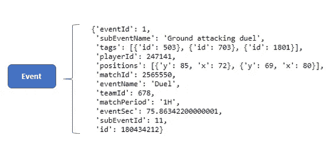
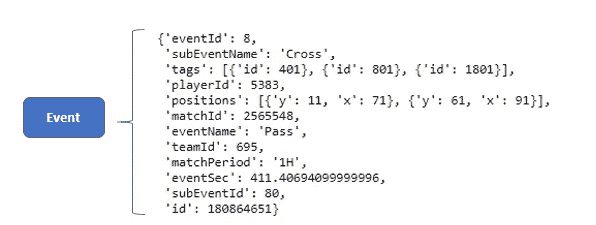
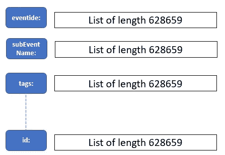
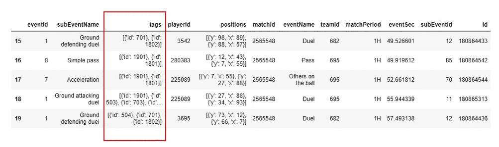
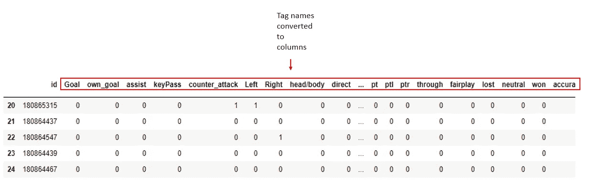
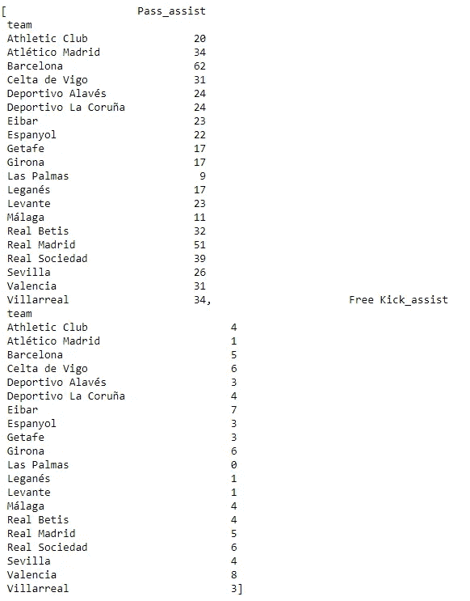
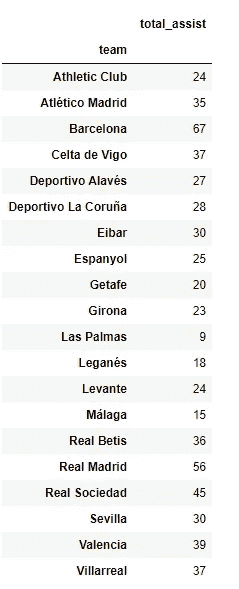
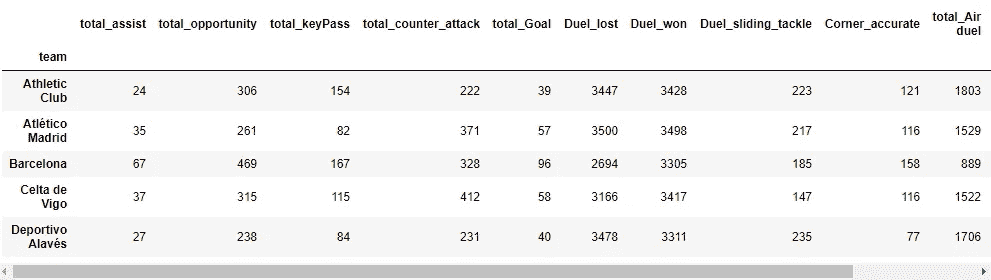

# 使用 Python 的数据争论项目演练

> 原文：<https://medium.com/analytics-vidhya/data-wrangling-project-with-python-eee40b460fed?source=collection_archive---------4----------------------->


在 [Unsplash](https://unsplash.com/s/photos/data-wrangling?utm_source=unsplash&utm_medium=referral&utm_content=creditCopyText) 上 [Sai Kiran Anagani](https://unsplash.com/@_imkiran?utm_source=unsplash&utm_medium=referral&utm_content=creditCopyText) 拍摄的照片

**项目目标:**

1.  将 JSON 文件转换成数据帧，以便于浏览和分析。
2.  自动化数据争论步骤，以便它们可以应用于多个数据集。
3.  开发查询方法，以帮助生成团队或球员的汇总数据。
4.  采用面向对象编程来帮助管理代码。

我在这个项目中使用了 python。这些代码可以在下面的 GitHub 库中找到。

[https://github . com/muhammadmarfsazed/Data _ wrangling _ soccer _ with _ Python](https://github.com/MuhammadMarufSazed/Data_wrangling_soccer_with_Python)

**数据集概述:**足球比赛时空数据集([https://springer nature . fig share . com/articles/dataset/Metadata _ record _ for _ A _ public _ data _ set _ of _ spatial-temporal _ match _ events _ in _ soccer _ competitions/9711164](https://springernature.figshare.com/articles/dataset/Metadata_record_for_A_public_data_set_of_spatio-temporal_match_events_in_soccer_competitions/9711164))是一个数据集，其中包含了几个代表欧洲足球比赛的 JSON 文件。数据集包括与不同事件、犯规、进球、传球、助攻等相关的信息。在这些比赛的足球比赛中。为了演示数据争论的步骤，我使用了包含西班牙联赛事件数据的数据集(文件名 events_Spain.json)。

感兴趣的读者也可以通过这篇论文(下面的链接)来了解方法和分析。我要感谢作者卢卡·帕帕拉多、保罗·钦蒂亚、阿莱西奥·罗西、伊曼纽·马苏科、保罗·费拉吉纳、迪诺·佩德雷斯基、福斯卡·吉安诺蒂的精彩论文和公开提供的数据集。

论文:[https://www.nature.com/articles/s41597-019-0247-7](https://www.nature.com/articles/s41597-019-0247-7)

**给定 datatset 的结构:**JSON 文件在 python 中存储为列表。该列表包含代表单个事件的 628659 个词典。

```
with open("events/events_Spain.json") as f:
    data_spain = json.load(f)
```


一个长度为 628659 的 python 列表，表示在联盟的所有比赛中发生的事件(每个事件都是字典格式的)。



字典表示单一事件，即决斗，子事件名称将其标识为对地攻击决斗。标签 id 表明这是一次对左的攻击(id: 503)，决斗获胜(id: 703)，并且是准确的(id: 1801)。



python 字典格式的事件示例。字典表示单个事件，这是一个传递，子事件名称将其标识为一个交叉。标签 id 表明它是左脚的(id: 401)，高交叉的(id: 801)，并且是准确的(id: 1801)。

每个事件字典都包含几个关于事件的信息。事件名称标识了事件的性质:是通过还是犯规还是其他。通过指定过程的性质，subEventName 的范围进一步缩小。在这个例子中，它是一个十字。标签代表关于事件的评论。在这种情况下，标签意味着这是一个左脚准确的高传。对于其他事件，例如犯规，我们有一组完全不同的标签(不一定长度为 3)，这些标签的 id 值不同。

**数据争论——第一步:**因为这些字典都有相同的一组键:eventId、subEventName、tags 等。，我们将把这多个字典组合成一个字典。



第一步:我们想把所有的字典合并成一个字典。结果字典的每个键都有一个长度为 628659 的列表，这是 data_spain 列表中事件号的长度。

将这些字典合并成一个字典的目的是为了方便我们将其转换成熊猫数据框架。在这个阶段，除了对应于标签的列表之外，所有其他列表都包含每个事件的一个元素。

**数据争论——第二步:**我们将字典转换成熊猫数据框架。然而，产生的数据格式不允许我们那么容易地利用 tags 列中的信息。所以，我们进行第三步。



第二步:将组合词典转换成熊猫数据帧。正如我们所看到的，tags 列中的元素有多个字典，表示与特定事件相关联的标记。而且这些字典的篇幅和值都不一样。数据帧的形状:(628659，12)

**数据争论——第三步:**然后为每个标签名称添加列，以确保我们能够使用标签中可用的有用信息。为了实现这些步骤，我开发了一个事件类(python 类),以便于管理代码并将其用于其他比赛的数据集。



第三步:组合不同事件中所有可能的标记名，并将其转换成列。这些列的值为 0 或 1，其中 1 表示标签与事件相关联，0 表示不相关联。因此，如果对于一个特定的事件，“传球”，目标列的值为 1，这将意味着射门导致进球。这个数据帧与我们从上一步得到的数据帧结合在一起。数据框架的形状:(628659，72)

在这个阶段，我们有一个形状的数据框架(628659，72)。现在我们有了一个数据框架，可以用一种更简单的方式提取数据。

**使用查询方法探索数据框架:**我假设在这一点上，很多好奇心将围绕所有比赛的球队级别或球员级别的数据。为此，我们必须对多个列进行大量的过滤和聚合(求和/计数)。也可能是在对某一组事件进行过滤后，我们可能有兴趣检查团队或球员在其他事件或子事件中的表现。为了使整个过程更容易，我在 events 类中开发了一些“查询”方法，可以用来方便快捷地获得这些结果。我们可以沿着不同的标签集搜索不同的事件和子事件。所有这些查询将产生对应于特定查询的数据帧。然后，我们可以将这些不同的数据帧组合成一个大的数据帧，其中包含我们在团队级别或球员级别感兴趣的信息。然而，如果我们不想处理汇总数据，比如说我们想分析与莱昂内尔·梅西相关的事件序列，我们当然可以通过使用第三步后获得的数据框架来完成。

**结论:**每个数据集都包含丰富的信息集，可用于机器学习、聚类分析、数据探索和可视化以及统计建模。数据争论是处理这类数据集的重要一步。查询方法允许用户根据需要查询不同的信息。采用面向对象的编程方法有助于更好地管理代码。

**附录:**

**查询方法演示:**

```
spain_object = event(data_spain, )
```

> #将给定的字典列表转换为数据帧
> 
> spain_object = events(data_spain，'西班牙'，tags_name，events _ label)
> Spain _ object . process(teams _ df，players_df)

**问题:**不同球队射门得分多少？

> #查询
> 
> by = ' team '
> tags =[' Goal ']；events =[' Shot ']
> Spain _ object . query _ event sub _ tag(tags，events = events，subevents = None，by = by，output = True，combine = False)

**问题:**不同球队分别从传球和任意球产生了多少次助攻？

> #查询
> 
> by = 'team'
> tags = ['assist '，]；events = ['Pass '，'任意球']
> Spain _ object . query _ event sub _ tag(tags，events = events，subevents = None，by = by，output = True， **combine = False** )

#设置 combine = False 将为不同的事件产生不同的数据帧。



整个赛季不同球队的传球和任意球助攻数的总和

**问题:**不同球队的传球和任意球总共助攻了多少次？

> #查询
> 
> by = 'team'
> tags = ['assist '，]；events = ['Pass '，'任意球']
> Spain _ object . query _ event sub _ tag(tags，events = events，subevents = None，by = by，output = True， **combine = True** )
> 
> #设置 combine = true 将产生一个数据帧，该数据帧添加了传球和任意球的各个数据帧。



整个赛季不同球队传球和任意球的总助攻数

**任务:**生成单个数据帧，其中包含不同事件、子事件和标签的团队聚合信息。

> #多重查询
> by = 'team'
> tags = ['Goal '，' assist '，' keyPass '，' opportunity '，' counter _ attack ']；events = ['Pass '，' Shot '，' Free Kick ']
> Spain _ object . query _ events sub _ tag(tags，events = events，subevents = None，by = by，output = False，combine = True)# 1st query
> tags =[' lost '，' won '，' sliding _ tangle ']；events =[' Duel ']
> Spain _ object . query _ event sub _ tag(tags，events = events，subevents = None，by = by，output = False，combine = False)
> tags =[' accurate ']；subevents =[' Corner ']
> Spain _ object . query _ event sub _ tag(tags，events = None，subevents = subevents，by = by，output = False，combine = False) #第二次查询
> Spain _ object . query _ eventsub([' Air duel '，' Cross '，' Free Kick']，output = False，level = 'subevent') #第三次查询
> 
> #从上一步生成的列表中创建一个组合数据帧
> Spain _ team _ data = Spain _ object . concat _ df()



组合来自不同查询的数据帧。