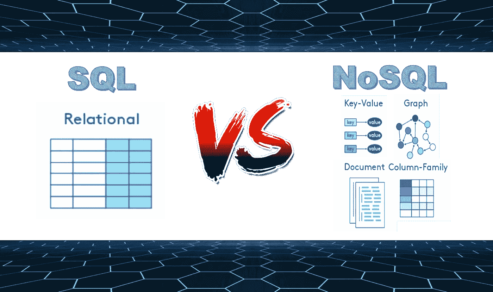

# 数据库管理— NoSQL 与 SQL(或 MongoDB 与 MySQL)

> 原文：<https://medium.com/analytics-vidhya/database-management-nosql-vs-sql-or-mongodb-vs-mysql-cfa351caf25a?source=collection_archive---------11----------------------->

## 何时选择 NoSQL 数据库而不是传统的 SQL 数据库(RDBMS)

来源:[通过](https://www.rpnation.com/members/thepotatogod.23469/)[引用](https://www.rpnation.com/threads/animus-gaming-thepotatogod-vs-cyborg-leopard.427415/) (CC0)

SQL 和 NoSQL 数据库之间的比较实际上是**关系型**和**非关系型**数据结构的比较。虽然大多数企业仅使用 SQL 数据库就取得了巨大的成功，但许多企业也开始集成…