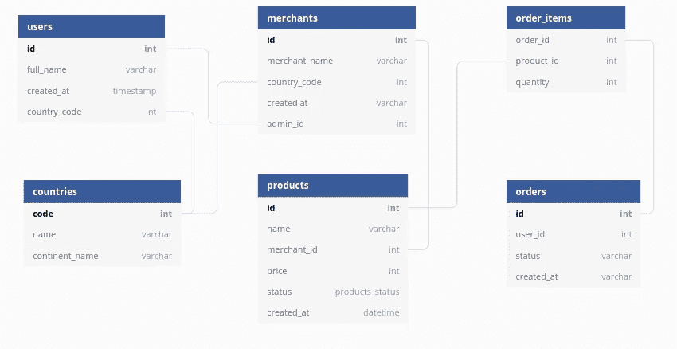
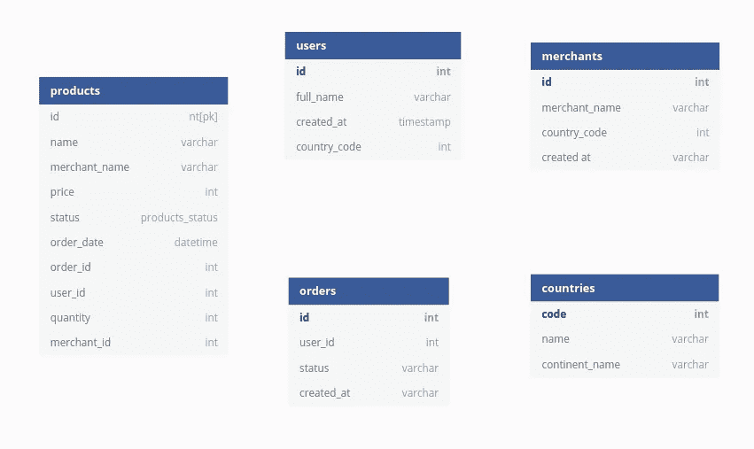
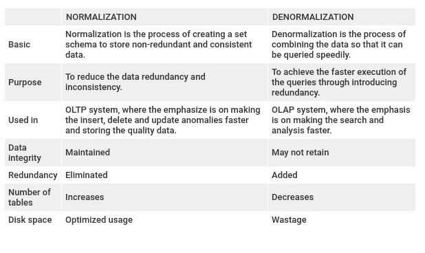

# 数据库规范化与反规范化

> 原文：<https://medium.com/analytics-vidhya/database-normalization-vs-denormalization-a42d211dd891?source=collection_archive---------1----------------------->

根据维基百科的定义，**数据库规范化**是按照一系列所谓的范式来构造关系数据库，以减少*数据冗余*，提高*数据完整性*的过程。

在数据库设计范围内，**规范化**是一种数据库设计技术，它通过消除冗余数据来最大限度地减少插入、删除和更新异常，从而以减少数据冗余和依赖性的方式来组织表格。使用规范化技术设计数据库会导致将较大的表分成较小的表，并使用关系将它们链接起来。**规范化的目的是消除冗余(无用)数据，并确保数据得到逻辑存储。**

规范化方式的数据库表

相反，**反规格化**是规格化的逆过程，其中冗余被有意地添加到数据中，以提高特定应用的性能和数据完整性。执行反规范化的原因是过度规范化的结构在查询处理器中产生的**开销**。反规范化减少了表的数量和复杂的表连接，因为更多的连接会降低处理速度。

非规范化方式的数据库表

# 规范化和反规范化之间的主要区别

规范化和反规范化技术都有各自的优点和缺点。下表以简单易懂的方式比较了这两种技术。

规范化与反规范化

1.  规范化是将数据划分到多个表中以减少数据冗余和不一致并实现数据完整性的技术。另一方面，反规范化是将数据合并到单个表中以加快数据检索的技术。
2.  规范化用于一个 OLTP 系统，它强调使插入、删除和更新异常更快。相反，反规格化用于 **OLAP** 系统，强调使搜索和分析更快。
3.  数据完整性在规范化过程中得以保持，而在反规范化过程中，数据完整性更难保持。
4.  当执行规范化时，冗余数据被消除，而反规范化增加了冗余数据。
5.  规范化增加了表和连接的数量。相反，反规范化减少了表和连接的数量。
6.  因为相同的数据存储在不同的位置，所以反规范化会浪费磁盘空间。相反，规范化表中的磁盘空间得到了优化。

# 结论

规范化和反规范化根据情况是有用的。当必须要求更快的插入、删除和更新异常以及数据一致性时，使用规范化。另一方面，当更快的搜索更重要时，使用非规范化来优化读取性能。它还减少了过度规范化的数据或复杂的表连接带来的开销。