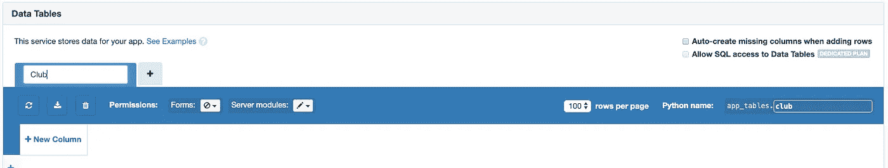

# Anvil 中的数据库

> 原文：<https://medium.com/analytics-vidhya/databases-in-anvil-b162b3a89bd4?source=collection_archive---------5----------------------->

这是一个在 [Anvil](https://anvil.works/) 中构建数据库的初学者指南，这个工具让你只用 Python 就能构建&部署整个 web 应用。

# 介绍

在本指南中，我们将建立一个数据库，存储管理体育俱乐部所需的信息。本教程面向那些对数据库和数据库架构有基础到中级知识，但从未使用过 Anvil 的人。

# 什么是铁砧？

Anvil 是一个 web 开发产品，它让你只用 Python 就能构建 web 应用。

# 为什么要用铁砧？

Anvil 消除了开发 web 应用程序的许多复杂性，让您可以专注于重要的事情，快速构建优秀的解决问题的应用程序。

# 先决条件

*   [一个铁砧账号](https://anvil.works/login)
*   对 Python 的基本理解
*   数据库和数据库架构的基础到中级知识

# 内容

1.  入门指南
2.  创建我们的第一个表
3.  创建链接表
4.  完成我们的数据库
5.  访问表数据

# 第 1 部分—入门

在开始设计和构建数据库之前，我们需要在 Anvil 中创建一个空白应用程序。这样我们就可以进入数据库 GUI，这是本教程的重点。

Anvil 提供的其他强大功能，包括页面、UI 和应用构建，不在本教程的讨论范围之内。然而，如果你感兴趣，你可以在 [Anvil 网站](https://anvil.works/learn)上找到大量的资源，包括完整的教程、文档和示例。

让我们从创建一个空白应用程序开始。一旦你[创建了 Anvil 账户](https://anvil.works/login)并登录，开始创建一个新的空白应用。


砧座启动屏幕

在本教程中，我们将使用材质设计主题。我还打算将我的应用程序从材料设计 1 重命名为俱乐部经理。


重命名应用程序后，让我们继续创建第一个表格。

# 第 2 部分—创建我们的第一个表

Anvil 通过基于 web 的 GUI 提供完整的数据库功能。GUI 易于使用，数据库基于 PostgreSQL 构建。

我们将基于下面的模式建立一个数据库，这将使我们习惯于在 Anvil 中建立数据库，而不必担心巨大的复杂性。


开始创建我们的数据库，我们将添加一个数据表服务到我们的应用程序。这可以通过左侧窗口中服务旁边的+按钮并选择数据表来完成。


现在我们有了数据表服务，让我们创建第一个表。我们将从俱乐部信息表开始，其中存储了:

*   俱乐部名称—文本
*   日期 _ 创建日期

注意:Anvil 在每个表中创建一个字符串 UID，所以我们不必自己创建一个。

让我们将该表的名称改为 Club，双击顶部的标签即可。这也将为我们更新 Python 名称，并将成为我们在代码中引用该表的方式。



命名后，我们可以使用 new column 按钮并选择相关的数据类型来创建表列。


就这样，我们的第一个表创建完成了。在下一部分中，我们将创建模式中的其余表，并讨论表之间的关系。

# 第 3 部分—创建链接表

现在我们知道了如何在 Anvil 中创建表，让我们从我们的模式中创建另一个表，并探索如何链接表。


让我们创建团队表。选择+选项卡将为我们提供从头创建另一个表或从其他应用程序添加表的选项。从另一个应用程序添加表意味着两个应用程序将共享表的数据结构以及其中的数据。

我们将从头开始创建团队表格，将表格命名为 team，并添加以下字段:

*   团队名称—文本
*   最少必需玩家-日期

最后，是时候添加一个专栏了，这样我们就可以将球队与俱乐部联系起来。由于每个球队只能属于一个俱乐部，我们希望创建一个名为 club 的列，以存储俱乐部与其球队之间的一对多关系。

该列的添加与其他任何列相同，但我们没有选择数据类型，而是选择“链接到表”，然后选择“俱乐部表”和“单行”。


为了测试这个链接，让我们在表格中添加一些数据。只需双击单元格即可开始编辑。我们将从在俱乐部列表中添加一个俱乐部开始。


一旦我们有了自己的俱乐部，让我们加入一支为这个俱乐部效力的球队。


现在我们有了链接表，在 Anvil 中创建表之间的关系是如此容易。

# 第 4 部分—完成我们的数据库

我们已经介绍了如何创建表并链接它们，所以让我们通过创建其余的表来进行一些练习。我们需要构建的其余表格是玩家、比赛、场地和游戏。

## 运动员

*   团队—指向团队的表格链接
*   名字—文本
*   姓氏—文本
*   年龄—数量
*   位置—文本

## 竞争

*   竞赛名称—文本
*   开始日期—日期
*   结束日期—日期

## 举办地点

*   地址—文本
*   邮政编码—文本
*   容量—数量

## 比赛

*   竞争—指向竞争的表格链接
*   地点—指向地点的表格链接
*   团队—指向团队的表格链接
*   开始时间—日期和时间
*   结束时间—日期和时间


创建后，您的数据表应该如下所示

一旦创建了表，至少向每个表添加一行数据，为本教程的最后一部分访问数据做好准备。

# 第 5 部分—访问表数据

我们已经看到了如何通过 GUI 添加数据，但是让我们快速地看一下添加数据的语法，以及其他基本的数据操作。Anvil 中的表是每行行为与 Python 字典类似的对象。

## 获取、设置和更新

让我们使用 get()方法获取我们在第 3 步末尾添加的团队，并将其存储在一个变量中。

```
from anvil.tables import app_tables1st_team_row = app_tables.team.get(team_name="1st Team")
```

现在我们有了自己的行，我们可以使用与 Python 字典对象相同的语法来设置或更新数据。

```
1st_team_row["min_players_required"] = 15
```

您可以使用 update()方法一次设置多个列。

```
1st_team_row.update(team_name="Mens 1st Team", min_players_required=15)
```

## 添加数据

我们可以使用 add_row 方法添加另一个团队，将列解析为参数。对于团队和俱乐部之间的链接，我们将在一个变量中存储我们想要的俱乐部记录。

```
cambridge_united_club = app_tables.club.get(club_name="Cambridge United")app_tables.team.add_row(team_name="Mens 2nd Team",
                          min_players_required=15,
                          club=cambridge_united_club)
```

## 删除数据

最后，我们可以使用 delete()方法删除数据。

```
2nd_team_row = app_tables.team.get(team_name="Mens 2nd Team")2nd_team_row.delete()
```

更多语法和数据库功能可在 [Anvils 文档](https://anvil.works/docs/data-tables)中找到。

仅此而已，Anvil 内置的一个简单的数据库。希望您现在应该理解如何添加表来构建数据库，然后开始处理数据。

```
**Don't forget!**[Follow me for more](https://codingwithryan.medium.com/) software development content!
```