# #DataBlogSpp6:如何在#powerbi 中使用期初/期末余额#DAX 函数。

> 原文：<https://medium.com/analytics-vidhya/datablogspp6-how-to-use-opening-closing-balance-dax-function-in-powerbi-4051582de66e?source=collection_archive---------11----------------------->

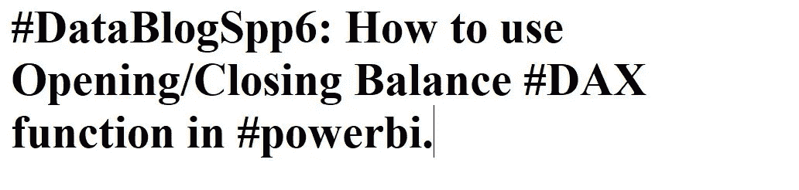

作者:soor ya Parthiban——数据分析师、博客作者和电力 BI Dev。

> 如果别人能做到，为什么我们不能！

大家好，很高兴在另一个博客上见到你们。

这篇博客实际上解释了:

## 月/季/年期初余额

## 月/季/年期末余额

看看想象中的个人银行的余额数据集:

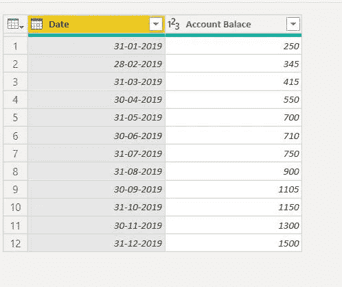

该数据集包含 2019 年 1 月 31 日至 2019 年 12 月 31 日的账户余额。

作为数据分析师，您需要从该数据集中提取趋势。

对该数据集使用 OPENINGBALANCE/CLOSINGBALANCE 函数将显著减少您的工作量。

# 1.理解 OB/ CB“月”和 OB/ CB“季”的区别。

*   一个月在 28 日/29 日/30 日/31 日结束。
*   而一个季度在三月/六月/九月/十二月结束。

## 1.1 一年中的季度是如何分组的？

*   一月、二月和三月**(第一季度)**
*   四月、五月和六月**(第二季度)**
*   七月、八月和九月**(第三季度)**
*   十月、十一月和十二月**(第四季度)**

# 2.函数的语法。

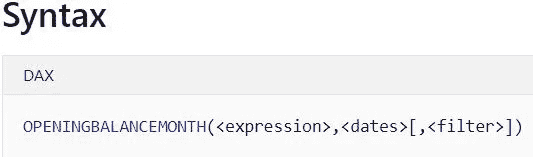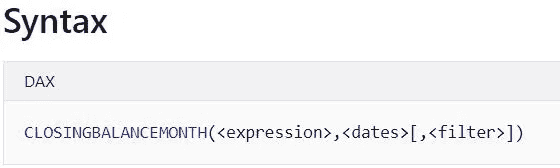

****期初余额季/年*** *和* ***期末余额季/年*** *的语法同上。**

# *3.语法是什么意思？*

*   ***表达式:**这是使用算术运算符和其他 DAX 函数的地方(例如:我们可以在这里使用 sum 或 average 函数)*
*   ***日期:**输入包含日期值的列。(格式:表名[列名])*
*   ***Filter:** 我们可以在这里过滤掉数据，也可以在这里添加任何其他 DAX 函数。*

# *4.我们把它们写在哪里？*

*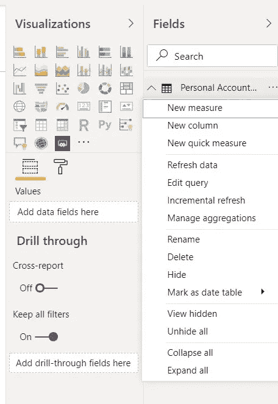*

*单击包含相应列的表附近的三个点(在我们的示例中，我们需要日期和余额列)，将显示一个选项列表，单击名为***‘新度量***’的第一个选项，编写 DAX 公式。*

# *5.键入代码并执行。*

*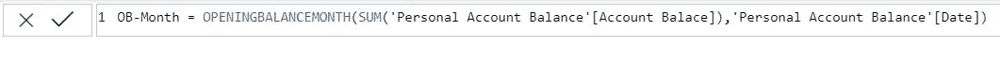**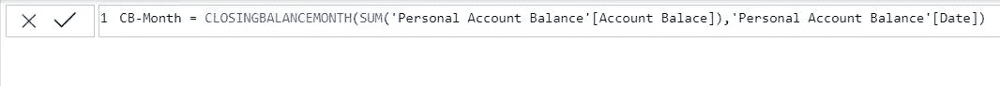*

*单击刻度按钮在父表中创建度量。*

## *5.1 在哪里可以找到创建的度量？*

*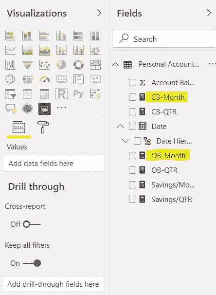*

*度量将位于原始/父表中。*

## *5.2 我们如何在画布中使用创建的度量？*

*   *单击可视化表格。*

*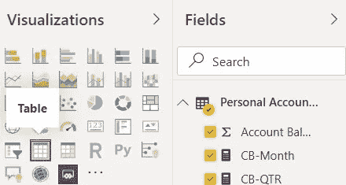*

*   *按照以下顺序将所有列和创建的度量拖动到“值”选项卡中。*

*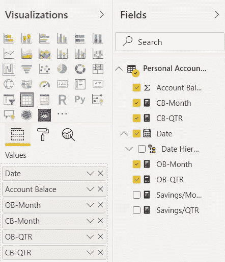*

# *6.了解表格可视化。*

*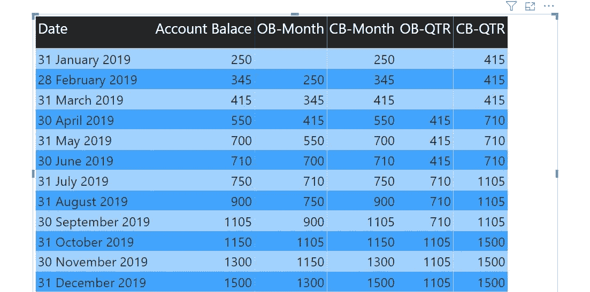*

*上面的视觉清晰地显示:*

*   *日期和相应的帐户余额*
*   *每月的期初余额和期末余额。*
*   *四个季度的期初余额和期末余额。*

*我们一月份的期初余额为空值，因为期初余额一词意味着 2018 年 12 月 ***的期末余额。*** 由于我们没有 2018 年 12 月的数据，所以我们得到了 1 月月份的空值。同样的 ***也适用于第一季度的空值。****

# *7.分析趋势。*

## *7.1 创建新的测量并将其添加到现有的视觉中。*

*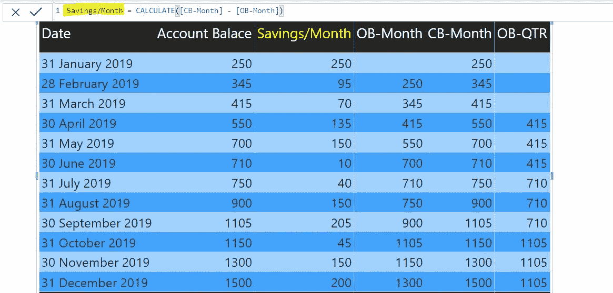*

## *7.2 分析趋势。*

*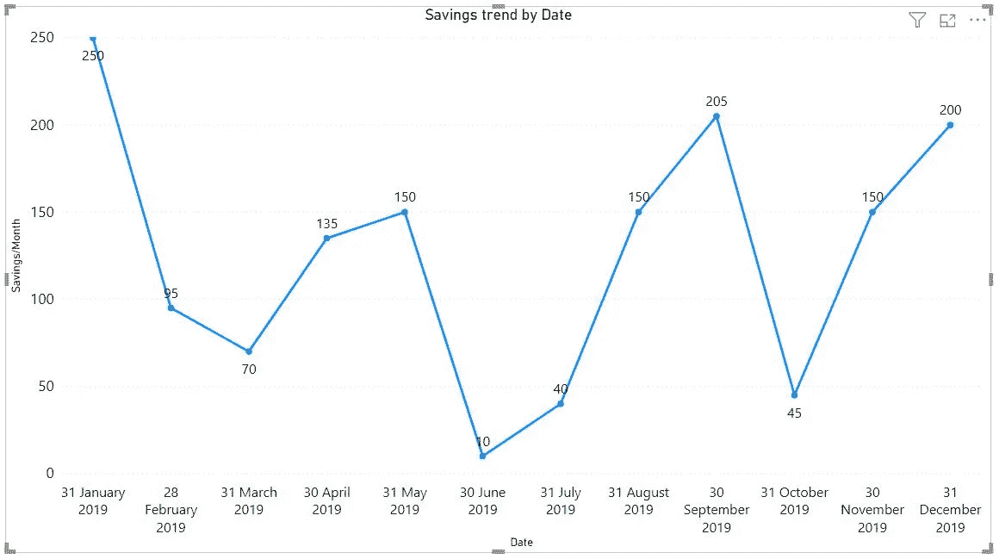*

# *结束了！*

*我希望这篇文章对你有用。我期待听到您的反馈和意见。大兴快乐！*

*在 [Instagram](https://www.instagram.com/drdata25/) 、 [LinkedIn](https://www.linkedin.com/in/soorya-prakash-parthiban-47a95718b/) 和 [FaceBook](https://www.facebook.com/sooryaprakash.parthiban.5) 上关注我。*

*感谢您的时间，非常感谢。*

*索亚·普拉卡什·帕西班。*