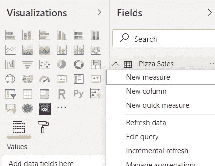

# #DataBlogSpp7:如何在#powerbi 中使用 TotalMTD/QTD/YTD #DAX 函数？

> 原文：<https://medium.com/analytics-vidhya/datablogspp7-how-to-use-totalmtd-qtd-ytd-dax-function-in-powerbi-d4d16ae29b8c?source=collection_archive---------18----------------------->

作者:soor ya Parthiban——数据分析师、博客作者和电力 BI Dev。

> 如果别人能做到，为什么我们不能！

大家好，很高兴在另一个博客上和大家见面。

# 这篇博客实际上解释了:

*   [TotalMTD](https://docs.microsoft.com/en-us/dax/totalmtd-function-dax) ， [TotalQTD](https://docs.microsoft.com/en-us/dax/totalqtd-function-dax) ， [TotalYTD](https://docs.microsoft.com/en-us/dax/totalytd-function-dax) 。

看看这个假想的披萨销售数据集:

我们可以看到，我们有日期的比萨饼销售和送货司机的工资，为各自的日子。这是一个假想的数据集，保存从 2020 年 1 月 1 日到 2021 年 4 月 30 日的值。

# 作为一名数据分析师，我们被要求分析这个数据集，以显示有多少钱用于支付送货司机，有多少钱留给了商店经理，并从这个数据集中提取一些重要的见解。

我们可以通过在数据集中使用正确的 DAX 函数来实现我们的目标。今天我们将使用总的 MTD/QTD/YTD 函数。

# 1.这些 DAX 函数的语法是什么？

# 2.以上语法是什么意思？

*   表达式:这是我们可以对数据集的列执行算术运算符的地方。
*   日期:输入数据集中包含日期值的列。
*   过滤器:我们可以在这里过滤掉任何特定的值。例如，如果我们有两个分支的相同数据，我们可以通过键入[branchName] = 'Lower Hutt '进行过滤。
*   year_end_date(仅用于 TotalYTD):该数据集包含从 2020 年 1 月 1 日到 2021 年 4 月 30 日的数据，如果要求我们仅计算一年的数据，那么我们可以键入我们希望进行计算的最后日期。

# 3.我们在哪里写 DAX 函数？

单击表名旁边的三个点将显示一个下拉列表，我们必须在其中选择名为*“New measure”*的选项来编写 DAX 公式/函数。

# 4.用现有数据创建一个可视化表格并添加 DAX 函数。

这里使用的视觉是**“表格”**视觉:

正如我们在这里看到的，我们有销售日期，每天的总销售额，以及送货司机当天的收入。当我们抬头看我们的目标时，我们想展示店主手里有多少钱，对吗？

# 4.1 键入 DAX 代码并执行它。

在这里，我们将总销售额与 ***相加，再减去*** 和送货司机的工资，这将得出店主在一天结束时的余额。如上所述，任何算术函数都可以用在<表达式>参数中。

# 4.2 在哪里可以找到创建的度量。

该措施可在*【字段】*下找到。

# 4.3 如何将创建的措施添加到视觉效果中？

要在视觉效果中使用创建的测量，将其从*字段拖至值*。

# 5.理解视觉。

上面的视觉清晰地显示:

*   每天的总销售额、送货司机的工资以及店主在一天结束时的余额。
*   每个月和每个季度的累计期末余额。

# 6.分析趋势。

# 结束了！

在 [Instagram](https://www.instagram.com/drdata25/) 、 [LinkedIn](https://www.linkedin.com/in/soorya-prakash-parthiban-47a95718b/) 、 [FaceBook](https://www.facebook.com/sooryaprakash.parthiban.5) 和 [Medium](/@sooryaprakparthiban) 上关注我。

感谢您的时间，非常感谢。

索亚·普拉卡什·帕西班。