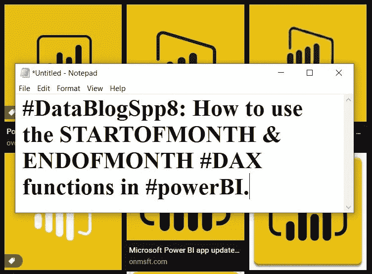
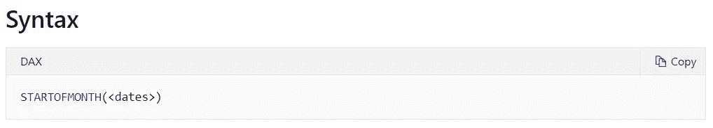
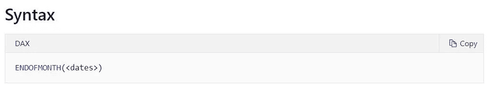
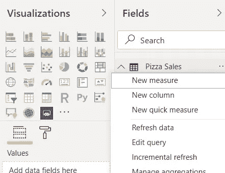
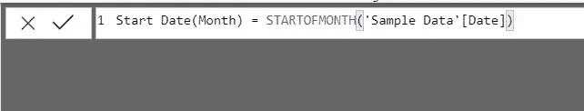
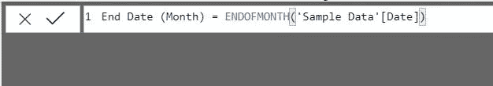
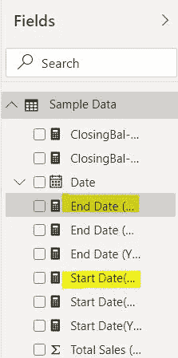
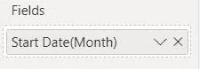

# #DataBlogSpp8:如何在#powerbi 中使用 STARTOFM/Q/Y 和 ENDOFM/Q/Y #DAX 函数？

> 原文：<https://medium.com/analytics-vidhya/datablogspp8-how-to-use-startofm-q-y-and-endofm-q-y-dax-function-in-powerbi-551caab4b18f?source=collection_archive---------30----------------------->

作者:Soorya Parthiban —数据分析师、博客作者和商业智能开发专家。

> *如果别人能做到，为什么我们不能！*

大家好，很高兴在另一个博客上和大家见面。

# 这篇博客实际上解释了:

*   [月初](https://docs.microsoft.com/en-us/dax/startofmonth-function-dax) & [月末](https://docs.microsoft.com/en-us/dax/endofmonth-function-dax)。

# 1.这些 DAX 函数的语法是什么？

# 2.以上语法是什么意思？

*   **日期:**输入表格中有日期值的列。

# 3.我们在哪里写 DAX 函数？

单击表名旁边的三个点将显示一个下拉列表，我们必须在其中选择名为*“New measure”*的选项来编写 DAX 公式/函数。

# 4.键入 DAX 代码并执行它。

# 4.1 在哪里可以找到创建的度量。

该测量可在*“字段”*下找到。

# 4.2 如何将创建的措施添加到视觉效果中？

要在视觉效果中使用创建的测量，将其从*字段拖至值*。这里用于显示月/季度的开始和结束日期的视觉对象是“卡片”视觉对象。

同样，我们也可以在季度初、月末和季度末这样做。

# 5.理解视觉。

请观看上面的视频，了解当每个月或季度被用户点击时，这种交互式 DAX 功能是如何工作的。

# 结束了！

我希望这篇文章对你有用。我期待听到您的反馈和意见。大兴快乐！

在 [Instagram](https://www.instagram.com/drdata25/) 、 [LinkedIn](https://www.linkedin.com/in/soorya-prakash-parthiban-47a95718b/) 和 [FaceBook](https://www.facebook.com/sooryaprakash.parthiban.5) 上关注我。

感谢您的时间，非常感谢。

索亚·普拉卡什·帕西班。