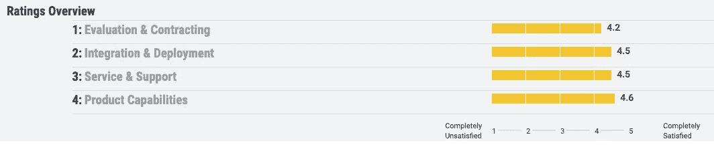

# 数据块和节点-红色

> 原文：<https://medium.com/analytics-vidhya/databricks-and-node-red-bb97cd7955?source=collection_archive---------8----------------------->

## 快速的第一印象

在过去的一周里，我借此机会参加了一些研讨会，这些研讨会展示了有助于更快、更高效地开展数据科学工作的产品。我将简要介绍 AWS 的 Databricks 和 IBM 的 Node-RED，让读者一窥他们可以使用哪些工具，并提供我的第一印象。

# 数据砖

> Databricks 本质上是 Jupyter 笔记本的升级版，允许用户用更少的努力做很多事情。

Databricks 是由创造了 Apache Spark 的同一个团队设计的。“ [Databricks](https://databricks.com/product/databricks-workspace) Workspace 是一个基于笔记本的协作环境，能够在一个地方运行所有分析流程，因此您可以在同一个环境中构建数据管道、培训和生产机器学习模型，并分享对业务的见解。”使用数据块可以如此容易地创建详细的可视化效果，这非常令人惊讶。我仍然喜欢创建交互式可视化，所以我仍然喜欢使用散景甚至 D3，但这对于简单快速的可视化来说很好。他们最引以为豪的功能是保存了牌桌历史的每个版本。通过引用自动创建的索引号，可以回调表的早期版本。

如果你想试一试，看看他们的[入门指南](https://docs.databricks.com/getting-started/index.html?mkt_tok=eyJpIjoiWXpreFptRmhaRGt4TldJMiIsInQiOiJFNlZUK0QrQ01qSHQrR1k5cWd6bUw4NTVsRFdGZlhzQUxleHJvZ1p0YU9FMktVdXlra1ZLNzhabVRTS2ZlS2lIeGkrNWRlVDhsbjd3SCttZnNjaVNJNGZOXC8wMmREdTdsdVM4VFVxaXNQTVFYNUVObXRpU1pub1p4RzYwanhmTFoifQ%3D%3D#getting-started-guide)。你可以免费试用他们的[社区版](https://databricks.com/try-databricks?mkt_tok=eyJpIjoiTnprM1pUTm1NMlpqTnpkayIsInQiOiJZcHp3R1RhelFUVlwvUTZKRkxyZnhXcXlXV1l5aXlHTlwvczgrZ2oycTVIelZ2WlhqMXViN2k0MCtTYXFwSkpORXhNUWJyMG9VRHZmRStVSUJmSG5DVEQ3Z2NJTkVxaGRGOUZtSnNrTThzN0JPdEQwWnRmWVdXZkVXKzROcW1NNmF0In0%3D)还有一个[入门](https://pages.databricks.com/rs/094-YMS-629/images/01-Delta%20Lake%20Workshop%20-%20Delta%20Lake%20Primer.html) workshop Delta Lake 和一个实现[机器学习](https://pages.databricks.com/rs/094-YMS-629/images/02-Delta%20Lake%20Workshop%20-%20Including%20ML.html)的 workshop。

用户对 Databricks 的评价非常积极。Gartner 有 89 个评级和 81 个验证评论。结果是平均 4.5/5 颗星。这些审查大部分来自价值低于 5000 万美元的北美金融业务。最常见的审核人员从事数据和分析工作。大多数评论都称赞这些特性的功能性，但批评缺乏支持来源以及对目标查询的响应速度慢。一位从事教育工作的用户评论道:“唯一的障碍是成本和合同谈判。我们觉得有点“偷梁换柱”

[高德纳](https://www.gartner.com/reviews/market/data-science-machine-learning-platforms/vendor/databricks/product/databricks-unified-analytics-platform/ratings)

最近来自 [G2](https://www.g2.com/products/databricks/reviews) 的正面评论将 Databricks 描述为“它就像一个 Jupyter 笔记本，但是更强大、更灵活。你可以很容易地从 Python 到 SQL 到 Scala 从一个单元格切换到下一个单元格。使用 Spark 框架，您可以预览您的数据处理任务，而不必构建大型中间表。”G2 的平均评分是 4/5 星，有 13 条评论。

[https://www.g2.com/products/databricks/features](https://www.g2.com/products/databricks/features)

[Trustradius](https://www.trustradius.com/products/databricks/reviews#2) 有 16 条用户评论，平均得分为 4.5/5 颗星，“trscore”为 8.8 分(满分 10 分)。

[https://www.trustradius.com/products/databricks/reviews#3](https://www.trustradius.com/products/databricks/reviews#3)

对于一些快速的机器学习诊断来说，Databricks 似乎是一个非常酷的工具。我很乐意将它用于一些个人项目和它的社区版本，但是在投资决策中应该有一些谨慎和思考。一个企业应该明白他们到底在支付什么，他们将会得到什么。

# **红色节点**

本周，Node-RED 有几次聚会。2019 年 9 月 23 日星期一有一个非常非正式的教程，让用户了解基础知识，接下来的周三提供了一个有趣的分析 Twitter 的应用程序。

用节点红管道分析 Twitter

基于数据流编程，Node-RED 旨在让用户轻松创建数据管道，同时利用一套各种节点，这些节点可以做从语音到文本、翻译到情感分析的任何事情。这个程序很容易上手。查看 Pooja Mistry 的 [github](https://github.com/pmmistry/Intro-to-Node-RED) 获得关于如何开始使用 Node-RED 的精彩介绍和教程。我真的相信 Node-RED 有很大的潜力，因为它可以减轻机器学习的负担。很多组件都很容易使用并且很有效。您甚至可以通过实施物联网来创建基本的仪表盘。

仪表板模板

用电仪表板

每时每刻都有如此多的研讨会和新工具推出，让人应接不暇，难以跟上。我总是留意任何我有机会了解的额外的很酷的东西。谢天谢地，纽约市并不缺少这种机会。