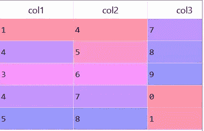
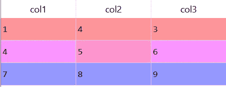
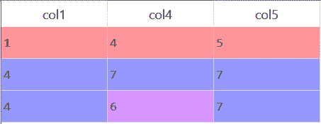
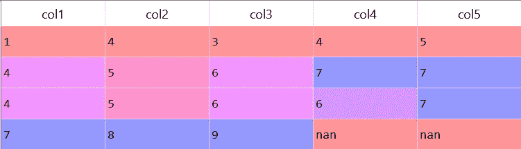
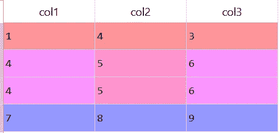
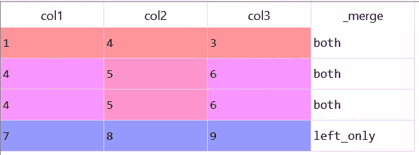
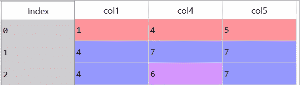
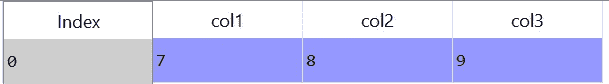

# 使用 Python 的初学者的数据框架

> 原文：<https://medium.com/analytics-vidhya/dataframe-for-beginners-using-python-e29a370c1d97?source=collection_archive---------36----------------------->


我知道当我有数千行要管理和实现操作时，我很难处理数据帧和管理时间复杂性，所以这里有一些内容供初学者查看和练习，以建立一些信心。

我们先来了解一下数据框，你用过微软 excel 吗？如果是，那么你可以跳过这一部分。如果为否，则数据帧是一个类似二维数组的结构，其中列包含变量，每行包含一组值。在下图中，col1、col2、col3 是列变量。



让我们从创建一个数据帧开始，

```
import pandas as pd
df1 = pd.DataFrame([[1, 4, 3], [4, 5, 6], [7, 8, 9]], columns = [‘col1’, ‘col2’, ‘col3’])
```

上面的命令将创建一个数据帧，看起来像这样:



现在，我们有两个数据帧，


数据帧— df1



数据帧— df2

在向任何数据帧合并或添加行时，首先我们需要忘记循环。不，对于数据帧，O(n)不是一个好方法，我们可以使用 O(1)。这就是 DFs 派上用场并为我们节省大量时间的地方。

假设我们需要**合并基于列-1 的 df1 和 df2** ，首先出现一个问题，我们需要如何合并-左？对吗？内心？还是外？这些是连接的类型，如果我们没有提到它会自动检测内部连接。下面的命令显示了内部连接。

```
df1 = df1.merge(df2, left_on = ‘col1’, right_on = ‘col1’, how = ‘left’)
```

在“左 _ 开”和“右 _ 开”中，我们提到了要考虑连接的列。这里，我们基于列“col1”进行连接，df1 与 df2 合并。现在，数据帧看起来像



现在，如果我们不希望 df2 的列包含在 df1 中，那么代码将看起来像-

```
df1 = df1.merge(df2['col1'], left_on = 'col1', right_on = 'col1', how = 'left')
```

由此，我们只能看到“列 1”、“列 2”和“列 3”。df2['col1']合并时我们只包含了' col1 '。看看下面的图片就知道区别了。



有时，您需要知道哪一行出现在 df1 和/或 df2 中。为此，我们使用一个指示符，这有助于我们增加一列，说明“仅左”、“仅右”或“两者都有”

```
df1 = df1.merge(df2['col1'], left_on = 'col1', right_on = 'col1', how = 'left', indicator = True)
```



带指示器的数据框

现在，如果我们需要删除行 where _merge = 'left_only '，添加一个' query '和 drop-merge 列。

```
df1 = df1.merge(df2['col1'], left_on = 'col1', right_on = 'col1', how = 'left', indicator = True).query("_merge == 'left_only'").drop('_merge',axis = 1)
```


仅用 left_only 删除合并

现在，我应该告诉你每一行都有一个索引，所以如果你正在使用 **anaconda** 的话，无论如何你都可以看到它，下面是有索引的图片。



图 1


图 2

**图 2** 是“仅左合并”的图像。但是，索引值是 3 而不是 0。原因是，每一行都有一个唯一的索引值，所以如果删除其他行，索引值不会改变。但是，在每次合并操作后重置索引是一个很好的做法。遵循代码片段。

```
df1.reset_index(drop = True, inplace = True)
```



这是它看起来的样子，为什么我用了 **inplace = True** ？当我们分配一些任务时，我们必须将它保存到变量中，这里我们使用相同的变量来分配更改，它类似于

```
df1 = df1.reset_index(drop = True)
```

**将列**添加到 DataFrame，让我们考虑原始的 df1(第一个图像)。

```
df1['col4'] = ''
```

创建名为“col4”的新列时，所有行值都为空。

**Drop a column** ，当你需要用一个数据框应用几个任务时，这个就派上用场了。在下面的代码片段中，我使用了 axis = 1 来搜索列中的名称。

```
df1.drop('col1', inplace = True, axis = 1)
```

**删除行中重复的**值，如果我们需要在特定的列中找到重复的值，那么我们使用关键字“子集”，否则不要使用它。

```
df1.drop_duplicates(subset = 'col1', inplace = True)
```

基于特定列的条件返回行的**索引值**。有时我们需要索引值，然后再使用它们。这是一个代码片段-

```
index_values = df1[df1['col1'] == 1].index
```

在数据帧中，“and”、“or”不起作用，我们必须使用布尔型，使用“&”和“|”就可以了。同样，当我们需要搜索数组中的值时，我们使用“in ”,但是对于数据帧，我们使用“isin”关键字。请参见代码片段。

```
array = [1,4,9]
1 in array
# This returns True but we cannot use this in DataFramesdf1['col1'].isin(array)
# 'col1' has values [1,4,7]''' 
This returns
0     True
1     True
2    False
'''
```

我希望，我已经讲了足够的内容，可以让你从数据框架开始，并建立一些信心。