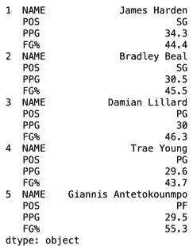

# 使用 Pandas 操作更多数据帧—第一部分

> 原文：<https://medium.com/analytics-vidhya/dataframe-manipulation-using-pandas-part-i-c4e95abfbed5?source=collection_archive---------11----------------------->


作者图片

我在几个月前发表了第一篇博客，命名为“[使用 Pandas](/me/stats/post/221e12db08b6) 的基本数据帧操作”，在这篇博客中，我试图给出一些提示并展示我经常使用的简短工作流程。大部分内容(如果不是全部的话)是为初学者准备的，所以我决定再写一篇，用稍微复杂一点的函数和方法，我把它分成两部分，这样就不会让一篇超长的博客冗长乏味。

我将再次尝试这样做，从创建我自己的数据框架(df)开始，然后尽可能多地使用它，试图将它保持在最高中级水平。稍后，在这篇博客的第一部分和第二部分发表后，我将集中精力在一个有真实数据的项目之后写一篇文章。

我将涉及的内容如下:

1.  从字典创建数据帧
2.  配置和设置
3.  组合数据帧
4.  重塑您的数据框架
5.  使用日期时间模块
6.  使用 groupby()方法/函数
7.  切片使用。loc 和。iloc

如果当我完成第二部分的时候，我发现水平不够高，那么我会修改这个内容，并在这个博客中编辑它，这样它们就都是连贯的。

因为我是一个超级篮球迷，我将再次使用 NBA 的数据，但这一次我将从 2019-2020 年最近结束的赛季中获取统计数据，我将使用前 25 名得分手。说完这些，让我们直接进入内容。

**1。从字典创建数据帧**

在我看来，用篮球数据列表来创建数据框架最简单的方法是通过字典，当然前提是你不需要处理大量的列表。如果您有大型数据集，这显然不是创建 df 的最有效的方法，但是对于 25 行(每个玩家一行)这样的小数据集，这就行了。

你可以在下面的要点中看到，我从 [NBA](https://www.nba.com/stats/players/traditional/?DateFrom=12%2F12%2F2020&DateTo=12%2F12%2F2020&PerMode=Totals&sort=PTS&dir=-1) 主网页上创建了 10 个与球员名字相对应的列表和一系列统计数据。然后我创建了一个名为“stats”的字典，在这里我分配了键和值，键是我未来 df 的列/特性的名称。随后，我使用 pandas DataFrame 创建函数，并将我的输出命名为“nba”。在最后一行(17)你可以看到我已经调用了“25”。我这样做是为了能够看到将和我一起工作的 25 名球员。

从一系列列表创建数据帧

运行这段代码给了我名为“nba”的 df，你可以在下面的图 1 中看到我选择的所有统计数据。在我上面分享的那个链接上，你会发现更多的信息，如果你想创建更大的数据框架，你可以手工抓取或复制这些信息。


图一。NBA 2019-2020 年 25 名最佳射手数据框

我不喜欢输出 df 的一个小细节，那就是索引起始编号(图 1 中最左边的一列)。默认情况下，它以“0”开头，但因为我使用的是顶级射手，所以给“詹姆斯·哈登”一个“0”而不是“1”感觉不太对。因此，我将修改它，从 1 开始，代码如下:

```
df.index = df.index + 1
```

**2。配置和设置**

我经常做的一件事是根据我运行的项目来配置我的数据框架。有时我想显示更多或更少的信息，或者我只想让我的所有数据框架在报告中看起来都一样。这样做很简单，我认为这是一个初学者水平，但我仍然会在这里补充，因为我没有在我以前的博客上这样做，这是我经常做的事情。

你会发现在 Pandas 中，你有很多选择来定制你的数据框架。如果你想进一步探索的话，我会用例子来说明一些常见的，并给你留下这个[链接](https://pandas.pydata.org/pandas-docs/stable/user_guide/options.html)供你阅读。

**2.1 最大行数&最大列数**

设置行和列非常方便。例如，如果您有太多的行和/或列，您可以将最大数量设置为一个较大的数字，以便显示所有的行和/或列，或者相反，您可能只想看到其中的几行和/或列，如图 2 所示。如果不修改，默认设置为 20。实现这一点的代码非常简单:

```
pd.set_option(‘display.max_rows’, 6, ‘display.max_columns’, 6)
```

这里的限制是，如果您减少数字，那么您可能会丢失大量信息，因此这对于您希望保持整洁的报告或其他文档，或者当您非常熟悉您的数据框架时非常有用。

**2.2 精度**

精度设置输出数字显示小数。根据我们现有的数据，我们只有 1 位小数，所以让我们强制它为“0”，这样您就可以看到它的效果(图 2):

```
pd.set_option(‘precision’, 0)
```

**2.3 尺寸**

Dimension 也是直截了当的，因为它在左下角打印出数据框的大小/形状(图 2)。代码与前一个代码一样，但只有两个选项，即 True 或 False 调用:

```
pd.set_option(‘show_dimensions’, True)
```

**2.4 max_colwidth**

这对应于 Pandas 数据结构的 repr 中一列的最大宽度。当列溢出时，输出中会嵌入一个“…”占位符(图 2 ),您可能在拥有超过 20 列的 df 中见过这种情况。“无”值表示无限制。同样，代码非常简单:

```
pd.set_option(‘max_colwidth’, 8)
```

正如您所想象的，您不需要为您想要设置的每个参数/选项写一行，您可以像下面的要点所描述的那样，在一次调用中添加所有参数/选项，并且您所做的任何修改都可以通过使用下面的代码(在要点上方)重置回其默认值:

```
pd.reset_option(‘^display’)
```

数据帧选项设置要点


图二。数据帧，参数设置为最多 6 列和 6 行，无小数，显示形状在左下角，最大列宽为 8。行号也被修改为从 1 开始。

图 2 显示了我们上面设置的所有选项的输出。请记住，如果您想要遵循这个工作流，您将需要在这一点上重置 _options，以便您保留默认参数，并可以遵循我将使用的其余方法。

**3。组合数据帧**

有了 Pandas，在 join/merge 类型的操作中，有各种方法可以轻松地将带有不同类型的集合逻辑索引和关系代数功能的数据帧组合在一起。让我们来看看我认为最有用的三个:

**3.1 拼接**

串联可能是最常用的一种，它可以被视为一种简单的堆叠，可以水平或垂直进行。为了向您展示它是如何真正工作的，我创建了适合目的的单独的数据帧，用于“连接”以及“合并”和“附加”。我将在每个方法中添加一个要点，这样您也可以从原始方法中重新创建它们，从下面的要点开始，这将为您提供如图 3 所示的数据框架。

为连接练习创建数据帧


图 3。通过对原始数据帧切片而创建的两个数据帧。上面的对应 nab_1，下面的对应 nba_2

用下面的代码垂直连接 nba_1 和 nba_2 相当简单:

```
nba_1_2 = pd.concat([nba_1, nba_2], axis = 0)
nba_1_2.head()
```


图 4。通过垂直连接 nba_1 和 nba_2 得到的数据帧

现在我们已经看到了垂直连接是如何完成的，让我们看看水平连接，它基本上是相同的代码。再一次，下面你会发现要点和必要的代码来重现我将使用的数据帧，如图 5 所示。

如果您查看图 5 中的数据帧，您会发现好像我把它分成了两个独立的部分。事实上，这就是我使用上述要点中的切片所做的。因此，水平连接它们(下面的代码)，基本上将它们重新连接在一起，如图 6 所示。


图 5。通过切片创建的数据帧，用于水平连接练习。左图对应 nba_3，右图对应 nba_4

```
nba_3_4 = pd.concat([nba_3, nba_4], axis=1)
nba_3_4.head()
```


图 6。水平连接 nba_3 和 nba_4 的结果

**3.2 合并**

连接是简单直接的，现在合并稍微困难一些，但是也更强大。为此，您需要在两个数据框架之间使用一个公共属性/特征作为连接点。在许多情况下，如果两者都不存在，你甚至可能不得不设计它。

下面是为合并重新创建数据帧的要点，正如您所看到的，它们都有一个共同的列“NAME”。图 7 和图 8 显示了合并后的输出。


图 7。为合并练习创建的数据帧。左一对应 nba_6，右一对应 nba_7。

在下面的代码中，为了合并数据帧，您会注意到有三个参数需要填写。第一个是将在左边的 df，第二个是右边的 df，第三个对应于用作连接点/列名的内容。

```
nba_8 = pd.merge(left=nba_6, right=nba_7, on=’NAME’)
nba_8.head()
```

图 8 显示了合并输出，正如您所看到的，它们已经使用“NAME”列合并，并且考虑到了所选择的左右 df 输入。


图 8。合并 nba_6 和 nba_7 的输出

**3.3 追加**

连接和合并非常简单，只要您不需要为合并设计您的“连接”,但是。append()可能是最简单的。“append()”用于将其他数据帧的行附加到给定 df 的末尾，返回新的 df。如果碰巧有一列不在您试图追加的行中，那么这些行将被填充 NaN 值(图 9)。

在这种情况下，我不会添加要点，因为与前几个一样，您将能够重新创建所需的数据框架。


图 9。要附加的数据帧(左右两边)和结果数据帧(下面)

追加的代码可能是最简单的一个(如下)。你选择了你的输出名(nba_11)，然后选择了上面的 df (nba_9)和下面的 df (nba_10)

```
nba_11 = nba_9.append(nba_10)
nba_11
```

**4。重塑您的数据框架**

有几种方法可以重塑 df，使之比其他的更复杂、更强大。我将再次集中讨论我最常用的四种，如果你想了解更多信息，我建议你浏览这个[链接](https://pandas.pydata.org/pandas-docs/stable/user_guide/reshaping.html)

和前面的例子一样，我创建了更小的数据框架来分别显示每个整形函数/方法的效果。

**4.1 通过熔化进行整形()**

这是一个非常有趣的函数，它将 df 转换成一种格式，其中一列或多列是标识符变量，而其他列则与行轴分离，留下一两个非标识符列“变量”和“值”。如果您愿意，可以像我一样重命名这些新列(变量和值)(代码如下)

首先，我将原始的 nba df 切片并向您展示它的输出(图 10):

```
nba_12 = nba.iloc[0:3, 0:5]
nba_12.head(3)
```


图 10。从原来的 nba 中切下了减少的 df

有了上面的 df(图 10 ),我将选择保留变量“NAME”和“POS ”,并融合其余的。我还将变量和值的名称分别改为“Stats”和“Values”(参见下面的代码)。结果如图 11 所示。

```
nba_12 = nba_12.melt(id_vars=[‘NAME’, ‘POS’], var_name=’Stats’, value_name=’Values’)
```


图 11。图 10 中熔化数据帧的结果

正如你所看到的，融合把 3 个属性加到了 1 个，我们现在得到了一个相当大的 df，但是所有的属性都在一个栏里。

**4.2 通过枢轴整形()**

Pivot 是重塑数据帧最常用的函数之一，也是我最喜欢的函数之一。基本上它所做的是在两个维度上聚合。在我们应用 melt()后创建的例子中，pivot 变得非常方便。在这种情况下，它将允许我们重组“Stats”列中描述的那些类别，并重新组织 df。

应用透视非常简单，您需要定义新的“索引”、“列”和“值”，如下面的代码所示:

```
nba_13a = nba_12.pivot(index=’Stats’, columns=’NAME’, values=’Values’)
```

输出如图 12 所示


图 12。旋转由上一练习中的熔化()产生的 df 的结果

我相信您已经注意到，您可以轻松地使用您的索引、列和值，并以非常高效和快速的方式做有趣的事情。有了支点，如果你愿意，你可以很容易地进行转置。请看图 13，这次我不会给出答案，因为它非常简单。


图 13。由熔化产生的旋转 df 的不同结果()

**4.3 通过堆叠和拆堆进行整形**

stacking()和 unstacking()方法与 pivot()方法密切相关。stacking()旨在与多索引对象协同工作。堆叠旋转一级列标签，返回一个带有新的最内层行标签索引的 df，而拆分则是相反的操作，它旋转生成一个带有新的最内层列标签的整形 df。

在这个练习中，让我们用下面的代码从原来的 new df 中切割出一个新的 df(输出如图 14 所示):

```
nba_14 = nba.iloc[0:5, 0:4]
```


图 14。从原来的 nba 联盟中切割出新的 df

堆叠这个 df 非常简单，如下面的代码所示(结果如图 15 所示):

```
nba_14_stack = nba_14.stack()
```



图 15。图 14 显示了叠加测向的结果。

你可以看到，它基本上分解了每个球员/名字的所有统计/类别，并做出了完全不同的显示(图 15)。恢复这一点很容易，我相信你可以想象…我们如何使用' unstack()'方法(代码如下)。我不会显示结果，因为它们与图 14 中显示的结果相同。

```
nba_14_unstacked = nba_14_stack.unstack()
```

**4.4 通过转置进行整形**

移调一个 df 非常有用，甚至比之前所有的方法都简单。你只需要用字母“T”或者。转置()。下面的代码显示了一个 df 是如何从原来的 nba 中切分出来的，以及它是如何使用 T 转置的(图 16)。

```
nba_15 = nba.iloc[0:10, :]
nba_15 = nba_15.set_index(‘NAME’)
nba_15 = nba_15.T # or nba_14.transpose()
```


图 16。将 nba 原始数据切片生成的 df 进行移调的结果

转置的结果基本上是轴的改变，其中列名随着新定义的索引(“名称”)改变了位置。如果我没有定义一个新的索引，你将会用默认的数字索引来代替你的列名。

这就是操作数据帧的第一部分。我希望你喜欢这个。一如既往，如果您有任何反馈或问题，或者甚至有任何您想在第二部分看到的内容，请随时给我发消息，我希望从现在起一周内可以发布。这是我的 [Linkedin](https://www.linkedin.com/in/jaherbas-ds-geophysicist/) 和 [GitHub](https://github.com/JaHerbas/Working-with-DataFrames---Part-II) ，在这里你会发现更多我玩过的东西。