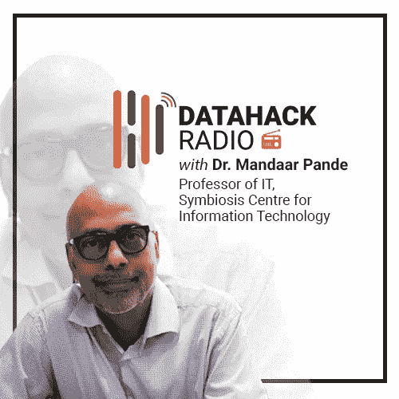

# DataHack 电台#14:曼达尔·潘德博士的量子计算和量子机器学习

> 原文：<https://medium.com/analytics-vidhya/datahack-radio-14-quantum-computing-and-quantum-machine-learning-with-dr-mandaar-pande-c81f47862d1e?source=collection_archive---------1----------------------->

# 介绍

量子计算和量子机器学习——我们大多数人都在某个时候遇到过这些概念，但没有机会深入研究。但是，如果我告诉你，这些可能会破坏我们看待和使用技术的方式呢？

在 DataHack 广播播客的第 14 集，曼达尔·潘德博士加入了我们，他带领我们穿越量子计算的奇妙复杂的世界。这里有一个令人震惊的事实，让你知道会发生什么:

> *“一台 300 量子比特的量子计算机的比特数将比宇宙中已知的原子还要多。”——曼达尔·潘德博士*

在我在 2018 年 DataHack 峰会上亲自见到 Mandaar 博士之前(他也在会上谈到了这个话题)，我对量子计算机是什么以及它们可以处理的巨大能量只有一个模糊的认识。但是你很快就会发现，幕后还有很多你可能从未想到的事情。

我已经简要介绍了这一集讨论的主要话题，但真正的快乐和知识在于聆听曼达尔博士本人。

*今天就订阅 DataHack 电台，在以下任何一个平台上收听这一集以及之前的所有剧集:*

*   [**音云**](https://soundcloud.com/datahack-radio)
*   [**分析 Vidhya**](https://www.analyticsvidhya.com/blog/category/podcast/)
*   [**iTunes**](https://itunes.apple.com/in/podcast/datahack-radio/id1397786677?mt=2)

# 曼达尔·潘德博士的背景

Mandaar 博士拥有海德拉巴大学的理论物理学博士学位，专攻非线性光学。1994 年获得博士学位后，他在比特皮兰尼的 EEE 系(电气工程系)担任了四年的讲师。

有经验的人会记得，这是在 90 年代末，当时它开始在印度兴起，曼达尔博士决定冒险探索学术界以外的其他途径。他于 1998 年加入 Tech Mahindra，成为建模和模拟中心的一员。在那里，他担任绩效工程和管理领域的小组负责人和首席顾问。

在 Tech Mahindra 工作了 12 年后，他在 Wipro 工作了 7 年，先是担任首席架构师，然后担任性能工程(质量工程和测试)的全球实践主管。如你所知，曼达尔博士在这个领域的经验非常丰富，没有多少人能与他的经验和知识相媲美。

但对于曼达尔博士来说，他觉得在某个时候重返学术界是不可避免的，去年他加入了共生组织，成为了该组织的教授。

# 对量子计算和量子机器学习感兴趣

那么，他对量子计算和机器学习的兴趣和热情在哪里呢？在 Wipro 的最后几年，他接触了一些数字化的工作方式(数据科学是其中很重要的一部分)。他在那里工作时建立了兴趣，并在返回共生学术界期间保持了这种兴趣。

他的量子光学博士学位显然在他从事量子计算的时候有所帮助。但是这个领域到底是什么？它是如何与机器学习联系在一起的？让我们听听曼达尔博士自己的说法:

> *“量子计算是量子物理学、信息科学以及功能理论的交叉领域。量子计算在不久的将来最大的应用之一将是量子机器学习。”*

# 学习量子计算需要具备哪些关键特征？

这是一个很难回答的问题，也是一个自从我听说这个话题后就一直想知道的问题。以下是曼达尔博士提到的两个要点:

*   数学和物理的扎实基础(和兴趣)。在这方面，曼达尔博士的理论物理学博士学位是一大福音
*   能够以不同的方式思考，并表现出长期应对挑战的耐心。人们倾向于在某个时间点后放弃，这在像这样一个新生的、研究密集的领域是不行的

还有很多，但是如果你在这两个方面没有一个坚实的基础，那就几乎不可能取得进展。

# 但是量子计算到底是什么呢？

我们目前使用的数字设备，如电脑和智能手机，都使用金属芯片(基于集成电路，而集成电路又基于晶体管)。无论我们今天做什么计算，包括我们捕获的数据和我们执行的分析，都是使用我们在这些晶体管中看到的 2 位来完成的——0 和 1。我们写的任何算法最终都会在机器层面上被分解成 0 和 1。

在最基本的层面上，量子计算中支配自然的物理原理遵循量子力学定律。那么什么是量子力学呢？这是物理学中的一个理论，它在最小的水平(原子和分子)上描述了自然。在这个非常基本的层面上，这些粒子的行为非常不同。

现在，有几件事非常重要，需要理解:

*   与基于比特的经典计算机不同，量子计算机基于量子比特(量子比特)
*   我们传递给经典计算机的任何指令都会被顺序解决(尽管 GPU 和 TPU 的崛起)。在量子计算中，并行性的概念开始发挥作用

这只是曼达尔博士在播客中描述的一个例子。他用例子将这个复杂的主题分解成易于理解的信息。如果你曾经想知道量子计算机是如何从头开始工作的，这一部分会让你感觉像中了大奖。

# 我们能给量子计算何时成为主流定一个时间表吗？

普遍的看法是，我们可能需要 15-20 年才能看到量子计算成为主流并变得大众化。

但是正如曼达尔博士指出的，这些事情并不是一成不变的。一项重大突破有可能打开大门，加快时间线(正如我们最近在深度学习和人工智能方面看到的那样)。但在那之前，量子计算仍将是像 IBM 这样的大机构的领域。

# 量子计算对机器学习的影响

据曼达尔博士介绍，现在大多数经典的机器学习和深度学习算法都有一个量子等价物。他举了一个感知器的例子，它也可以作为量子感知器使用。此外，曼达尔博士提到了看待量子 ML 的四种方式:

*   **CC:** 在经典计算机上运行经典的 ML 算法(这就是我们目前的情况)
*   **CQ:** 在量子计算机上运行经典的 ML 算法
*   **QC:** 在经典计算机上运行量子 ML 算法(这是目前正在研究的)
*   在量子计算机上运行量子 ML 算法(这还有很长的路要走)

# 结束注释

那是充满力量的一集！曼达尔博士告诉了我们很多关于我们大多数人在职业生涯中隐约听说过的话题。除了我在这里提到的几点，对话还涵盖了量子计算中的挑战，经典计算机可能比量子计算机更好的领域，为了在该领域获得牵引力需要了解的非常具体的要求列表，什么是量子互联网(非常酷的概念！)，还有其他的。

*原载于 2018 年 12 月 21 日*[*www.analyticsvidhya.com*](https://www.analyticsvidhya.com/blog/2018/12/datahack-radio-quantum-machine-learning/)*。*