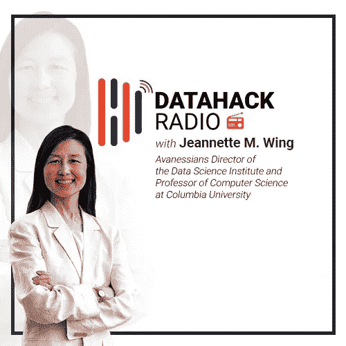
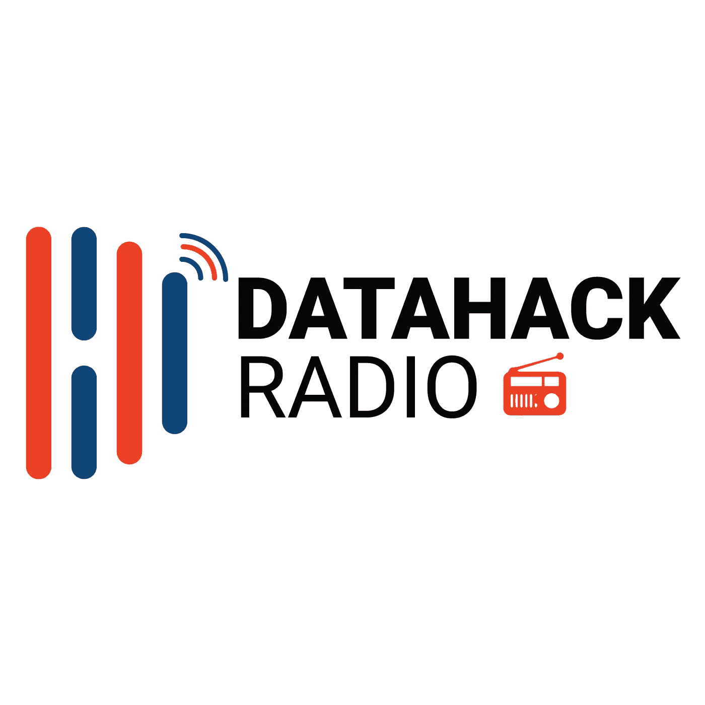

# 数据黑客电台#10:计算机科学在数据科学世界中的作用，珍妮特·M·温博士

> 原文：<https://medium.com/analytics-vidhya/datahack-radio-podcast-computer-science-data-science-bd8e00715b5e?source=collection_archive---------2----------------------->

# 介绍

有没有注意到最近激增的数据科学家都是有计算机科学背景的？这不是巧合。这两个领域本身就很重要，但是当它们融合在一起时，就会产生强大的效果。

我们很高兴地宣布，我们的数据黑客广播播客第 10 集的发布不是别人，正是珍妮特·M·温教授！她在学术界和业界拥有超过 40 年的经验，没有人比她更适合就计算机科学如何发展，以及它如何与数据科学世界相融合给出观点。

我在下面简要总结了这一集的要点。我建议收听播客，以真正感受计算机科学和数据科学在一起使用时是多么强大的组合。享受这一集吧！

*现在就订阅 DataHack 电台，在以下任何一个平台上收听这一集以及之前的所有剧集:*

*   [**音云**](https://soundcloud.com/datahack-radio)
*   [**分析 Vidhya**](https://www.analyticsvidhya.com/blog/category/podcast/)
*   [**iTunes**](https://itunes.apple.com/in/podcast/datahack-radio/id1397786677?mt=2)

# 永贞教授的背景

Wing 教授从小就对数学和工程非常着迷。她去了麻省理工学院的研究生院，并开始在那里主修电子工程。在大学的最初几天，她接触了计算机科学领域，这促使她改变了专业。从那时起就没有回头路了。

她在麻省理工学院(在那里她也成功地完成了计算机科学博士学位)工作过，在加入卡内基梅隆大学之前，她在南加州大学工作了几年。她曾两度担任卡内基梅隆大学的计算机科学系主任。在这两次任职期间，她在国家科学基金会(NSF)工作。

在她第二次担任卡内基梅隆大学系主任期间，微软找到了她，她在 2013 年接受了一个职位。加入后不到一年，她就负责了所有的基础研究实验室，包括硅谷、纽约、班加罗尔和北京等地的实验室。

去年，哥伦比亚大学给了我一个再次在学术界工作的机会。在哥伦比亚大学，她是 Avanessians 数据科学研究所的主任和计算机科学教授。她直接向大学校长报告。

# 使用形式方法技术改进机器学习算法

尽管在计算机科学领域已经做了几十年的研究来正式展示如何证明一个程序是正确的，但这都是关于数理逻辑的。数据科学现在带来的是证明一个属性相对于固有的概率和统计方法如何正确的复杂性。

Wing 教授坚信，许多新的数据科学方法都应该用形式化方法技术重新审视。对于正式方法社区来说，使用这些概念来帮助数据科学发展是一个挑战，这还没有发生。

如果你不知道，正式方法是基于数学的技术，特别是在计算机科学中使用。你可以在这里阅读更多关于他们的信息。

# 学术界和微软的研究项目

Wing 教授目前在哥伦比亚大学的角色是与人工智能社区合作，以了解需要什么方法和逻辑来指定这些机器学习模型应该具有的相关属性。她觉得这将有助于为未来构建安全可信的人工智能系统，这是 Wing 教授大力倡导的一个主题。

正如我上面提到的，在微软，她在多个地方负责几个研究项目。尤其是班加罗尔实验室有几大优势:

*   理论计算机科学，以及
*   面向新兴市场的技术

# 在学术界和工业界工作的区别

> *“我本质上只是一个学者。”Wing 教授*

刚接触数据科学的人经常会问一个问题——“在学术界工作和获得行业经验有什么不同”？Wing 教授很友好地谈到了这个话题。

她呼应了一种普遍的看法，即做一名学者有其独特的优势。**你有更多的自由去探索一些问题，比如某样东西为什么会工作，而不是仅仅关注它是如何工作的**(这是大多数行业角色都会发生的事情)。计算机和数据科学的科学部分来自研究和学术界，远远超过工业。

# 未来 5 年，计算机科学和数据科学将走向何方？

*   Wing 教授认为，未来几年，人工智能、大数据和数据科学将在几乎所有领域变得更加普遍
*   量子和生物系统是我们应该更加关注的领域
*   像自动驾驶汽车这样的网络物理系统将成为我们生活中不可或缺的一部分
*   当然，解决像偏见和修正算法这样的问题，让社会牢记在心，是研究界应该关注的事情

# 结束注释

在我们的播客上主持荣教授是一种特权。她对形式方法及其在软件行业中的重要作用的解释听起来真的很令人愉快。数学迷一定会喜欢这一集。

快乐聆听！

*原载于 2018 年 9 月 17 日*[*【www.analyticsvidhya.com】*](https://www.analyticsvidhya.com/blog/2018/09/datahack-radio-data-science-podcast-jeanette-wing/)*。*