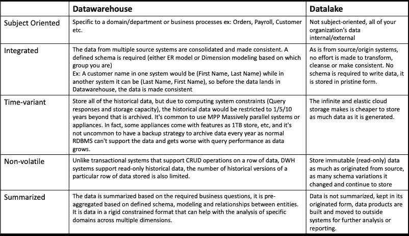

# 数据湖——理解和提取价值的方法

> 原文：<https://medium.com/analytics-vidhya/datalake-an-understanding-and-approach-to-extracting-value-569116a82df7?source=collection_archive---------12----------------------->


大数据的一个十年& Hadoop 和问题类似，*Hadoop 能取代 RDBMS 吗？大数据技术能取代数据仓库系统吗？datalake 是打破数据孤岛和突破性分析的最佳答案吗？*

这里不是提供答案(反正你知道)，而是理解和从数据湖中构建和提取价值的方法。

回到数据仓库的定义，数据仓库系统是一个决策支持系统，它基于对来自操作系统的事务数据的汇总分析来帮助企业做出决策。分解这个

*   **决策支持系统** —该系统支持基于过去数据和预测(如果有)的基于事实的业务决策。事实不是近似值，但顾名思义，它们是事实和确定的。
*   **聚合分析** —大部分分析都是聚合，你不会问“乔在 2020 年 2 月 14 日下午 4 点在 XYZ 商店买了什么”这样的问题。你的问题通常是“在过去 5 年中，2 月 14 日情人节的红色产品销售趋势是什么，明年的预测是什么”。

设计数据仓库的主要架构实践[比尔·恩门的](https://en.wikipedia.org/wiki/Bill_Inmon)和拉尔夫·金博尔的[在高层次上不同于自顶向下或自底向上的方法，但对 Inmon 定义的数据仓库特征有类似的看法，即 ***“数据仓库是面向主题的、非易失的、集成的、时变的数据集合，以支持管理层的决策”*。**](https://en.wikipedia.org/wiki/Ralph_Kimball)

数据仓库的特征在数据湖的上下文中很重要，因为数据湖现在被吹捧为突破性分析的系统。



比较数据仓库和数据湖的特征

我们经常听说数据是 21 世纪数字经济的石油。我们日常生活中使用的石油，最初是以原油的形式从地下开采出来，然后被运输或运到炼油厂。运输的原油包含各种成分，需要提炼和转化才能制成对消费者有用的一系列产品。

将数据类比为石油，来自源系统的原始形式的数据被移动到中央存储库，在那里使用不同的方法对其进行提炼，以产生对业务有用的数据产品。

## 数据湖的正式定义是

```
**A Datalake is a centralized, secured & cataloged repository of data in its source system’s form, accumulated in a cheap storage system. Using polyglot tools, the data in its source format is refined and transformed to produce data products.**
```

分解这个

*   **集中化** —所有数据都在一个位置，内部组织数据和外部数据都在一个位置，这有助于结束数据孤岛。
*   **安全** —将所有数据放在一个位置赋予组织巨大的权力，权力越大，责任越大，因此数据湖将通过强大的身份验证、授权和审计策略得到保护。
*   **编目** —原始/源形式的数据应至少编目，这对于发现数据很重要，如果没有这种重要活动，数据湖就会变成数据转储。编目包括提取模式和对模式中的变化进行版本控制，仅此而已。
*   **源系统格式** —数据必须保持其原始格式，因为它来自源系统。与事务性系统不同，数据湖中的数据是不可变的和只读的。数据的所有版本都被存储，没有任何内容被更新、更改或丢弃。在限定输入数据集时，最好使用术语**“源系统的形式”**而不是 native 或 raw，术语 native/raw/basic 并不表示是否应用了转换。
*   **在廉价存储系统中积累** —由于当前和未来收集的数据将会非常庞大，因此拥有一个非常廉价的存储系统以及一个分层存储系统非常重要。
*   **使用多种语言的工具进行提炼和转化** —提炼后的原油中提取出成千上万种产品，每种产品都有特定的提取过程，这就是为什么炼油行业会有几个足球场大小的巨大工厂，而上游的钻井行业却没有。没有一种工具是将数据湖中的数据转化为数据产品的理想或最终解决方案。工具的选择将取决于预期的结果，按照使用障碍从低到高的顺序排列。

```
**SQL** — for business analysis, this is a must and minimum, the success of datalake implementation depends on this, ignore this at your peril.**Python/Java/Machine Learning libraries** — for advanced processing**API’s** — for automation & operationalization
```

*   **按需和自动扩展计算** —避免长期运行的基础设施/集群，即每次实验后都要获取、使用和丢弃的计算能力。
*   **数据产品—** 数据湖实验的结果就是数据产品。反过来，数据产品为组织提供了突破。数据产品可以是

```
* A Machine learning model
* A probabilistic, non-deterministic model of the data
* Aggregated analysis that can feed to data warehouse systems
* A data quality assessment of the organizational data
* A curated dataset that is cleaned, transformed and corrected for inconsistencies.
* A segmented dataset to be used for target marketing or a study.
* An operational process to generate a machine learning model.
```

[](/@vijay_b/a-work-breakdown-structure-wbs-for-big-data-analytics-projects-part-1-db4c2a8179fd) [## 大数据分析项目的工作分解结构(WBS)——第 1 部分

### 有没有想过大数据项目涉及哪些活动？工作分解结构(WBS)有助于选择…

medium.com](/@vijay_b/a-work-breakdown-structure-wbs-for-big-data-analytics-projects-part-1-db4c2a8179fd) 

## 数据湖的禁忌

*   *当源数据到达 datalake 时，不要转换/更改/纠正源数据中的不一致，保持其源格式。*
*   *不要直接从 datalake 进行业务分析报告，使用计算能力来准备数据集并输入到您的数据仓库系统。*
*   不要在 datalake 的数据集上构建星型模式或雪花模式。
*   *设计数据湖时不要推迟安全设计，安全设计必须是数据湖设计的一部分。*

大多数情况下，分析 datalake 中的数据就像大海捞针。对于每个实验来说，都有可能发现黄金，有时什么也没有，所以保持实验的低成本。

***数据湖是低成本实验的场所，这些实验可以产生突破性的数据产品(预测模型、新见解等)，如果做得正确，对企业来说是一种竞争优势。***

**相关** : [了解设计实时流分析应用时的权衡](/@vijay_b/understanding-tradeoffs-in-designing-real-time-streaming-analytical-applications-f1ddbc852d77)

*免责声明:所有表达的观点都是我个人的独立想法，不归因于我现在或以前的雇主。*