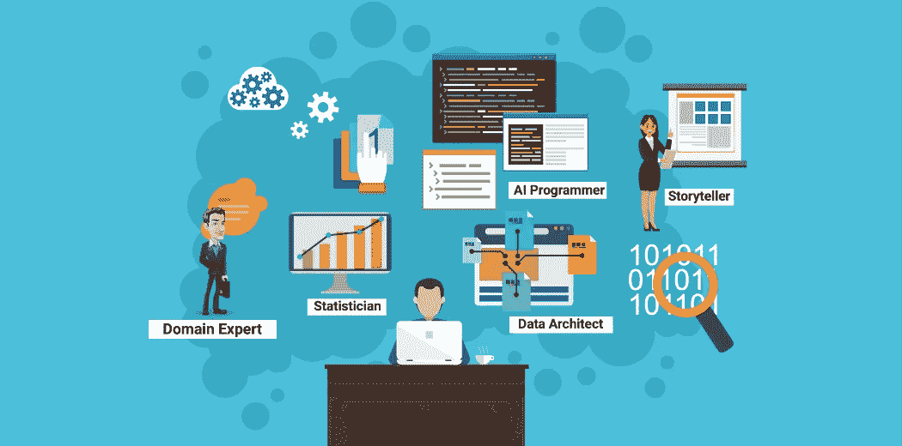
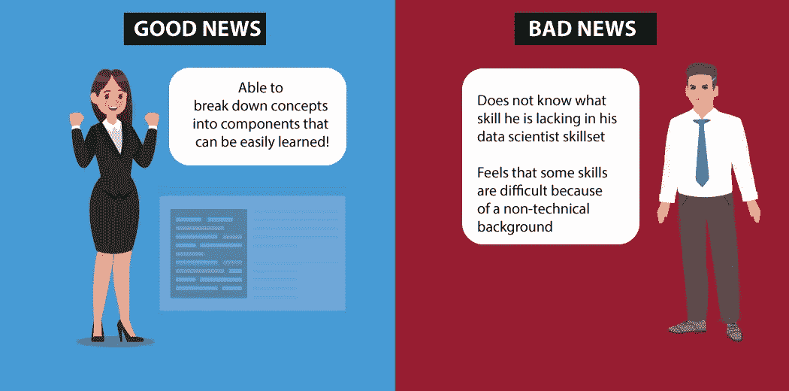
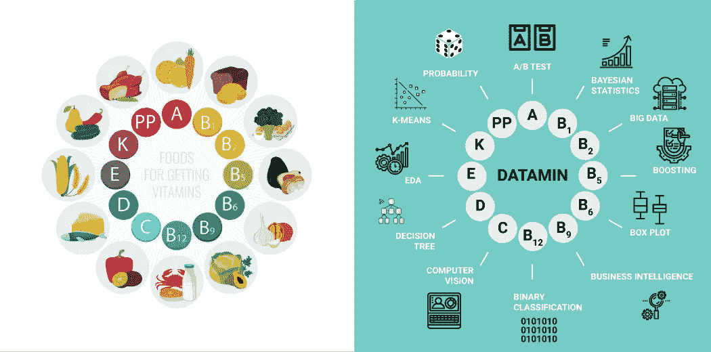

# Data min——推出世界上最大的在线数据科学测验平台

> 原文：<https://medium.com/analytics-vidhya/datamin-unveiling-the-worlds-biggest-online-data-science-quizzing-platform-3273ad8d28de?source=collection_archive---------5----------------------->

## 欢迎来到 Datamin！

## 我们很高兴地宣布，世界上最大的在线数据科学测验平台: [Datamin](https://datamin.analyticsvidhya.com/?utm_source=Mediumblog&utm_medium=unveiling-datamin) ！

***你是否觉得你的一些同行在数据科学职业生涯中做得更好，原因你无法解释？***

随着行业、风险资本家、政府和各种其他职能部门的兴趣，数据科学已经扩展到一个非常广泛的领域。随着这种扩张，今天的数据科学家需要展示大量的技能才能胜任这一角色。

一个人需要:

*   ***统计学家*** 解释概率推论
*   **专家程序员**编写人工智能代码
*   **高效的展示者**在商业观众面前展示复杂的 ML 技术
*   一个具有很强的量化技能的人**来评估和优先考虑新的机会**
*   一个**领域专家**将人工智能与业务流程相结合
*   一个**数据架构师**理解复杂的数据模型等。

随着领域的扩展，这个列表会越来越大。这张信息丰富的图片捕捉到了这一多面角色:

这里有好消息也有坏消息。

好消息是，如果你有正确的心态、纪律和每天练习的决心，你可以学会任何你想要的技能。**坏消息**？有抱负的数据科学家面临两大挑战:

*   他们通常无法找出并确定自己技能中需要改进的领域。这种不确定性对你在数据科学领域的职业生涯是危险的
*   由于缺乏相关经验，有些技能你可能一开始很难掌握

第二个挑战，来自非数据科学背景的人，太普遍了。我见过有人半途而废，因为他们觉得自己永远不会提高现有的技能。例如，一个没有工程背景的人可能会觉得他/她可能永远不会成为一名出色的数据科学家，因为他可能永远不会擅长编程。

听起来很熟悉的情况？

# 那么，我们如何克服这两个挑战呢？

这里有几个解决这些挑战的方法，我将用相关的类比来解释:

每个人都知道维生素对我们的身体是必不可少的。如果你与任何身体/精神疾病作斗争，你会简单地开始服用维生素片吗？不是吧？你接受各种维生素的诊断测试，然后开始治疗。

> *同样，数据科学家需要掌握一系列技能要素。为了了解哪个因素阻碍了他/她的成长，数据科学家需要对数据科学的各个方面进行严格的诊断测试。*

一旦你确定了你的知识差距，现在该怎么办？如果你需要掌握的技能看起来无法实现，或者只是花费了你没有的太多时间，该怎么办？

> *事实证明，学习新技能或提高现有技能的时间主要取决于我们的心态。*

看起来太抽象？让我举例说明。在你的一生中，你认为你的学习曲线最陡的时候是什么时候？当你还是个蹒跚学步的孩子时，你可能已经猜对了。你能想出一个理由吗？主要原因是心态。在那个年纪，每一节新课都是一场游戏。通过游戏学习被证明是最快的学习新技能的方式，不管你的年龄如何。

我们 Analytics Vidhya 将这些概念结合起来，并利用我们在数据科学方面的专业知识，创建了一个名为 [Datamin 的新产品，这是您日常所需的数据科学](https://datamin.analyticsvidhya.com/?utm_source=AVblog&utm_medium=unveiling-datamin)。我们现在准备试水，推出产品的测试版。

# Datamin —数据科学的日常剂量

[Datamin](https://datamin.analyticsvidhya.com/?utm_source=Mediumblog&utm_medium=unveiling-datamin) 是一个独特的数据科学测验平台，由行业专家设计。Datamin 将:

*   从不同的数据科学维度对您进行评估
*   通过对每个用户的尝试给出相关的反馈来加速你的学习
*   通过实时社区聊天和“挑战你的朋友”等功能吸引你
*   通过阅读建议实时确定你的机会领域

这些测验将持续一周，对你尝试的问题数量几乎没有限制。如果这还不够的话，**每场比赛都有价值 20 万印度卢比(3000 美元)的奖品。**

您将面临的问题将在与数据科学家最相关的三个主要类别上对您进行广泛测试:

测试平台附带了许多社区参与杠杆和给我们实时反馈的模式。

# 游戏规则

1.  在测验进行期间，您可以随时注册。我们建议您尽早注册，以获得最大的尝试次数
2.  你可以回答不限数量的问题。我们只是把你每天尝试限制在一个非常高的数字，以限制任何机器人。
3.  每个正确答案给你+3 分，错误答案给你-1 分
4.  你回答任何问题的时间是 90 秒
5.  你可以随时查看你在排行榜上的排名
6.  跳过一个问题不会给你任何惩罚或奖励
7.  每周比赛结束后，排行榜上的前几名将获得现金奖励和工作机会

# 为 Datamin 的发布做好准备

[DATAMIN](https://datamin.analyticsvidhya.com/?utm_source=Mediumblog&utm_medium=unveiling-datamin) 将于 2019 年 7 月 25 日(星期四)下午 3 点在 IST 上线。戴上您的数据科学帽子，让您的游戏自我集中起来，准备好进行超快速的学习。

确保你尽快注册，给你自己最多的时间和最多的尝试。请注意，您可以尝试的问题总数没有限制，因此最大化您分数的唯一方法是以高准确度最大化您的尝试。祝你好运，学习愉快！

*原载于 2019 年 7 月 25 日*[*【https://www.analyticsvidhya.com*](https://www.analyticsvidhya.com/blog/2019/07/datamin-unveiling-the-worlds-biggest-online-data-science-quizzing-platform/)*。*