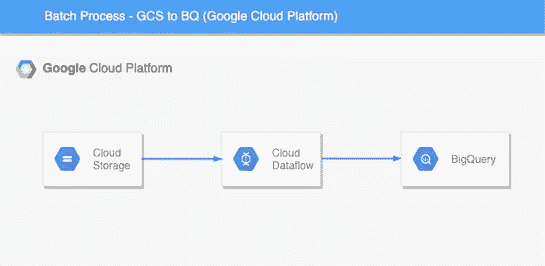
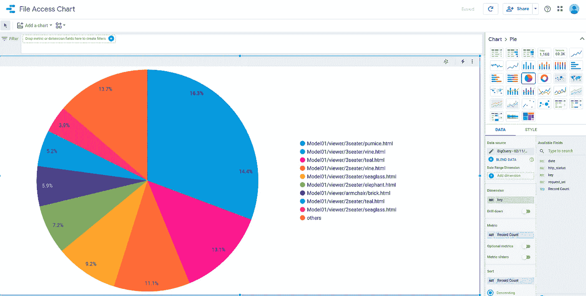

# DataPipeline 使用 Apache Beam 和 Google Cloud DataFlow 作为 Runner，使用 BigQuery 作为 DataSink

> 原文：<https://medium.com/analytics-vidhya/datapiepeline-using-apache-beam-and-google-cloud-dataflow-as-runner-and-bigquery-as-datasink-a6dcfadc8428?source=collection_archive---------8----------------------->



[https://www . Hadoop inrealworld . com/batch-processing-with-Google-cloud-data flow-and-Apache-beam/](https://www.hadoopinrealworld.com/batch-processing-with-google-cloud-dataflow-and-apache-beam/)

在本文中，我们将探讨使用谷歌云平台(GCP)服务创建数据管道。我一直在通过 Coursera 专攻[数据工程、大数据和机器学习进行学习，GCP](https://www.coursera.org/account/accomplishments/specialization/certificate/YM5K5UWD8474) 想自己创造一些课程之外的东西。幸运的是，我得到了一个很好的用例，最近我正在进行 AWS s3 日志分析。我已经用我在 GCP 控制台的免费账户完成了这一切。此外，有一个演练视频添加在最后，执行所有的行动对 GCP！！！

**用例是这样的:**

下载日志→上传日志到 Google 存储→触发数据流

**数据流作业的职责:**

读取日志文件→解析日志文件→写入 BigQuery

**为了什么？**

BigQuery 用于生成 S3 日志所需的报告。

我将提供所有的链接，我已经经历了，而创建这个管道。要理解这其中的每个概念可以通过这些链接: [DataFlow](https://www.youtube.com/watch?v=KalJ0VuEM7s) 、 [Apache Beam Python](https://beam.apache.org/documentation/sdks/python/) 和 [BigQuery](https://cloud.google.com/bigquery/?utm_source=google&utm_medium=cpc&utm_campaign=japac-IN-all-en-dr-bkws-all-super-trial-e-dr-1009137&utm_content=text-ad-none-none-DEV_c-CRE_315806004867-ADGP_Hybrid%20%7C%20AW%20SEM%20%7C%20BKWS%20~%20T1%20%7C%20EXA%20%7C%20Big%20Data%20%7C%201%3A1%20%7C%20IN%20%7C%20en%20%7C%20bigquery-KWID_43700028131581118-kwd-297617549231&userloc_1007880-network_g&utm_term=KW_bigquery&ds_rl=1264446&gclid=CjwKCAiA-f78BRBbEiwATKRRBDt_Kkf6JeH1BGG6KW4wSwbJ6inIYEycBQo6XTirx4DdiInlBZ6cABoCngIQAvD_BwE) 。

**创建完整管道的步骤:**

1.  在你喜欢的地方创建一个谷歌云存储。
2.  在同一项目中创建一个 BigQuery 数据集
3.  创建服务帐户并提供所有者角色
4.  使用 Apache Beam 创建管道
5.  使用 BigQuery 和 DataStudio 分析日志

**谷歌云存储:**

在所选项目的任何所需区域中创建一个存储桶，并记录该区域已被选中。

**创建一个大查询数据集:**

在 BigQuery UI 中，在同一项目下创建一个数据集。

**创建服务帐户:**

创建一个服务帐户，以便从本地计算机与 GCP 服务进行通信。

**使用 Apache Beam 创建管道:**

这在开始时可能有点耗时。这里我们需要用 Java 或 Python 语言使用 ApacheBeam 开源库创建一个管道。这是我用 Python 为上述用例设计的管道。

```
obj = AwsLogParser()
quotes = ( 
        p           
        | 'Read' >> ReadFromText(known_args.input)
        | 'Parse Log' >> beam.Map(lambda line: obj.parse(line))
)quotes | beam.io.gcp.bigquery.WriteToBigQuery(
    obj.table_spec,
    obj.schema,
    write_disposition=beam.io.BigQueryDisposition.WRITE_APPEND,
    create_disposition=beam.io.BigQueryDisposition.CREATE_IF_NEEDED
)
```

该管道包含三个步骤，从日志中读取每一行，然后将其传递给解析步骤。这里的解析主要是解析 s3 日志行，并创建一个与 BigQuery 表模式的列名相匹配的字典。最后一步是将解析后的数据填充到 BigQuery 表中。这里需要注意的一点是:当我们在本地机器上运行任何管道时，将所有数据指定为本地路径的输入和本地路径的输出。同样，当使用数据流运行器运行管道时，需要指定 Google 存储文件路径。我犯了一个错误，通过指定输入的本地路径在云上运行管道。这里的问题是，管道将成功执行，但是由于没有数据，表不会在 BigQuery 中创建。

**和上面运行的命令:**

```
export GOOGLE_APPLICATION_CREDENTIALS="/path/to/your/json_file.json"export PROJECT=your_project_id
export BUCKET=your_bucket_id
export REGION=your_regionpython main.py  \
 --region $REGION   \
 --runner DataflowRunner  \
 --project $PROJECT  \
 --temp_location gs://$BUCKET/tmp/ \
 --input gs://$BUCKET/aws_logs/2020*
```

运行后，我们可以在 GCP 的 Web 用户界面上看到状态。这需要时间，需要一点耐心。

**使用 BigQuery 和 DataStudio 分析日志:**

BigQuery 是 Google 维护的数据仓库。它提供了一个简单的丰富的 MySql 类型的语法方法来分析 Pb 级的数据。

在我们的例子中，我们解析 s3 日志并将所有信息存储在表中。这里为了简单起见，我们将只查询 200 个请求和以 HTML 结尾的关键字。

```
SELECT
  key,
  request_uri,
  http_status,
  date
FROM
  `justlikethat-294122.s3_logs.access_report`
WHERE
  http_status='200' and ends_with(key, 'html')
LIMIT
  1000
```

然后，我们将使用 Google DataStudio 通过一个饼图来实现上述查询的结果。



同样，可以获得任何类型的图表。

**接下来呢？**

一旦使用 Google Datastudio 提供的模板或您自己创建的模板创建了报告，就可以通过使用 iframe 将报告嵌入到相应的网站中，轻松地将其集成到您的网站中。这不包括在这里。

**链接:**

```
[https://medium.com/swlh/apache-beam-google-cloud-dataflow-and-creating-custom-templates-using-python-c666c151b4bc](/swlh/apache-beam-google-cloud-dataflow-and-creating-custom-templates-using-python-c666c151b4bc)[https://github.com/ankitakundra/GoogleCloudDataflow/blob/master/dataingestion.py](https://github.com/ankitakundra/GoogleCloudDataflow/blob/master/dataingestion.py)[https://stackoverflow.com/questions/55694541/error-unable-to-parse-file-when-i-run-a-custom-template-on-dataflow](https://stackoverflow.com/questions/55694541/error-unable-to-parse-file-when-i-run-a-custom-template-on-dataflow)[https://cloud.google.com/dataflow/docs/quickstarts/quickstart-python](https://cloud.google.com/dataflow/docs/quickstarts/quickstart-python)[https://github.com/apache/beam/blob/master/sdks/python/apache_beam/examples/wordcount.py](https://github.com/apache/beam/blob/master/sdks/python/apache_beam/examples/wordcount.py)[https://beam.apache.org/documentation/io/built-in/google-bigquery/](https://beam.apache.org/documentation/io/built-in/google-bigquery/)
```

**演练:**

**尾注:**

做这个完整的流程是一次很好的经历。感觉我做了件很酷的事。我确实有在本地处理多个服务器的经验，但这是一种完全在云中进行的不同体验，代码可在此处获得。就是这个！！！感谢阅读干杯！！！享受编码！！！