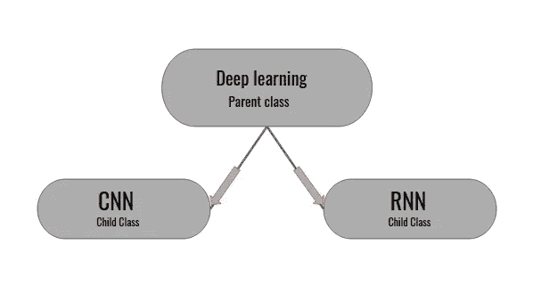
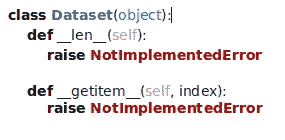
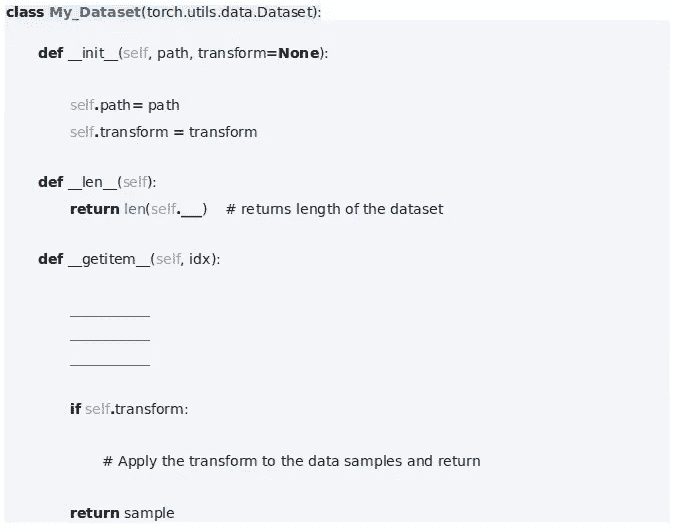
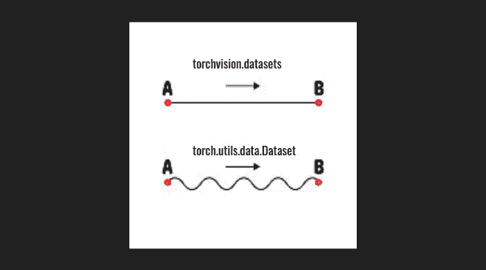

# PyTorch 中的数据集和数据加载器

> 原文：<https://medium.com/analytics-vidhya/datasets-and-dataloaders-in-pytorch-b1066892b759?source=collection_archive---------13----------------------->

## *一个介绍*


T 在实际训练一个模型之前，我们要做的第一件事就是获取数据，清理并准备好这些数据，使它们能够通过我们的模型。我们在这个阶段花费了大部分时间，不仅因为它要求更多，而且我们的模型需要在分配给它的任何任务中实现良好的性能。

为了让这项艰巨的任务变得简单一点，PyTorch 提供了一些工具，包括[数据集](https://pytorch.org/docs/stable/data.html#torch.utils.data.Dataset)和[数据加载器](https://pytorch.org/docs/stable/data.html#torch.utils.data.DataLoader)。本文的重点是清楚地理解这些工具，以便我们能够有效地使用它们。

为了处理数据，PyTorch 提供了一个抽象类形式的数据集类。等等，什么是抽象类？让我们快速浏览一遍。



**父类&子类——直觉**

父类可以被视为其子类的蓝图。子类继承父类的属性。类似地，抽象类是其他类的蓝图，但是这个类包括一组称为抽象方法的方法，这些方法必须在任何子类中创建。关于这些抽象方法要记住的另一件事是，它们在抽象类中声明，但没有任何实现。它们是通过子类实现的。

> 你知道吗？
> 
> Python 有一个名为“ [abc](https://docs.python.org/3/library/abc.html) 的模块，为定义抽象基类(ABCs)提供了基础设施。

回到我们的抽象数据集类，__len__()和 __getitem__()是我们的抽象方法。这意味着无论我们编写什么样的自定义数据集，它都应该覆盖这些抽象方法。我们将很快看到更多关于自定义数据集的内容。

__len__ 方法返回传递的数据集的大小。

__getitem__ 方法将索引“I”作为输入，并返回数据集中的第“I”个样本，如果指定，则对其应用必要的转换。转换作为可选参数传递给我们的数据集类。



**数据集类**

上面显示的[torch . utils . data . dataset](https://pytorch.org/docs/stable/data.html#torch.utils.data.Dataset)类是从 Python 的抽象基类(abc)构建的。让我们看看如何创建一个[定制数据集类](https://pytorch.org/tutorials/beginner/data_loading_tutorial.html)。



**从数据集类创建的自定义数据集**

在上面的代码块中，My_Dataset 是子类， [torch.utils.data.Dataset](https://pytorch.org/docs/stable/data.html#torch.utils.data.Dataset) 是父抽象类。我们通过传递路径和转换来实例化 My_Dataset。

> new _ datset = My _ Dataset(path = ' path _ to _ Dataset '，transform = None)

> 你知道吗？
> 
> 从抽象类派生的类不能被实例化，除非它的所有抽象方法都被重写。这意味着我们必须在子类中使用抽象方法。

如果我们不在子类中使用抽象方法，我们会得到一个“[notimplementererror](https://pytorch.org/docs/stable/_modules/torch/utils/data/dataset.html#Dataset)”，正如我们在上面的 Dataset 类中看到的。

我们看到了如何实现 Dataset 类来创建自定义数据集。我们必须在数据集上迭代，同时将它们传递给我们的模型。[torch . utils . data . data loader](https://pytorch.org/docs/stable/data.html#torch.utils.data.DataLoader)是实现这一目标的有效工具，具有以下几个优点。
1。我们可以创建成批的数据，并将整批数据传递给模型。
2。我们可以打乱数据。
3。我们可以使用多重处理并行加载数据。

```
dataloader = torch.utils.data.DataLoader(new_dataset, batch_size = 4, shuffle = True, num_workers = 4)for i, data in enumerate(dataloader):
_____________
_____________
```

传递给 DataLoader 的 new_dataset 是创建的自定义数据集。batch_size 指定一次要加载的数据(比如图像)的批次。shuffle = True，启用数据混排。num_workers 表示用于并行生成批处理的进程数。

Dataloader 只是从数据集中调用 __getitem__()方法，并在训练和推理期间对整个批处理进行包装。



**火炬视觉包让某些任务变得更简单**

PyTorch 的 [Torchvision 包有一些常用的数据集，包括 MNIST、CIFAR 等。使用这个包可以创建自定义数据集，这使得这个过程更加简单。我们不必编写自定义数据集类，除非我们充分利用它的特性。](https://pytorch.org/docs/stable/torchvision/index.html)

[torchvision.datasets](https://pytorch.org/docs/stable/torchvision/datasets.html) 下的所有数据集都是父抽象类 [torch.utils.data.Dataset](https://pytorch.org/docs/stable/data.html#torch.utils.data.Dataset) 的子类，这意味着它们都实现了 __len__()和 __getitem__()方法。同样，这些数据集可以类似地传递给一个[数据加载器](https://pytorch.org/docs/stable/data.html#torch.utils.data.DataLoader)，就像我们之前看到的那样。torchvision.datasets 下的一个通用数据集类是 [ImageFolder 类。](https://pytorch.org/docs/stable/torchvision/datasets.html#imagefolder)

我们看到了 PyTorch 的数据集和数据加载器是如何工作的，以及我们如何利用这些神奇的工具来构建我们的自定义数据集。准备数据是最重要的，因为模型从我们提供的数据中学习。

最后，查看关于数据集和数据加载器的 PyTorch 文档，了解更多信息和示例。如果这篇文章有帮助，请告诉我。