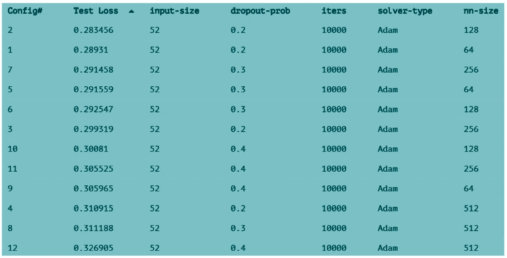

# Team Crest 发起的 Datathon 能源预测挑战

> 原文：<https://medium.com/analytics-vidhya/datathon-energy-forecasting-challenge-by-team-crest-1c09a0986812?source=collection_archive---------30----------------------->

作者:克劳迪娅·阿曼达、凯尔文·苏特贾、文森特·里布利

风能取决于风速和风向等环境因素。风能对外部环境的过度依赖导致反对采用风能作为主要能源。我们的社会依赖于稳定的、可预测的能源，这转化为化石燃料、核能和其他不可再生能源。

考虑到八个不同地区的历史发电量、风速和风向，我们试图通过每小时预测 T+18 小时的能量预测来减轻风能供应的不可预测性。

扮演能源交易商的角色，我们的目标是使用我们的能源产量预测和提供的交易算法为我们的客户实现利润最大化。

# **数据探索与特征工程**

我们使用以下数据:

*   法国能源岛的能源产量(预测 T+18)
*   以下地区的两个模型的速度和方向数据:guitrancourt、lieusaint、lvs-pussayparc-du-gatinais、arville、boissy-la-riviere、angerville-1、angerville-2

以上数据总计 33 列。

在我们探索给定数据的尝试中，我们绘制了电能/千瓦时与时间的关系图，我们发现有一个增加的趋势，这意味着数据不是静态的，如下所示。

能量与时间图

我们认为这可能是由于技术进步，提高了产生风能的能力。因此，我们决定修剪数据，并使用我们模型的最后 10，000 个数据来解决增长趋势的问题。绘制剩下的数据，我们设法得到一个更规则的图形，如下所示。

能量与时间图(微调)

给定的风向数据包括角度数据，该数据稍微有些微妙，因为它是以 360°为模。这意味着神经网络不能识别 359 度接近 1 度。因此，我们建议将其编码为 **sin θ** 和 **cos θ** ，让我们了解基于正弦和余弦值的角度有多接近。

随后，我们创建了一个关联热图来检查风能、角度的正弦值和角度的余弦值之间的关联。生成的关联热图如下所示。

根据上图，我们得出以下结论:

*   能量与速度高度相关
*   区域的速度是相互关联的
*   角度的正弦值和角度的余弦值也彼此相关

考虑到这些结论，我们提出空间平均来减少冗余。

除了上面的关联热图，我们还使用所用值的平均值创建了另一个关联热图。这留给我们能量，平均速度，平均正弦和平均余弦。

我们的下一步是在相同的轴上用平均速度(最后 40%的数据显示一个更规则的图形)绘制能量图，这表明它们似乎密切相关，如下所示。

能量与平均速度图

绘制能量和平均速度的滞后曲线，我们观察到能量滞后于平均速度 2 小时，这是一个很好的指示。

滞后曲线

# **数据预处理**

对数据进行归一化，x'=(x-)/。我们还发现持久性损失为 0.46711，我们将使用这个值作为我们必须打破的基准。

除此之外，我们现在有四列——能量、平均速度、平均正弦和平均余弦。基于这四列，我们将创建以下功能:

*   过去 24 小时的能量(A:0:-24)
*   从 12 小时前到 12 小时后的平均速度(B:12:-12)
*   电流平均正弦值(C:0)
*   当前平均余弦值(D:0)

输入尺寸为 52。

# **神经网络**

感知器用 tanh，性能比 relu 好。我们的神经网络的架构可以在下面找到:

> *:网络(l - l )*
> 
> *命名为 P003*
> 
> *${nn-size}感知器*
> 
> *${dropout-prob}辍学*
> 
> *${nn-size 2 * 3 /}感知器*
> 
> *${dropout-prob}辍学*
> 
> *${nn-size 4 * 9 /}感知器*
> 
> *1 内部产品*
> 
> *最终命名*
> 
> *；*

神经网络体系结构

有一个输入层和三个隐藏层，其中每个层的大小都变小。我们还添加了一个退出功能，这两个功能都是为了解决在实现这些功能之前出现的严重过拟合问题。

我们的神经网络的配置如下:

{{ 64 128 256 512 }} := nn-size

{{ 0.2 0.3 0.4 }} :=辍学概率

# **结果和分析**

结果如下:

迭代的训练和测试损失(图表)

迭代的训练和测试损失(表)

基于上面的结果，我们决定选择 0.283456 测试损失的最佳配置(#2)，这超过了我们的持久性损失 0.46711。我们的结果详情如下:

训练预测

测试预测

散点图

滞后相关性

因此，根据我们的预测，我们获得了 419，221，685 美元的净利润！

净利