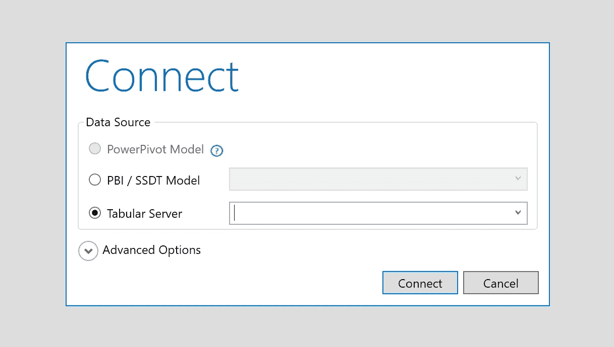

# DAX Studio——通往 DAX 的捷径

> 原文：<https://medium.com/analytics-vidhya/dax-studio-a-faster-way-to-dax-61f997c8f41a?source=collection_archive---------9----------------------->

Visual Studio 一直是我特别讨厌的 IDE 之一。我一直认为它是功能丰富的 ide 中“太多”的一种。我认为它太强大了，拥有太多的功能，而且在很多情况下，太慢了。

最近，我不得不使用它进行一些商业智能建模工作，我用 Analysis Server 做这些工作。我们有一个项目，使用 ETL 将数据导入数据仓库，然后导入表格模型。表格模型主要是标准数据库的内存版本，但是它被优化来运行分析类型的查询。针对表格模型编写的查询是用微软的数据分析表达式( [DAX](https://docs.microsoft.com/en-us/dax/) )语言编写的。我在这个项目中的角色是在 DAX 中编写查询来支持我们想要执行的建模。我们的最终用户使用 Excel 的 PowerPivot 或其他队友在 PowerBI 中构建的仪表板与这些查询进行交互。

微软构建了一个名为 SQL Server 数据工具-商业智能(SSDT-BI)的 Visual Studio 扩展，允许我们编写 DAX 查询并对表格模型执行其他管理操作。不幸的是，我发现这个扩展很难使用。

DAX 编辑真的很不靠谱。当试图用键盘滚动时，光标从不平滑移动。选择文本经常会导致一些不可预知的意外，括号匹配/突出显示很奇怪，自动完成很碍事。当我意识到每次保存 DAX 查询都意味着每次都要等待 10-30 秒(尽管我告诉它不要每次都重新计算模型)时，我就到了崩溃的边缘。在此期间，用户界面将完全阻塞😦有人穿了吗？

> 结束咆哮…进入 DAX 工作室。

[DAX Studio](https://www.sqlbi.com/tools/dax-studio/) 是一款制作精美的软件。它为编写 DAX 查询提供了一个优秀的接口，并为理解慢速查询提供了一些急需的分析工具。我只使用了一个晚上，就获得了如此大的动力。我开始阅读这本很棒的[入门](https://exceleratorbi.com.au/getting-started-dax-studio/)指南。它告诉您如何安装它，主要的特性集，以及如何在 DAX 中编写查询。

一旦安装好了，您要做的第一件事就是连接到表格模型。

一旦你连接，你将有一个 DAX 窗口，你可以写你的查询。

在 DAX Studio 中开始编写 DAX 表达式需要一个主要原则。

简单的规则是你写的每个 DAX 表达式必须**计算一个表**。通常，在 SSDT BI 中，我们会创建一个提供一些标量值的度量。我们需要在 DAX Studio 中做一些额外的工作来检查这个值。

先说一个基本的例子。

如果您只想在一个名为`Product`的表格中列出所有数据。您可以简单地这样做:

`EVALUATE ALL(Product)`

然后，您可以使用 **F5** 或点击 **Run** 来执行查询。同样，如果你想做一个过滤器…

`EVALUATE FILTER(Product, Product[Price] > 2000)`

现在假设你想查看一个标量的输出…它不会产生一个像上面例子那样的表。DAX 有一个`ROW`函数，它创建一个只有一行的表。假设您想使用`NOW`显示当前日期。

`EVALUATE ROW("The Date", NOW())`

这将产生一个只有一行标题为“日期”和值为`NOW`的表。

我们可以扩展这个例子，展示如何将我们在 Visual Studio 中编写的测量代码转移到 DAX。

假设我们在 Visual Studio 中有以下代码。

`Number of Products := SUM(VALUES(Product[ProductId])`

我们只需要将实际的表达式复制到 DAX Studio 来评估它。我们可以再次使用`ROW`来显示值。

`EVALUATE ROW("Number of Products", SUM(VALUES(Product[ProductId])))`

这是一个很好的工具，可以用来慢慢构建表达式并检查它们的输出。我还发现创建自己的“数据透视表”式视图很方便。例如，我使用了一个`SUMMARIZE`查询来测试我的度量。这个例子看起来像这样…

`EVALUATE SUMMARIZE(<Table>, <Group By Column>, "Testing", <Test Measure>)`

现在 DAX 工作室当然不是完美的，我已经发现了一些对我来说不是交易破坏者的事情。

*   它不太了解你的*。bim 文件。bim 文件存储您的模型、分区、计算表等的定义。这意味着您必须复制和粘贴您正在处理的新度量。这也意味着没有 KPI 创建或添加格式到您的措施。
*   它可以很容易地连接到 Analysis Server 的一个实例，但是我还没有在 Visual Studio 的 workspace Server 上尝试过。我依稀记得使用 Visual Studio 时，创建了一个临时表格模型数据库。您需要验证是否可以连接到该临时工作区。如果您无法连接到您的临时工作区，这意味着您在那里所做的任何编辑在 DAX Studio 中都是不可见的。
*   工作流需要一点时间来适应，但是一旦你掌握了它，它会给你比在 Visual Studio 中工作更大的动力。

现在，我使用 DAX Studio 作为我今后的创作环境。鉴于我是 DAX 的新手，SSDT-比真的放慢了我的步伐，并阻止了我的尝试。DAX Studio 构建良好，在运行长查询时不会死机。在我看来，它比 SSDT-BI 更健壮，也得到更多的喜爱和更新。

让我知道这是否为你工作，或者你的工作流程看起来像 SSDT-比。