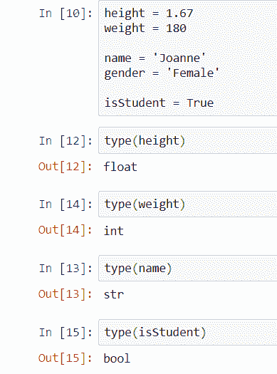
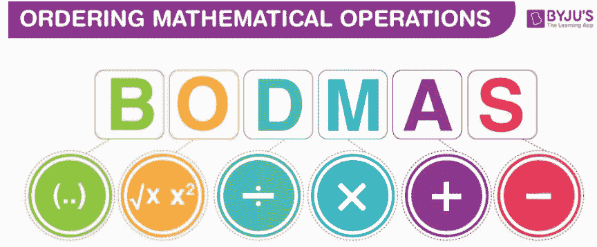

# 第 1 天:让我们开始学习 Python

> 原文：<https://medium.com/analytics-vidhya/day-1-let-get-started-with-python-2b590236a4b0?source=collection_archive---------1----------------------->

在我的一个朋友分享了我可以从 Udemy 的在线学习网站上获得的学习材料后，我在 2018 年开始学习 Python 编程语言。一门在线课程最便宜的报价约为 16.00 新加坡元。

# 如何开始？

我在运行 Windows 操作系统的机器上安装了 Python 3。安装非常简单，使用。exe 文件，然后按照向导进行操作。没有麻烦。另外，我尝试在另一台运行 Ubuntu 操作系统的机器上安装 Python 3，因为我想尝试通过终端(命令提示符)安装它。

# 检查版本

安装 python 3 后，我打开终端(在 Linux 中)或命令提示符(在 Windows 中),通过键入以下命令进入 python 的 shell:

```
python
```

我可以在终端或命令提示符屏幕上看到 Python 返回的消息，其中包含版本号。有 Python 2 和 Python 3。因此，要清楚机器上使用的是哪个版本，因为语法彼此略有不同。

```
python --version
```

只需打开您的终端或命令行，在上面键入上述命令。在屏幕上，它可能会返回如下所示的版本信息:

```
Python 3.7.0
```

# 使用哪个编辑器？

我选择了我喜欢的 IDE(集成开发环境)。我喜欢用 Jupyter 笔记本。我可以使用在线版本或我机器上安装的版本。在《Python:如何在 5 分钟内编写代码》这篇文章中，我写了我如何安装 Python、Anaconda，并在两年后使用 Jupyter 笔记本编写了我的第一批 Python 代码。在我编辑这篇文章之前，我曾经使用 IntelliJ 编写 Python 代码，因为我在学习如何用 Scala 编写代码时安装了它。

# 打印(“HELLO WORLD”)

这是每个程序员学习一门新语言的第一步。对于 Python，它有第 2 版和第 3 版，基本原理几乎相同，但一些语法必须注意。而**双引号(")和单引号(')**都是定义字符串或文本的可接受方式。字符串需要用相同类型的引号来开始和结束。Python 中的文本被认为是一种可以包含字母、数字和符号的字符串数据类型。我们可以使用 **+** 来连接(组合)文本。

```
print('Hello World!') print("Hello World!")
```


以上截图取自 IntelliJ。当我在左侧面板上编写代码时，输出显示在右侧面板上。

我们可以对一个字符串使用**三重引号**(**" "**)来跨越多行并将它赋给一个变量。我学到的一个例子是，

俳句= " "老池塘，
一只青蛙跳进来:
扑通！，我们预料中的:老池塘，
一只青蛙跳进来:
扑通！”""

三重引号(" ")作为文档字符串的另一种用法。文档字符串描述了函数的功能。它作为函数的文档，直接放在函数头的后面。举个例子，

```
def square (value): """Return a value of the square""" new_value = value ** 2 return(new_value)
```

这看起来很容易开始，对不对？

# 错误处理

我不认为在这个开始阶段讨论错误处理和阅读语法错误是正确的。然而，我想分享一下在编写代码时，语法错误是如何发生的。大多数编辑器显示 SyntaxError 来告诉我们哪里出错了。例如，此错误是由于缺少引号造成的。


我现在不涉及错误处理的话题，让我继续基本的编程。

# 变量和类型

然后，我进一步使用了**变量**。当我的同事构建 web 应用程序时，他们不断地处理变化的数据。看到用数据硬编码的源代码，我觉得很气人。如果我们需要不断地修改我们编码到脚本中的文本或数据，这将会很不方便。Python 使用**变量**来定义易变的事物。你得到的每个变量都可以用来存储文本、数字或日期。

与编写 SQL 脚本类似，只要有可能，我将使用变量来定义会发生变化的值，在某种程度上，我们可以动态地使用我们的脚本。

# 变量

*   具体且区分大小写的名称，最好使用小写的**。**
*   **定义易变的事物。**
*   **可用于存储文本、数字或日期。**
*   **不能以数字开头。**
*   **名称中不能使用空格和符号，请使用\**

```
height = 1.67 weight = 180 name = 'Joanne' gender = 'Female' isStudent = True
```

**上面显示了 float 和 int 数据类型中的身高和体重变量，然后我们有一个字符串中的姓名和性别以及一个名为 isStudent 的布尔值变量。在 Python 中，如果你熟悉 Javascript 或 SQL Server，它不需要在变量前后声明任何前缀。然后，你可能会问编译器(计算机)如何知道它是什么类型的数据类型。**

****

**这就是我们定义变量和赋值的方式。你可以看到它如何分配一个日期，一串文本和数字。**

# **(=)和(==)有什么区别？**

**单个等号(=)将右边的值赋给左边的变量。double equal (==)测试这两个值是否相同。这两件事可以是两个变量或一个变量的算术运算比较。**

# **动态打字**

**Python 使用**动态类型化**。这是什么意思？**

**这意味着我们可以将变量重新分配给不同的数据类型。它使得 python 很容易分配数据类型，这不同于其他静态类型的编程语言。除了 python，你知道还有哪些编程语言有类似的特点吗？**

# **类型**

**那么，Python 对这些不同类型的值怎么称呼呢？**内置类型:****

*   ****布尔**运算:与、或、非(真、假)。它区分大小写**
*   ****数字**类型:int、float、complex(数字、小数)**
*   ****文本**序列类型:str(字符串)**
*   ****序列**类型:列表、元组、范围**
*   ****映射**类型:dict**
*   ****套**类型:套**
*   ****None** 常用来表示没有值，例如默认参数没有传递给函数。它是一个空值或根本没有值，与空字符串 0 或 False 不同。**

**现在看起来有点复杂，但不用担心他们。我们以后会经常用到它们。让我们看一些如何用不同的数据类型在 Python 中派生变量的例子。更多的数据类型可以在互联网上找到。**

# **类型()**

```
type(height) type(weight) type(name) type(isStudent)
```

**type()是一个内置函数，它允许我们检查用赋值创建的变量的数据类型。type()有助于回答上述问题。**

****

**这完成了 Python 代码的基础。现在，您知道如何执行以下操作:**

*   **使用 print()语句打印文本。**
*   **变量和数据类型的使用。**
*   **使用 type()语句打印出变量的数据类型。**

**大概，现在你想知道什么是整数，字符串，布尔等等。我这里有一些链接，可以帮助你找到基本的解释和例子:**

**谈到数字和字符串，它本身可以是另一个话题，因为它们有很多有趣的地方，比如(+)符号的使用。它是一个连接符号，这意味着它将两个或多个相同类型的变量组合在一起。数字和字符串使用(+)符号的方式也互不相同。此外，我们必须记住，在 Python 中，字符串和整数不能一起使用(+)符号。它抛出一个异常(错误)。例外是一个编程术语，意思是错误。Python 中还有一个异常处理的主题。在这种情况下，有字符串格式和整数格式。**

# **基本算术运算**

**现在，我们可以研究使用变量的**算术运算。该变量将用于保存每个操作的最终结果。算术运算遵循运算符的优先级。优先权的细节可以在因特网上找到。****

****

# **Python 遵循 BODMAS 法则**

**BODMAS 是首字母缩略词，它代表括号、顺序、除法、乘法、加法和减法。在某些地区，处理运算时会用到 PEMDAS(圆括号、指数、乘法、除法、加法和减法)。**

****

**图片摘自[https://byjus.com/maths/bodmas-rule/](https://byjus.com/maths/bodmas-rule/)**

**在结束第一天的分享之前，我想在条目中介绍一点高级的基础知识。这是 Python 集合，是我经常用于数据分析或数据科学编程的东西。**

# **Python 集合**

**这是一个有趣的话题，也是 Python 的重要组成部分。我们每个人在日常编码生活中几乎都会用到 Python List🙂它是一个值的集合，允许我们在元素中有不同的类型，这是最简单和容易的集合之一。说到“集合”这个词，Python 有四种类型的集合。**

**你可以在这里阅读更多关于这些系列的基本信息[。每一种都有不同的特点、句法、结构和用法。一路上，我们使用不同的集合来解释 Python 代码和概念。下面是列表外观的一个示例:](https://liyenz.wordpress.com/2019/01/08/day-10-python-collections/)**

```
fruits = ['orange', 'apple', 'pear', 'banana', 'kiwi', 'apple', 'banana']
```

**声明一个列表和声明一个变量是一样的，它只需要遵循列表的语法来创建一个列表。如前所述，它可以是列表中的任何数据类型。因此，您也可以声明如下列表:**

```
family = ['Anna', 1.73, 'Eddie', 1.68, 'Mother', 1.71, 'Father', 1.89]
```

**上面的列表处理控制流，通过迭代和/或条件检查，然后计算一个值并返回一个结果。更多细节将在另一篇文章中介绍，我会更新文章的链接。**

**到目前为止，这部分仍然是基本的 Python，不涉及任何分析或数据科学工作，如果你正在寻找一个。如果你想看看我以前的文章，请访问这个[链接](https://liyenz.wordpress.com/category/experience-sharing/python/)。希望你喜欢我的分享，请关注下一次更新。谢谢你。**

***原载于 2018 年 11 月 25 日*[*http://liyenz.wordpress.com*](https://liyenz.wordpress.com/2018/11/25/let-get-started-with-python/)*。***