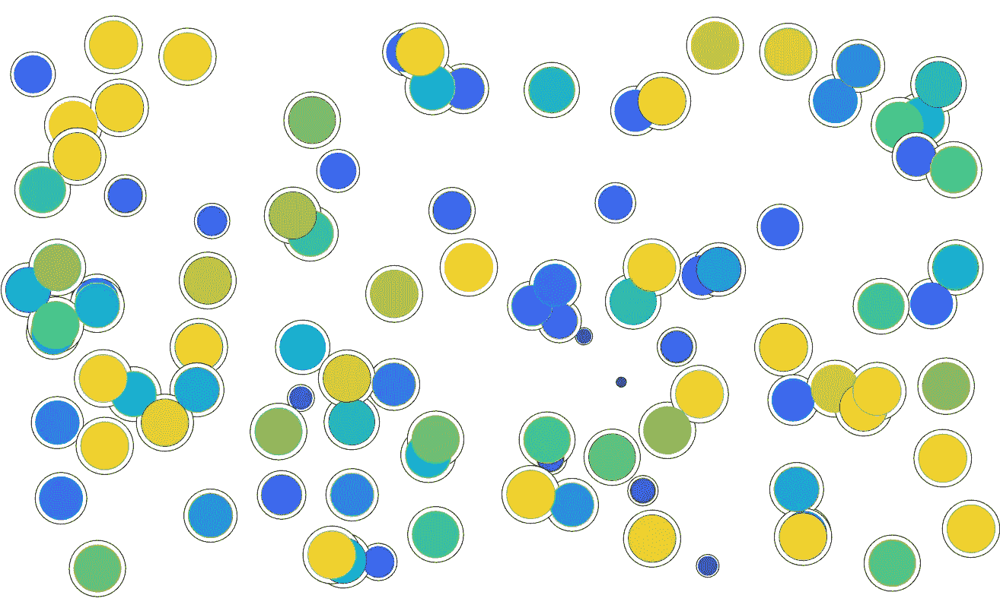

# 第一天:让 MATLAB 变得“有趣”

> 原文：<https://medium.com/analytics-vidhya/day-1-making-matlab-fun-ad850eaffbde?source=collection_archive---------8----------------------->



在 MATLAB 中，让你的代码与众不同的最重要的工具之一是“有趣”的操作家族: *arrayfun* 、 *structfun* 、 *cellfun* 、 *rowfun* 等等。

下面是一个最简单的例子:

```
output = arrayfun( @(x) x+1, [1:10] )
```

试着猜测输出将包含什么，然后进入 MATLAB，自己尝试一下。

我遇到过精通 MATLAB 的研究生，他们仍然觉得 MATLAB 中“有趣”的操作令人困惑、神秘，一点也不有趣。出现这种情况有几个原因:

*   **“有趣”操作的输入之一是函数**，而不仅仅是数字或数组。这种把函数当做输入的思维方式对于基础用户来说并不常见。
*   他们经常使用匿名函数。匿名函数存在于函数或命令行中，对于主要使用函数的“开箱即用”实现的用户来说，它们通常是陌生的(例如。m 文件)。

```
myfxn = @(x) x+1 % An anonymous function
```

*   **大多数人学的第一个“好玩”的操作是*cell fun*。这种“有趣”的操作很容易也是最困难的，因为单元格在访问其内容方面已经不简单了，并且值单元格、单元格数组和单元格字符串之间的差异可能会令人混淆。**
*   与此相关，“有趣”的操作需要了解 MATLAB 中的变量类型。您不能将单元格数组输入到 *cellfun* 中，但是您可以输入一个多维单元格并对单元格中的每个元素进行操作。同样，您不能将数组输入到在表上工作的 *rowfun* 中。

下面我将提出几个任务，并展示一个“有趣”的操作是如何简化它们的。

## 从细胞中获取特定元素。

假设您在单元格数组中有数据，如下所示:


要在 MATLAB 中生成此内容，请使用:mydata = arrayfun( @(x) rand(1，x)，[50，51，52，53，52，50]，' UniformOutput '，false)

出于某种原因，您希望从每个数组中获取第一个元素，您可以通过对循环使用*来实现，如下所示:*

```
out = []
for i = 1:numel( mydata)
    out(i) = mydata{i}( 1 )
end
```

下面是同样的事情，只不过用的是 *cellfun* :

```
out = cellfun( @(x) x(1), mydata )
```

**提示:**任何你想要的函数都可以放入匿名函数位置。所以你也可以用这个来得到每个单元格的长度。

```
output = cellfun( @(x) numel(x), mydata )
```

## 从多个变量中提取信息。

假设您有一个矩阵，其中包含时间序列数据的五个观察值。


另外，您有一个数组，其中包含您对五个观察值中的每一个都感兴趣的时间点(每行包含一个观察值)。


假设您想要获得每个观察在相关时间点的值。换句话说，第 1 行的第 2 个时间点(1.000)，第 2 行的第 6 个时间点(3.000)，依此类推。这些时间点可以是测试对象输入响应或按下按钮的时间。有一种方法可以做到:

```
out = []
N = size( mydata, 1 )for i = 1:size( mydata, 1 )
out(i) = mydata( i, timepoints( i ) )
end
```

下面是使用 arrayfun 的方法。

```
N = size( mydata, 1 )
out = arrayfun( @(x) mydata( x, timepoints(x) ), [1:N] )
```

# 让你的数字标题“有趣”

使用有趣的操作，您可以轻松完成的事情之一是以文本字符串的形式快速返回数据摘要。这些可以用作你的图的标题，文件名，或者带有元数据的标签。要做到这一点，你必须了解附加在*数组*末尾的相当神秘的标志**‘统一输出’**。到目前为止，我们一直使用 fun 函数来返回数组，但是有许多变量不是数组，例如，字符串的单元格。当你创建一个简单数组之外的任何东西时，你必须在你的 *arrayfun* 的末尾附加‘uniform output’，false。

```
% Setting up the data %
mydata = rand(10,100);
grps = [ repmat('GrpA',5,1);repmat('GrpB',5,1)];
subjects = [1:10];% The arrayfun %
titles = arrayfun( @(x) sprintf('%s (mean=%1.2f) (%i/10)',...
           grps(x,:),mean(mydata(x,:)),subjects(x)), [1:10],...
                                 'UniformOutput',false)'
```

这表示您有 10 个受试者，每个受试者有 100 个观察值，存储在 **mydata** 的行中。 *arrayfun* 命令将遍历数组[1:10]并提取:

grps(1，:[a string]
mean(mydata(x，:)【a double】
subjects(x)【整数】

这些值将被放入一个字符串中，由命令 **sprintf** 格式化【如果您不熟悉这个命令，您可能想阅读它的帮助！—以后我会写一篇关于它的帖子】。

最终输出是:


这种类型的输出可用于标记您的数字或创建更有意义的文件名。

使用这些技巧使您的数据可视化更加健壮。继续第二天。

> 这个故事是我的系列的一部分，题为“30 天的 MATLAB 技巧，我希望我已经知道做神经科学研究生院”。关注我这里的 [Neurojojo](https://medium.com/u/71417ba6ebf5?source=post_page-----ad850eaffbde--------------------------------) 或在 [Twitter](https://twitter.com/neurojojo) 上的更多提示。