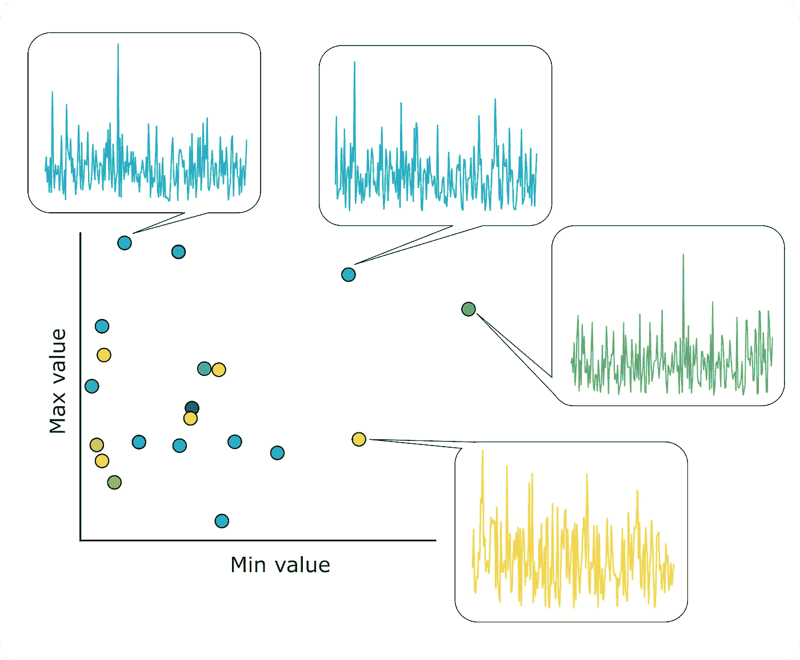
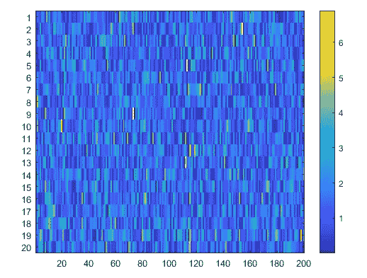
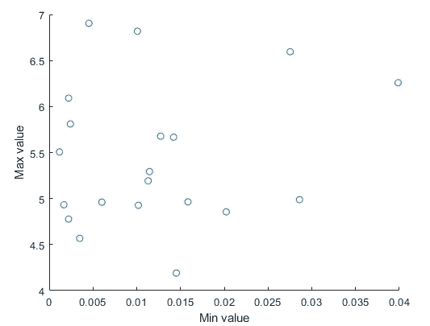
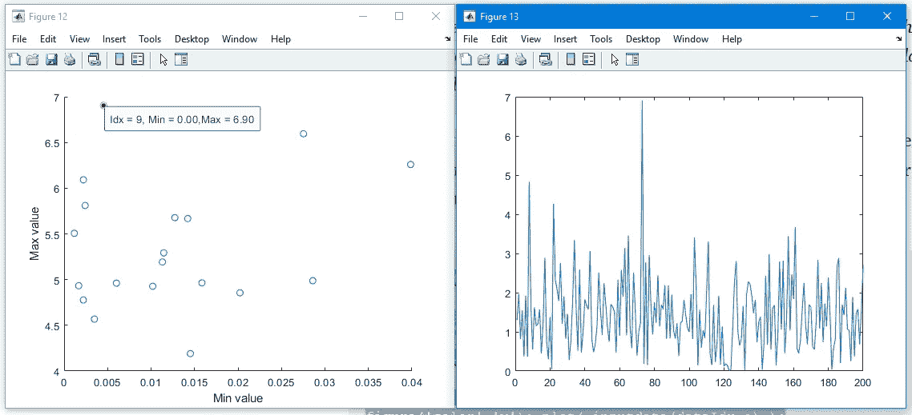

# 第 12 天:用几行代码和这个简单的函数来听你的数据

> 原文：<https://medium.com/analytics-vidhya/day-12-listen-to-your-data-with-a-few-lines-of-code-and-this-simple-function-4b55ffe4015?source=collection_archive---------23----------------------->

当您对新的分析或故障排除结果进行头脑风暴时，能够看到汇总数字中的基础数据会非常有帮助。



在处理时间序列数据的许多观察值时，我们经常用一些参数来概括每个观察值:均值、中值、曲线下面积(AUC)、最大值、最小值等。这些汇总变量可以帮助我们洞察数据中的关系，但有时我们希望看到生成它们的潜在时间序列。

基于第 10 天和第 11 天的帖子，我们将编写动态更新函数的修改版本来实现这个目标！

我们今天的随机数据有点有趣，因为我们使用泊松随机数生成器来添加一些不常见的“尖峰”。

```
rng(5)
spiking_data = rand(20,200) + poissrnd(1,20,200);
```

这种类型的时间序列数据通常使用热图(快速)显示，如下所示。您可以看到值的范围从 0 到大约 7，不同的时间序列(1 到 20)将在不同的时间达到一个或多个最大值。



我们可以使用下面的代码创建一个非常简单的散点图，显示时间序列中每一行的最小值和最大值。



```
min_values = min( spiking_data, [], 2);
max_values = max( spiking_data, [], 2);

fig = figure('color','w');

scatter( min_values, max_values );
xlabel('Min value'); ylabel('Max value');
```

这个图表还没有什么特别令人兴奋的地方。但是我们需要做的就是在下面放下三行:

1.  打开数据光标模式
2.  将数据光标对象附加到我们的图形上
3.  指定我们的更新功能

在绘图命令下添加以下代码块:

```
datacursormode on
dcm_obj = datacursormode(fig);
set(dcm_obj,'UpdateFcn',{@myupdatefcn3, spiking_data})
```

> 请注意， *'UpdateFcn'* 属性接收由@ flag 指定的函数和变量 **spiking_data** ，该变量包含生成我们的汇总数字的数据！

现在我们的下一个任务是创建 *myupdatefcn3.m* 作为一个单独的文件。这是一个非常非常简单的函数，每当你点击一个数据点时就会被调用。下面是:

```
function txt = myupdatefcn3(~,event_obj,inputdata)% Get the data that generated the point you clicked on %
dataIdx = get(event_obj,'DataIndex');
theData = inputdata(dataIdx,:);% Plot it! %
figure('color','w'); plot( inputdata(dataIdx,:) );% Return a text label for your original figure %
txt = sprintf('Idx = %i, Min = %1.2f,Max = %1.2f', dataIdx, min(theData), max(theData) );

end
```

现在返回并运行上面的代码。单击其中一个数据点，它的基本时间序列应该会显示出来供您检查。尽情享受吧！



如果你想做一个整洁、多彩的版本(就像我在横幅中做的那样，这里有一个代码要点可以帮你实现)。

这里是动态更新函数的代码，你会看到它和上面帖子里的代码没有太大区别！

保存代码，然后运行它来生成数据和图形。然后就点击！