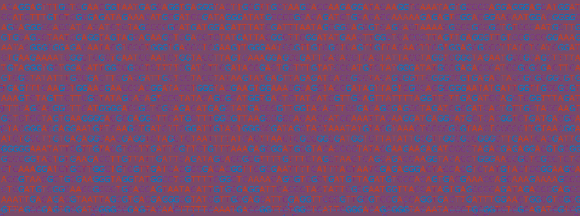

# 第 13 天:当你想把数字数据转换成文本时

> 原文：<https://medium.com/analytics-vidhya/day-13-when-you-might-want-to-turn-your-numerical-data-into-text-290cfd26c291?source=collection_archive---------30----------------------->

坦白:我花了六年时间在研究生院编码，做了几十个项目和合作的数据分析，从来没有人告诉过我正则表达式！这就是为什么我希望他们有。

即使您不处理基因序列，您也可能拥有包含离散状态的数据。通过将数据转换为离散状态，您可以…