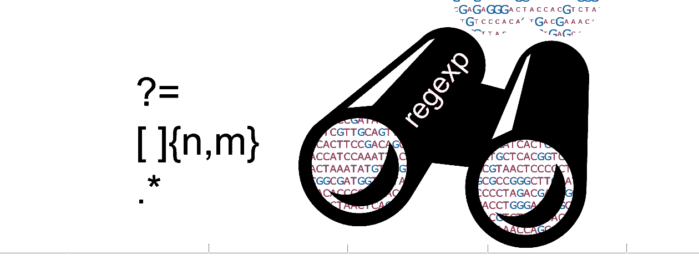
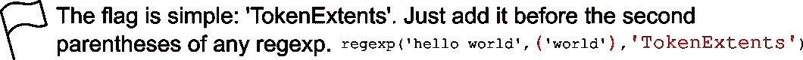

# 第 14 天:我最喜欢的三种正则表达式用法

> 原文：<https://medium.com/analytics-vidhya/day-14-my-three-favorite-regular-expression-uses-90763cd803ef?source=collection_archive---------18----------------------->

使用高级正则表达式真的会让人不知所措。作为一个处理神经科学数据的人，我将为自己分解三个最常见的高级用途。



希望你看了昨天的帖子，[“第 13 天:当你可能想把你的数值数据变成文本的时候”](/@neuraljojo/day-13-when-you-might-want-to-turn-your-numerical-data-into-text-290cfd26c291)你应该确信，从长远来看，每个人都学习正则表达式更好。如果你没有，我就把这一段粘贴在这里，因为它非常重要:

> 必要的生活建议:你可能不会总是与 MATLAB 或数字数据打交道。如果你想学习一种新的编码技能，它应该是跨多个领域的。正则表达式用于 Python、Java、C++、Javascript 和许多其他语言中。当然，您可以用大量的循环来分析您的顺序数据，或者您可以尝试某人的定制包，但是学习像正则表达式这样的基本技能将为您准备各种各样的上下文—无论您遇到什么情况。

总之，昨天我们介绍了一个虚构的例子，一只老鼠在四个象限(1，2，3，4)之间移动:


信用:生物兰德

随着时间的推移，如果我们每隔几毫秒跟踪一次鼠标的位置，它会看起来像“1111111111222222222221111111”。

让我们生成一些人工数据来模拟鼠标的运动:

```
% Do this or your results will differ in the rest of the tutorial %
rng(5)
quadrant = randi(4,1,500);% We can easily convert the quadrant numeric values to a string %
quadrant_str = sprintf('%i',quadrant);
```

现在来看三个使用案例:

## 1.我不仅想知道一种模式是否存在，还想知道它在序列中的起点和终点。

昨天我介绍了在带括号的数字后使用“+”符号，例如“1[2]+3”，它将搜索任何 2 的序列夹在 1 和 3 之间的模式。找到 2 的序列开始和结束的地方需要你学习两件事:一个概念(token)和一个标志(“TokenExtents”)。

> 概念:令牌。令牌就是您希望通过搜索提取的一段文本。我们用括号来描述记号。比如:‘1([2]+)3’。“令牌”可以是任何 2 的序列。令牌可以夹在非令牌标识符之间，在本例中是 1 和 3。小测验:如果我们的搜索表达式是‘1([2]+3)’，那么令牌是什么？



现在来看一些实践(将理论付诸实践):

```
extents = regexp( quadrant_str, '1([2]+)3', 'TokenExtents' )
```

这将返回 9 个条目，包含所有您需要知道的 2 的模式出现的位置！

## 2.我想找出某个模式出现的次数。

在上面的例子中，我们甚至会返回非常短的 2 序列，这可能代表某些类型的数据中的噪声，或者至少是进入象限 2 的非常简短且不太有趣的入口。对提取的序列设置下限很简单，用括号代替加号。

```
extents = regexp( quadrant_str, '1([2]{3,10})3', 'TokenExtents' )
```

在这种情况下，{3，10}设置序列长度的下限，10 设置上限。您也可以通过省略第二个数字来指定无上限:

```
extents = regexp( quadrant_str, '1([2]{3,})3', 'TokenExtents' )
```

## 3.我想找到某个模式之前的一切。

有时我会遇到在行为盒中记录动物行为的数据(医学与任何人相关联？).我们可能希望在某个模式开始时找到某个试验。假设我们想知道在我们的序列中我们第一次到达‘333333’的位置。

为此，我们使用两个正则表达式约定:

```
extents = regexp( quadrant_str, '(.*)(?=333333)','TokenExtents')
```

**。*** 表示匹配每一个字符——这使我们能够捕获从序列开始直到六个 3 被捕获的所有内容

**(？= ___ )** 意味着向前看，以确保您的令牌被后面的任何字符串终止

正则表达式的一个我最喜欢的用途是操作文件名，给它们添加重要的实验细节或日期。稍后，您可以使用正则表达式来获取这些细节。[点击这里查看我的帖子。](/analytics-vidhya/day-15-manipulate-filenames-with-the-least-amount-of-clicking-8c1a7ba5f8d1)

正则表达式有很多内容，要真正掌握它们需要几个月或几年的时间。你可以变得非常有创造力。试图将它们提炼成任何一个小技巧集是非常雄心勃勃的。尽管如此，我还是希望你可以使用这些，并且利用网上丰富的资源来构建正则表达式搜索，或许还可以组合出一些你自己的东西。现在，把你的实验伙伴从单调乏味的文本搜索模式中解救出来吧！