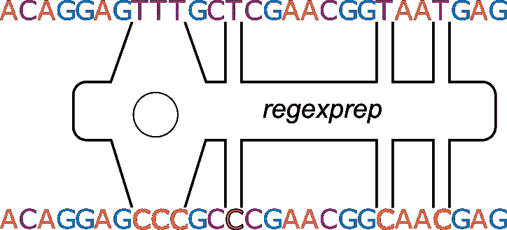
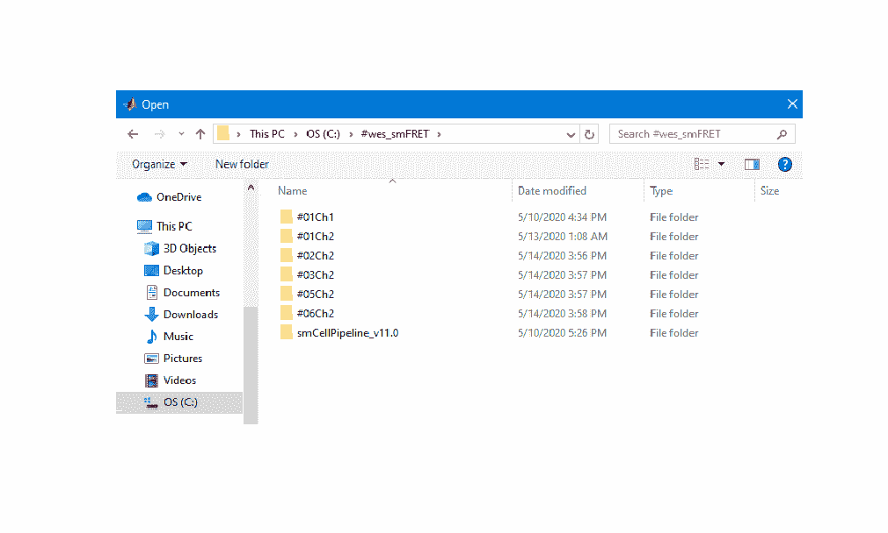

# 第 15 天:用最少的努力可靠地修改和替换文本

> 原文：<https://medium.com/analytics-vidhya/day-15-manipulate-filenames-with-the-least-amount-of-clicking-8c1a7ba5f8d1?source=collection_archive---------20----------------------->

为了保证您的分析是简化的和可重复的，请熟悉函数 *regexprep* 。



在[的第 13 天](/@neuraljojo/day-13-when-you-might-want-to-turn-your-numerical-data-into-text-290cfd26c291)和[的第 14 天](/@neuraljojo/day-14-my-three-favorite-regular-expression-uses-90763cd803ef)，我们使用正则表达式定位文本。在今天的帖子中，我们在函数 *regexprep* 中使用正则表达式，这是进行精确有效的文本替换的关键。

## 以下是 regexprep 的几个简单用例:

***从文件名中删除字符。*** 为了保持一致性，如果你能把一组数据和一个文件名放在一起，然后把这个文件名变成一个图形标题，那就太好了。你可以这样做。

```
% Lets suppose we have a file with some data %
file = 'C:\Files\Kaleemah\Mouse1\Images\Neuron_10_May_12_Dorsal.tif'% We would load the file and show the image %
```

现在你想创建一个标题，但你不想要所有额外的东西。以下是如何分两步做的。首先，确保你对我在第 13 天和第 14 天讨论的话题感到舒服。接下来，我们将获取文件名:

```
% Extract just the filename %file = regexp( file, '(Neuron.*)(?=.tif)', 'match')
file = file{1}
```

> 旁白:是的，有一种更复杂的方法，我还没有谈到，因为正如我所说的，正则表达式可能会变得非常复杂，我建议如果你有时间和耐心，你可以花几个星期的时间来研究它们。以下是另一种方法:

```
file = 'C:\Files\Kaleemah\Mouse1\Images\Neuron_10_May_12_Dorsal.tif'
file = regexp( file, '([^\\]+$)', 'match')
file = regexp( file, '(.*)(?=.tif)', 'match')% To recover the output as a string you'll need to use file{1}{1} %
```

无论是哪种情况，此时，您都应该有一个变量*文件*，它是一个包含“Neuron_10_May_12_Dorsal”的字符串

现在如果你试图创建一个图形并给一个图命名，不管是通过*轴*还是*标题*功能，你都会遇到这个问题:


下面是如何使用 *regexprep* 来解决这个问题:

```
file = regexprep( file, '_', ' ' )
```

如果您随后为图添加标题，您将看到不带下标的文本。

***另一个用例:加载、重命名和保存文件。如果你对可靠的、可重复的分析感兴趣，并且这种分析不会给你或你的合作者带来麻烦，那么下面的图片就是你最糟糕的噩梦:***



通过图形界面访问文件不仅是单调乏味的手工操作，而且最糟糕的是，在大多数情况下，它不会留下你打开的文件在哪里的痕迹。

另一种方法是在您的分析脚本或函数中保存写好的文件名，这样下一个重复您的分析的人就可以准确地看到文件的位置。

这可能是这样的:

```
files{1} = 'C:\Files\Kaleemah\Mouse1\Images\Neuron_10_May_12_Dorsal.tif';
```

这将是加载文件的位置。接下来，假设您想要读入图像并对其进行一些分析。

```
% Suppose you want to load the images (For illustrative purposes only!)   %

% image{1} = imread( files{1} );                       
% image{1} = some_analysis_fxn( image{1} );
```

将输出图像写入原始位置(文件{1})是可以的，但是这样会覆盖原始图像。以下是替换文件夹位置并在文件名中添加“_modified”的方法:

```
% First change the folder location %
files_adjusted{1} = regexprep( files{1}, 'C:\Files\Kaleemah\Mouse1\Images\', 'C:\Files\Kaleemah\Mouse1\Images\Adjusted\' )% Next, change the file name %
files_adjusted{1} = regexprep( files_adjusted{1}, '.tif', '_modified.tif' )
```

新文件名应该是:

" C:\ Files \ Kaleemah \ mouse 1 \ Images \ Neuron _ 10 _ May _ 12 _ Dorsal _ modified . TIF "

现在，您可以将修改后的图像保存到变量 *files_adjusted{1}* 中包含的新位置。

既然你已经掌握了[第 13 天](/analytics-vidhya/day-13-when-you-might-want-to-turn-your-numerical-data-into-text-290cfd26c291)、[第 14 天](/analytics-vidhya/day-14-my-three-favorite-regular-expression-uses-90763cd803ef)和[第 15 天](/analytics-vidhya/day-15-manipulate-filenames-with-the-least-amount-of-clicking-8c1a7ba5f8d1)的这些重要的文本处理技能，那么让我们继续学习[第 16 天](/@neuraljojo/day-16-the-ten-table-commandments-7186337fb020)，在这里我们将了解另一个对任何数据科学家都极其有用的技能:表格！