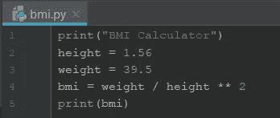

# 第四天:Python 中的数字

> 原文：<https://medium.com/analytics-vidhya/day-4-numbers-in-python-6a5f1a898ab3?source=collection_archive---------0----------------------->

在阅读了 Python 中的**数字**之后，我发现了一些很棒的东西。该数字可以是一个整数( **int** )，一个带小数的数字()，一个使用科学记数法的**浮点数， **e** 表示 10 的幂。例如:float4 = 1.5e2，得出 150。**

# 除法和分母

当我使用数字来执行**除法**时，会发生两种不同的情况。当我将两个数相除时，结果是一个整数。然而，当两个数字没有被整除时，除法的结果**被截断成整数**。商被四舍五入为整数。当我期望结果是一个小数时，结果变得很惊讶。为了产生数据类型为“float”的结果，我可以将分子或分母(或两者)更改为数据类型“float”。下面例子，

```
quotient1 = 7./2 quotient2 = 7/2\. quotient3 = 7./2.
```

但是，我不能使用带句点的变量。它会给出一个语法错误，因为变量名后面的句点并没有做我想做的事情。有关处理该场景的正确方法，请参见下面的代码。我可以使用 float()函数转换结果。例子，

```
cucumbers = 100 num_people = 6 whole_cucumbers_per_person = cucumbers/num_people print whole_cucumbers_per_person float_cucumbers_per_person = float(cucumbers)/num_people print float_cucumbers_per_person
```

更多关于数字除法的信息，我是在 docs.python.org 网站上阅读 Python 文档时发现的，它可以得到整数结果，丢弃任何小数结果，换句话说，它通过截断小数而不舍入来返回整数结果。可以使用 **"//"** 来实现。叫做**楼层划分**。

# 基本算术运算

我在我的 [Day 1](https://liyenz.wordpress.com/2018/11/25/let-get-started-with-python/) 帖子中已经介绍了基本的算术运算，所以在此不再赘述。请参考相关信息的链接。

# 模和幂运算

除了普通的算术运算，我还可以对数字使用模和幂运算。除了正常的加减乘除之外，我倒退了一步学习了模和幂运算。这两个是我们在计算中经常用到的高级操作。

# 幂运算:**

它使用双星号。与单个星号(多个)不同。该操作员将数字**向左**提升到数字向右**的**的**次方。比如 4**2 会给 16。**

# 模数:%

该运算符返回左边的数除以右边的数的余数。比如 18 % 7 等于 4。

# 数字格式

我找到了一个学习格式化的有用网站，[https://pyformat.info/](https://pyformat.info/)。数字和浮点数的基本格式，见下面的例子:

**'%d** 或' **{:d}** ' =格式号。
' **%f** 或' **{:f}** ' =格式浮点。
' **%4d** 或' **{:4d}** ' =填充数。意思是指定 4 个数字的宽度。它可以在数字前面有小于 4 个数字的空格。

# 浮动格式

语法是**value:width . precision f }**。
' **%06.2f** 或' **{:06.2f}** ' =输出 6 个数字，包括'.'带有 2 个小数点，如果整数没有这么多位数，则打印前导“0”。例如，下面的代码打印了一个包含 4 个数字和 3 个小数点的结果。


浮点格式的一个例子。有人知道为什么上面的{4.3f}打印结果为 0.129，而下面的%5.2f 打印结果为 13.14 吗？


# 我有疑问

## 1.使用 _(下划线)

在下面的例子中，有人使用 variable _ 吗？看起来像是将产量和价格相加得到税后净价。但是，我得到了一个语法错误，因为我没有声明 variable _。 *名称错误:名称' _ '未定义。* *下面是我从 Jupyter 笔记本上截取的截图，在这里我尝试执行上面的代码并得到结果。*


当我运行上面的代码时，结果显示为，
**12.5625**

当我继续从上面的结果中添加价格和销售税时。它给出了总数，
**113.0625**

现在，我相信它不是一个变量，它是前面计算结果(价格*税收)的占位符。到目前为止，**它在 Jupyter Notebook** 上运行，但我无法在 IntelliJ IDE 中运行类似的脚本。这意味着它在**细胞环境**中工作。

## 2.为什么 0.1+0.2–0.3 不等于 0？

*我在网上学习时分享的另一个有趣的话题。这与浮点精度和计算机在内存中表示数字的能力有关。如需详细分析，请查看:*[【https://docs.python.org/2/tutorial/floatingpoint.html】T42](https://docs.python.org/2/tutorial/floatingpoint.html)

下面的截图是测试我添加 0.1 + 0.2，结果显示在输出屏幕上是 0.3000000000000004。


## 3.计算身体质量指数

*流行编程语言的问题。我来分享一下身体质量指数计算的要求:*

我使用 IntelliJ 创建了一个 python 文件来运行身体质量指数计算，这就是我如何编码的。我将默认的身高和体重值存储在两个变量中，bmi 变量保存算术运算的结果，最后，print()语句显示结果。然后，我点击 Run 按钮来获得我的输出。下面是我用 IntelliJ 编写的身体质量指数计算的截图。



另一个使用 Python **NumPy** 包计算身体质量指数的例子如下，假设我已经在集合 height_in(身高英寸)和 weight_lb(体重磅)中有数据。NumPy 包稍后会在我的博客里分享。NumPy 包是使用 Python 进行科学计算的基础包之一。它通常用于对整个集合执行数学运算，并允许我们快速执行计算。在开始编码之前，我需要导入 NumPy 包。见下文:

```
# height and weight are available as regular lists# Import numpy
import numpy as np# Create array from height_in with metric units: np_height_m
np_height_m = np.array(height_in) * 0.0254# Create array from weight_lb with metric units: np_weight_kg
np_weight_kg = np.array(np_height_m) * 0.453592# Calculate the BMI: bmi
bmi = np_weight_kg / np_height_m ** 2# Print out bmi
print(bmi)
```

我还用 numpy 中的数组看到了代码“np.array”。在执行算术运算之前，它将集合转换为数组。之后，在同样的练习中，它打印出所有身体质量指数低于 21 的运动员的 BMI 指数。请参考以下代码:

```
# height and weight are available as regular lists# Import numpy
import numpy as np# Calculate the BMI: bmi
np_height_m = np.array(height_in) * 0.0254
np_weight_kg = np.array(weight_lb) * 0.453592
bmi = np_weight_kg / np_height_m ** 2# Create the light array
light = np.array(bmi < 21)# Print out light
print(light)# Print out BMIs of all baseball players whose BMI is below 21
light = bmi < 21
print(bmi[light])
```

在第行，*light = NP . array(BMI<21)*
由于条件检查，它返回 True 和 False 值。我可以使用 *print(light)* 来验证输出。接下来，它打印出身体质量指数低于 21 的球员的 BMI。用同样的条件再次检查，我们用 *print(bmi[light])* 列出 21 以下的身体质量指数值。

除了使用 NumPy 数组、基本算术和取幂运算之外，这些代码还包括在 create the light 数组中进行比较检查，并打印出身体质量指数低于 21 的棒球运动员的 BMI。

到目前为止，我相信自己已经非常熟悉用 Python 处理数字了。如果你有其他关于 Python 中数字的基本信息，你可以给我留言。到目前为止，这部分仍然是基本的 Python，不涉及任何分析或数据科学工作，如果你正在寻找一个。如果你想看看我以前的文章，请访问这个[链接](https://liyenz.wordpress.com/category/experience-sharing/python/)。希望你喜欢我的分享，请关注下一次更新。谢谢你。

*原载于 2018 年 12 月 2 日*[*http://liyenz.wordpress.com*](https://liyenz.wordpress.com/2018/12/02/day-4-numbers-in-python/)*。*