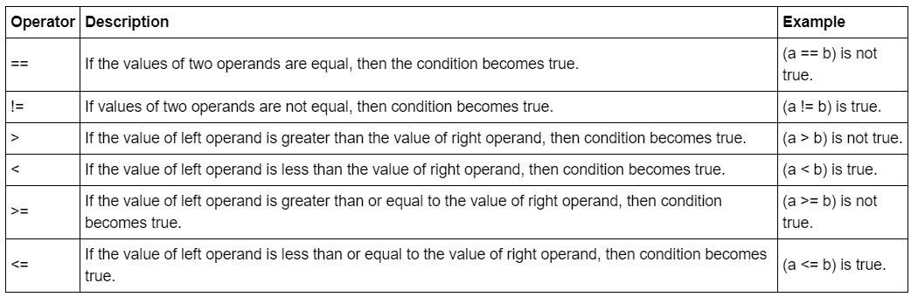

# 第 5 天:Python 中的布尔和比较运算符

> 原文：<https://medium.com/analytics-vidhya/day-5-boolean-comparison-operators-in-python-ae13654fb6b3?source=collection_archive---------0----------------------->

# 布尔代数学体系的

**布尔型**不是真就是假。该数据类型只能取这两个值中的一个。在 Python 中，它的关键字是 True 或 False。它区分大小写。如果值不符合字母大小写，编译器将抛出错误。True 值对应于整数值 1，并且行为相同。False 值对应于整数值 0。

从布尔扩展而来的是**逻辑和比较运算符**。它与布尔运算密切相关，因为当我们使用任何逻辑和比较运算符时，它会返回**真**或**假**。

# 比较运算符

通常，我们想要比较两个或更多的值。可以对相同的对象类型进行比较。一些操作符如' == '，'！= '，'【T8]'常用于任何编程语言，包括数据库的查询语句。



例子，

```
# Create arrays
import numpy as np
my_house = np.array([18.0, 20.0, 10.75, 9.50])
your_house = np.array([14.0, 24.0, 14.25, 9.0])# my_house greater than or equal to 18
print(my_house >= 18)# my_house less than your_house
print(my_house < your_house)# Output:
[ True  True False False]
[False  True  True False]
```

# 逻辑运算符

可以使用带有关键字“and”、“or”和“not”的比较运算符组合使用。
' **'和** ' =两者都为真的条件则它变为真。
' **或** ' =任一条件为真，则为真。
' **not** '=用于反转操作数的逻辑状态。真变假，假变真。例，not(2 > 10)，则返回 True。

下面是一个执行时布尔值为真的例子。第一个 print 语句返回 True。
第二个 print 语句返回一个 False。
第三个 print 语句返回 True。

```
# Define variables
my_kitchen = 18.0
your_kitchen = 14.0# my_kitchen bigger than 10 and smaller than 18?
print(my_kitchen > 10 and my_kitchen < 18)# my_kitchen smaller than 14 or bigger than 17?
print(my_kitchen < 14 or my_kitchen > 17)# Double my_kitchen smaller than triple your_kitchen?
print(my_kitchen * 2 < your_kitchen * 3)
```

在我的日常工作中，我经常使用比较和逻辑操作符，它也常用于编程语言和数据库中。到目前为止，这部分仍然是基本的 Python，不涉及任何分析或数据科学工作，如果你正在寻找一个。如果你想看看我以前的文章，请访问这个[链接](https://liyenz.wordpress.com/category/experience-sharing/python/)。希望你喜欢我的分享，请关注下一次更新。谢谢你。

*原载于 2018 年 12 月 7 日*[*http://liyenz.wordpress.com*](https://liyenz.wordpress.com/2018/12/07/day-5-boolean-in-python/)*。*