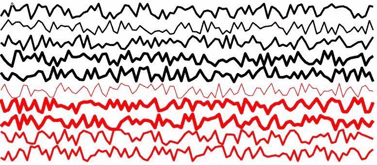
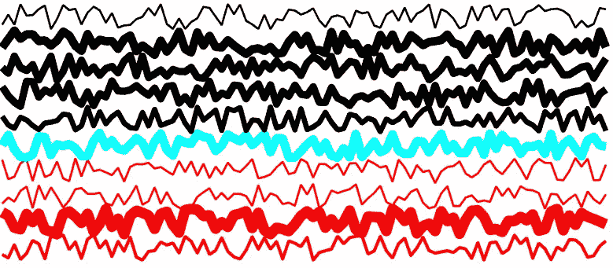
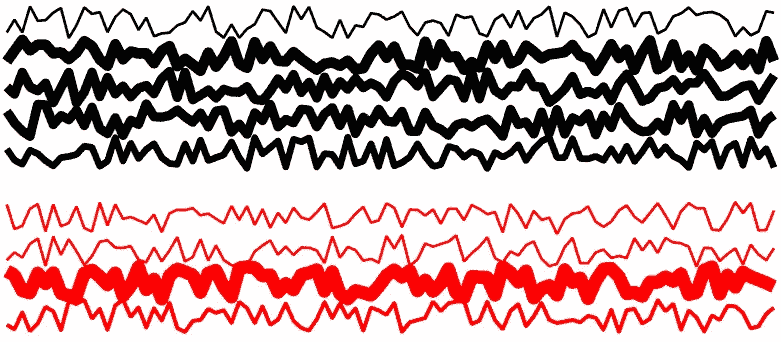
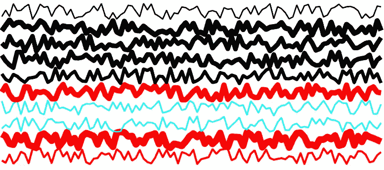

# 第 6 天:享受“处理”数据可视化的“乐趣”

> 原文：<https://medium.com/analytics-vidhya/day-6-have-fun-getting-a-handle-on-your-data-visualizations-6d04bae97a96?source=collection_archive---------12----------------------->



> 声明:除非你已经非常熟悉 rowfun 和在 MATLAB 中创建高级图形，否则你可能想从第 1 天开始[！](/@neuraljojo/day-1-making-matlab-fun-ad850eaffbde)

这篇文章最初会非常简单，但是它介绍了 **rowfun** 的几个重要特性来帮助你管理你的数据可视化。

这是制作“动态”图形的一项重要技能，它肯定会大大改善你的远程实验室会议演示，也会给你的朋友留下深刻印象！

让我们生成一些神经科学家可能会遇到的人工数据。你可以想象这些线条是来自一个电极，一个神经元，一个大脑区域的时间序列数据，不管它是什么。也许你还知道动物的重量——在这个例子中是一只老鼠，所以我们将重量保持在 20 到 25 克之间。(这只是为了让例子更具体。)

```
rng(5);data = [1:10]'+rand(10,100), 20+randi(10,10,1); 
weight = 20+randi(5,10,1);
linewidth = randi(10,10,1);
group = [repmat('r',5,1);repmat('k',5,1)];

mytable = table( data, weight, linewidth, group, ...
    'VariableNames',{'Data','Weight','LineWidth','LineColor'});
```

我们所做的就是创建四个变量:*数据*、*权重*、*线宽*和*组*。

然后我们把它们放进一张桌子里。我们添加了一个标记“VariableNames ”,以便命名表中的列。我们还方便地将前五只老鼠标记为“r ”,后五只老鼠标记为“k”——这将有助于我们稍后使用颜色。

现在我们已经建立了我们的数字:

```
figure('color','w');
ax = axes('NextPlot','add','Xcolor','w','Ycolor','w');
```

再次注意，我们选择预定义我们的图形的参数，而不是更笨拙的“先绘制后保持”的方法。

最后，是开心的时候了:

```
mylines = rowfun( @(data,weight,width,color) ...
plot( ax,data,'LineWidth',width,'Color',color ), mytable, ...
        'OutputFormat', 'uniform' )
```

以下是 90%的 MATLAB 用户都会注意到的两件事:

1.  您正在从 **rowfun** 中运行绘图功能。
2.  您正在保存 **rowfun** 的输出，它们只是您的十行代码的“句柄”。句柄基本上是 MATLAB 语言，表示可以操作的对象，通常是图形对象。
3.  您的 **rowfun** 将可选参数‘output format’作为‘uniform’。这意味着 **rowfun** 的输出将被存储为一个*数组*。

> 在“有趣”的行动中，“统一”意味着“阵列”

*“输出格式”的其他选项是“单元格”和“表格”(稍后会详细介绍)*

## 我们现在能做什么？

很多事情，说实话。但是这里只是上面两个步骤允许你接下来做什么的几个例子。

```
set( mylines(5), 'color', 'c')
```



```
delete( mylines(5) )
```



```
set( mylines( find(mytable.Weight==25) ), 'color', 'c' )
```



# 在你潜入之前，给你一个警告。

当你对一个表使用 rowfun 时，你必须将表中的每一列都传递给匿名函数。对于上面的例子，

```
mylines = rowfun( @(data,weight,width,color) ...
plot( ax,data,'LineWidth',width,'Color',color ), mytable, ...
        'OutputFormat', 'uniform' )
```

作品。

```
mylines = rowfun( @(data,width,color) ...
plot( ax,data,'LineWidth',width,'Color',color ), mytable, ...
        'OutputFormat', 'uniform' )
```

不工作。

这很奇怪，因为你没有在你的图中显式地使用“weight”——但是 **rowfun** 将读取 *mytable* 的所有列，所以你需要显式地命名它们。如果您的桌子变得太大，这可能会成为一个令人头痛的问题。我将在几天后发布一个解决方法。享受你的新的阴谋乐趣！

> 这个故事是我的系列的一部分，题为“30 天的 MATLAB 技巧，我希望我已经知道做神经科学研究生院”。关注我这里的 [Neurojojo](https://medium.com/u/71417ba6ebf5?source=post_page-----6d04bae97a96--------------------------------) 或者在 [Twitter](https://twitter.com/neurojojo) 上关注我，以获得更多提示。