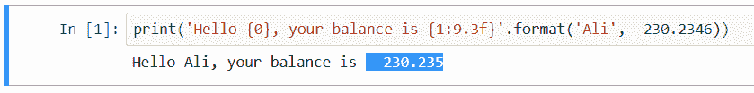
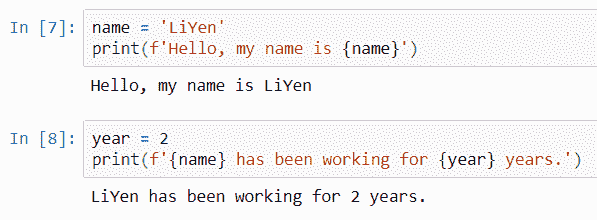

# 第 6 天:Python 中的字符串

> 原文：<https://medium.com/analytics-vidhya/day-6-strings-in-python-fbd1ab5a83f3?source=collection_archive---------3----------------------->

经过几天对数字的研究和使用数字尝试不同的东西，今天让我们开始学习 Python 中的字符串。正如我之前分享的，字符串可以使用单引号( **'…'** )或双引号( **"…"** )在我之前的博客[中，让我们开始吧](https://liyenz.wordpress.com/2018/11/25/let-get-started-with-python/)

# 字符串插值

有许多方法可以格式化 print 语句的字符串。其中之一是使用“ **+** ”符号连接。我在上面的同一篇文章中分享了如何使用“ **+** ”将两个字符串组合在一起。从 docs.python.org 网站上，我发现了一个使用“*”的有趣例子。字符串可以用+运算符连接(粘合在一起)，并用*重复。例子，

```
3 * 'un' + 'ium'
```

它返回，
'unununium '

看起来它能够在连接单词“ium”之前将“un”乘以三次。接下来，我想分享一些字符串中使用的转义语法。我想在这里分享另外三种方法，

*   使用模%运算符。
*   。format()方法。
*   f 字符串(格式化的字符串文字)

# %s，%r 和%d 是做什么的？

## %运算符

-最古老的方法涉及使用模 **%** 运算符的占位符。
- %作为字符串格式操作符。
-使用 **%s** 将字符串注入打印语句。

它们是格式化程序，告诉 Python 获取右侧的变量，并将其放入以替换%s。参见下面的示例，它打印出“我今晚要去市政厅。”在屏幕上。

```
print('I am going to %s tonight.' %'City Hall')
```

如果我有多个占位符怎么办？简单地添加更多的%s。下面的例子打印出来，我今晚要去市政厅和莱佛士广场，你想加入我吗？

```
x = 'City Hall'
y = 'Raffles Place'
print('I am going to %s and %s tonight, would you like to join me?' %(x,y))
```

还记得 Python 中的数字是如何格式化的吗？我在[第 4 天](https://liyenz.wordpress.com/2018/12/02/day-4-numbers-in-python/)的帖子中提到过，它使用%d 进行数字格式化，使用%f 进行浮点格式化。因此，%s 用于字符串。

除了 **%s** ，Python 还有一些其他的，比如:
- **%r** =用于调试。它显示变量的“原始”值。
- **%t** =在字符串中插入制表符。

## 。格式()

- String 方法用于将内容注入到字符串中。
-取任意数量的参数。
-一般语法:“字符串在这里{}，也在这里{}”。格式(' value1 '，' value2')
-两种类型的参数，位置参数和关键字参数。

**位置参数**
-可以用花括号{index}内的参数索引访问的参数列表。
-例如，“您好{0}，您的余额为{1:9.3f}”。格式('阿里'，230.2346)。
-对于 Python，参数列表从 0 开始。

{0}采用第一个值“Ali”，因此它变为“Hello Ali”。

然后，语句继续第二部分，其中{1:9.3f}取第二个值，
230.2346。它并不精确地输出值 230.2346，它还执行操作 9.3f。什么是 9.3f？

**f** 为浮点数的具体**格式。让我后退一小步来检查一下浮点数格式。**。”之前的部分** (9)指定数字(230.2346)可以采用的最小宽度/填充。在这种情况下，230.2346**分配到至少 9 个位置，包括“.”**。如果未指定对齐选项，则它会靠剩余空格的右侧对齐。对于字符串，它靠左对齐。**.”后的部分** (3)将小数部分(2346)截断到给定的数字。在这种情况下，2346 在 3 位**后被**截断。剩余的数(46)被舍入输出 235。**



输出显示你好阿里，你的余额是 230.235。你看到 is 后面的空格了吗？这是因为我在语法中设置了最小宽度或填充，它给出了额外的间距。

**关键字参数**
-key = value 类型的参数列表，可以用花括号{key}内参数的 key 来访问。参数的键值。
-例如，“您好{name}，您的余额为{bal:9.3f}”。格式(name='Ali '，bal=230.2346)。

这个方法给出了与上面的位置参数相同的输出。然而，这种方法清楚地表明，它更干净，更容易被引用，而不用考虑哪个索引号。无论是哪种方法，每个开发人员都有不同的偏好来实现相同的结果。除了 f，还有另外一个**号格式化**可以和**一起使用。格式()**。

## f 弦方法

-这是 Python 3 中的一个新方法。
-一般语法:f '你好，我的名字是{name} '(假设我已经给一个变量名赋值)。

文字前面的 **f** 字符串快速执行字符串插值。这是其他编程语言中常见的字符串格式。它可以处理 print 语句中的字符串和数字。



在开发工作中使用这种方法是非常有用的。一些令人敬畏的阅读和例子可以在 https://pyformat.info/找到。

字符串是不可变的。一旦将字符串值赋给变量，就不能更改它。

最近，我面临一些关于在 SSIS 包中添加转义引用的问题，它需要我在 SSIS 解决方案中使用 C#语言编写代码。我没有探究给定代码的细节。在 Python 中，我们可以使用“\”来转义引号。

# 转义语法

```
print('I haven\'t eaten my lunch.')
```

**使用“\”对单引号**进行转义。屏幕上的输出是我还没吃午饭。或者，它建议我可以在给出结果的代码中使用双引号。

```
print("I haven't eaten my lunch.")
```

**使用打印语句使用“\n”写换行符。**屏幕上的输出:
第一行。
二线。

```
s = 'First line.\nSecond line.' print(s)
```

但是，如果我没有使用 print()语句来显示输出，它将输出显示为不带任何格式的字符串:
第一行。\ n 第二行。

**使用“r”在第一个引号前使用原始字符串。**如果我想显示一个文件位置路径，这可能是有用的，并且碰巧该路径包含\n 一个换行符。

```
print('C:\some\name')
```

屏幕上的输出:
C:\some
ame

这不是我想看到的，尤其是当我想打印文件路径时。我能做的是在引号前加上“r ”,见下面的例子:

```
print(r'C:\some\name')
```

屏幕上的输出，文件路径显示正确。
C:\某\名称

# 索引和切片

字符串是有序序列，这意味着它们可以被**索引**和**切片**以获得字符串的一个子部分。如果你熟悉**子串**，这就是它的意思。我可以使用[x:y]符号提取字符串的一部分，其中 x 是我想要的元素的起始位置，y 是字符串的最后一个位置(不包括这个位置)。这意味着它提取元素起始位置的第一个字符，直到元素的最后一个位置，但不包括作为输出的字符。请参见下面的示例:

```
nric = 'S12345678D' nric[1:8]
```

当我执行上面的代码时，结果显示数字是从字符串中提取的，因为 x 表示位置索引 1，y 表示位置索引 8。在 Python 中，索引从索引 0 开始。因此，它从上面的变量中提取“1234567”。

# 字处理

最常见的有上()，下()，分体()。我参考这个[链接](https://www.programiz.com/python-programming/methods/string)来了解如何使用其中的一些方法。要调用该方法，请使用带有.< method_name >()的变量名。举个例子，

```
nric.upper()
```

我遇到的其他方法有。title()，。startswith()，。endswith()。例如，请参考上面的链接。

# 字符串输入

输入功能可用于捕捉用户的输入。除了字符串，它们还可以用于数字。例如，我创建了一个名为 your_name 的变量来保存用户的输入，并为该变量分配输入函数。接下来，我使用 print()语句打印出字符串，包括用户的输入，假定用户键在' Joanne '中。结果显示“你的名字是乔安妮”

```
your_name = input() print('Your name is ', your_name)
```

到目前为止，这部分仍然是基本的 Python，不涉及任何分析或数据科学工作，如果你正在寻找一个。如果你想看看我以前的文章，请访问这个[链接](https://liyenz.wordpress.com/category/experience-sharing/python/)。希望你喜欢我的分享，请关注下一次更新。谢谢你。

*原载于 2019 年 1 月 6 日*[*【http://liyenz.wordpress.com】*](https://liyenz.wordpress.com/2019/01/06/day-6-strings-in-python/)*。*