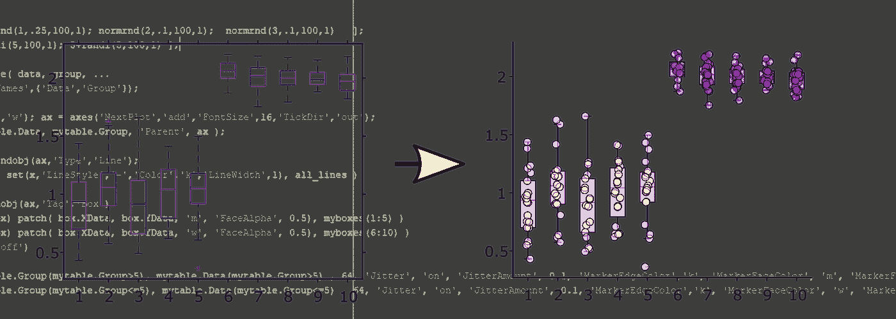
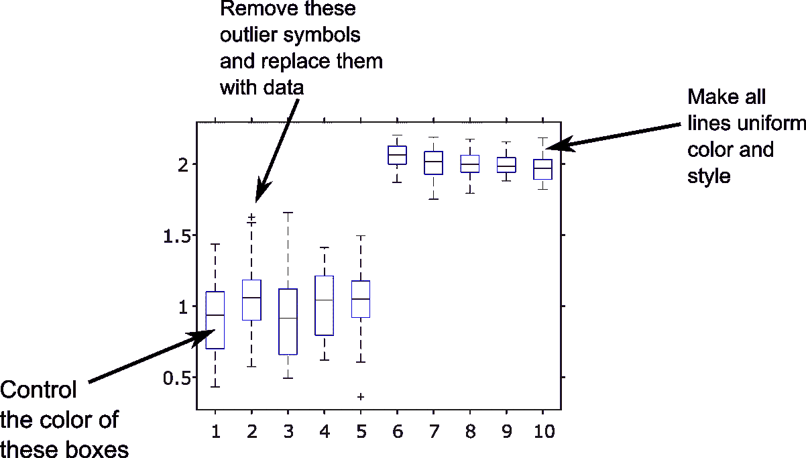
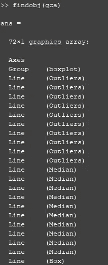

# 第 7 天:定制你的图形和 MATLAB 最有用的隐藏绘图属性

> 原文：<https://medium.com/analytics-vidhya/day-7-where-does-my-data-go-and-matlabs-most-useful-hidden-plotting-property-d00d9d12045e?source=collection_archive---------16----------------------->



使用比箱线图还小的代码块，您可以在 MATLAB 中控制您的图形，并根据您的目的定制它们。在这个过程中，您将了解 findobj、标记、类型和抖动。

*问候！除非你熟悉 MATLAB 中的“有趣”操作，否则你可能想从阅读我以前的帖子开始，从第一天的* *开始* [*。*](/@neuraljojo/day-1-making-matlab-fun-ad850eaffbde)

通常，在学术界，当你接近发表或展示你的研究时，你需要增强你的数字，使它们清晰明了。在开始的时候有计划地这么做将会省去你很多头疼的事情。

> 这是我在研究生院做的事情:我制作的图形看起来足够好，可以在实验室会议上或向我的导师展示，但当涉及到使它们具有正确的大小、形状、颜色以便于阅读，为读者添加或强调某些功能等等时，我会进入 Illustrator 或 Inkscape 并开始摆弄。这些工具有它们的位置(主要是布置图形)，但是检查每个图形并进行调整是一个巨大的时间消耗。上帝禁止你用新的或额外的数据重新制作这些数字(你会的)。

我们这样做的原因是因为有时我们的配色方案与合作者的不匹配，或者因为 MATLAB 没有给我们一个直接的方法来设置某些对象的颜色。

到目前为止，最糟糕的是 **boxplot** 函数。没有简单的方法来:



(也就是说，如果你对能帮你解决很多问题的软件包感兴趣，我强烈推荐[Gramm](https://github.com/piermorel/gramm)by[@ NeuroPierre](https://twitter.com/NeuroPierre))

但是对于我们这里的目的，我们将利用这些不幸的限制作为学习的机会:

1.  如何使用 **findobj** 使用“类型”和“标签”在我们的绘图轴中搜索和选择对象
2.  如何使用 **arrayfun** 控制那些对象
3.  如何根据数据集中的信息用“抖动”覆盖**散点图**

## 让我们开始吧。

像往常一样，创建一个假数据集:

```
rng(5)data = [ normrnd(1,.25,100,1); normrnd(2,.1,100,1);  ];
animal_id = [ randi(5,100,1); 5+randi(5,100,1) ];mytable = table( data, animal_id, ...
                 'VariableNames',{'Data','Animal_id'});
```

我们可以想象它由分布在一组测试对象中的 100 个数据点(标识为 1 到 5)和分布在具有更高平均值的第二组中的另外 100 个数据点(标识为 6 到 10)组成。[对于神经人，可能是两组小鼠(1-5)和(6-10)，数据是每只小鼠神经元的平均放电率。]

接下来，我们将像往常一样生成我们的**箱线图**。

```
figure('color','w'); 
ax = axes('NextPlot','add','FontSize',16,'TickDir','out');boxplot( mytable.Data, mytable.Animal_id, 'Parent', ax );
```

您已经创建了盒子，但是它们在哪里呢？我们可以通过简单地使用 **findobj** 函数从图形或它的轴中得到任何东西。请在您的命令窗口中尝试。

```
findobj(ax)
```

您会看到类似这样的内容:



## 一切都很好，看起来是时候让**来做 arrayfun** 了。但是我们如何指定我们想要修改的对象呢？

原来你可以传递一个“类型”参数，只取出“类型”的东西，也就是“行”。让*所有线条统一的好方法*。让我们在这儿做它。

```
all_lines = findobj(ax,'Type','Line');arrayfun( @(x) set(x,'LineStyle','-','Color','k','LineWidth',1), all_lines )
```

回顾一下:您正在迭代 *all_lines* 数组，并且为该数组中的每个元素设置属性。没有 for 循环，没有要索引的 I，没有伪变量。只是一个简单的 **arrayfun** ！

剧情已经看起来更好了。

## 但是那些盒子呢？

这也有一个参数。是‘标签’。请记住这一点，以后当您想要修改其他有标签的图形对象时！*提示:它们都有标签。*

```
myboxes = findobj(ax,'Tag','Box')arrayfun( @(box) patch( box.XData, box.YData, 'm', 'FaceAlpha', 0.5), myboxes(1:5) )
```

我们基本上在框 1 到 5 上放置了一个洋红色的补丁(但是你可以选择 1 到 10 的任何子集，我们的 animal_id)。

*【怪癖:在 myboxes 数组中绘制的最后五个盒子实际上是 1:5！]*

你可以用**补丁**做各种各样的事情，如果你还没有看过的话，我建议你查阅一下它的文档。

## 另一件很酷的事情是:立即删除

你不喜欢那些异常值在箱线图中的绘制方式？(我没有。)

删掉就好了。简单。

```
outliers = findobj( 'Tag', 'Outliers' )
delete( outliers )
```

这将消除所有的异常值——当然，如果您想有选择地挑出某些异常值并对它们进行注释或强调，您也可以在这里使用 **arrayfun** 。

# 最后是抖动。

让我们添加数据点，并匹配配色方案。

我们将让第二组受试者(6-10 名)呈现洋红色，以匹配我们的盒子。为此，我们将对我们的 *mytable* 变量做一点布尔索引。尝试以下方法:

```
mytable.Animal_id(mytable.Animal_id>5)
```

这将产生一个“迷你”表，仅包含组> 5 的那些受试者。让我们将该表的内容绘制成散点图，如下所示:

```
scatter( mytable.Animal_id(mytable.Animal_id>5), mytable.Data(mytable.Animal_id>5) , 64, 'Jitter', 'on', 'JitterAmount', 0.1, 'MarkerEdgeColor','k', 'MarkerFaceColor', 'm', 'MarkerFaceAlpha', 0.5 )
```

[注意:我们将点的大小设置为 64(散点的第三个参数)。]

通过使用未记录的“抖动”和“抖动量”属性，您可以给散点图中的数据点一个漂亮的抖动外观。还要看看我们如何索引表格，以便将散布点放置在第二组上。

我们可以对第一组盒子做同样的事情。

```
scatter( mytable.Animal_id(mytable.Animal_id<=5), mytable.Data(mytable.Animal_id<=5) , 64, 'Jitter', 'on', 'JitterAmount', 0.1, 'MarkerEdgeColor','k', 'MarkerFaceColor', 'w', 'MarkerFaceAlpha', 0.5 )
```

## 生成图形的完整代码如下。

这是非常微不足道的，希望容易理解！但更重要的是，它应该是教育性的，而不仅仅是实用性的。

请继续关注更多技巧，让您的 MATLAB 代码简洁而灵活！