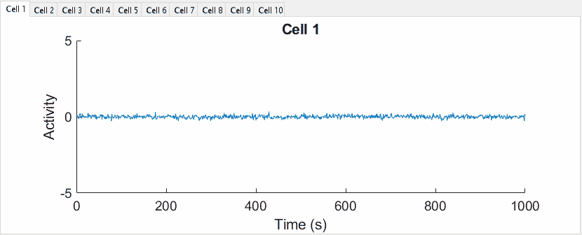

# 第 8 天:子绘图很棒，但是你曾经尝试过在它自己的 uitab 中显示每个数据集吗？

> 原文：<https://medium.com/analytics-vidhya/day-8-subplotting-is-great-but-have-you-ever-tried-displaying-each-dataset-in-its-own-uitab-796dbf203eaf?source=collection_archive---------17----------------------->



"我们能一个接一个地检查所有的细胞吗？"看完第八天的小贴士，答案是:可以！

*在开始使用 tab 之前，通过查看* [*我第一天的帖子:让 MATLAB 变得“有趣”，确保你至少熟悉 arrayfun 的基本用法。*](/@neuraljojo/day-1-making-matlab-fun-ad850eaffbde)

第 8 天的参赛作品受到了一位朋友的启发，她的尊敬的导师会要求她打印出实验中每个单个神经元的神经时间序列数据，以便他们可以一个一个地仔细检查它们。MATLAB 提供了一个很好的方法来做到这一点——虚拟地。

在某些时候，你可能在 MATLAB 中遇到过制表符。也许是一个聪明的本科生在 2006 年为实验室做的 GUI 的一部分，但是你可能没有想到它们，因为它们很少在分析脚本中使用。你不会把它们放在幻灯片里或者在会议上打印出来，但是在这个数字世界里，它们提供了一些很大的好处:

*   我们越来越多地转向网络，所以你的同事和顾问不会要求你打印页面来翻阅
*   点击文件是一种拖累，浪费宝贵的时间和注意力
*   将所有数据放在一个窗口中可以让您轻松地来回移动，同时 x 轴和 y 轴始终保持在同一位置

幸运的是，您不需要指南或 GUI 来获得选项卡的好处。它们实际上和支线剧情一样简单易用。

在这里，我会告诉你到底是怎么做的。

## 从一些无聊的随机数据开始。

假设我们希望数据的形状是 10 行乘以 1000 列，或者说是 10 个单元格乘以 1000 个时间点。数据以这种方式构造是很常见的，因此应该很容易适应您的目的。

```
Ncells = 10;
Y = arrayfun( @(sigma) normrnd(0,sigma,1,1000), linspace(.1,1,10), 'UniformOutput', false );
data = cell2mat(Y');
```

> **注意:**如果你没有添加‘uniform output’，false 标志，MATLAB 会返回一个错误。这是 *arrayfun* 的一个怪癖:它不能连接我们函数的输出，在这里是 *normrnd* 。因此，我们将采取 MATLAB 建议的修复，并添加“统一输出”，真标志。然后，我们将使用 *cell2mat* 连接 Y，这是 *arrayfun* 的单元(不是“统一的”——应该是一个矩阵)输出。

## 仅用三行简单的代码，就可以建立整个图形

通过使用 *arrayfun* ，你可以用三行代码建立一个完整的“GUI”。我将标题添加到每个选项卡上，如“单元格 1”、“单元格 2”等。使用对 *sprintf* 的调用，但这是可选的。

```
figure();
tabs_ = arrayfun( @(x) uitab( 'Title', sprintf('Cell %i',x) ), [1:Ncells] );
ax_ = arrayfun( @(tab) axes( tab ), tabs_ );
```

注意最后一个 *arrayfun* 的参数不是一个数字数组，而是一个标签数组！别担心，MATLAB 会处理这些细节。

## 现在让我们配置我们的轴并绘制数据！

让我们假设我们上面创建的假数据代表十个单元格的时间序列，并且我们从 *normrnd* 参数中知道，这些值将大致跨越-2 到 2。我们将再次使用 *arrayfun* 确保我们图形中的每个轴都已设置好。

```
arrayfun( @(i) set( ax_(i), 'NextPlot', 'add',... 
                            'FontSize', 14,...
                            'YLim', [-5,5],...
                            'YLabel', text(0,0,'Activity'),...
                            'XLabel', text(0,0,'Time (s)'),...
                 'Title', text(0,0,sprintf('Cell %i',i)) ),... [1:Ncells] ) 
% The last line contains the array over which we have fun!
```

我们不需要返回任何东西，我们只是希望 MATLAB 将这些设置应用到所有的轴上:ax_(1)，ax_(2)，等等。

> **注意好。**这里的标签和标题有点奇怪。这与轴的配置方式有关，与制表符无关。你不能简单地写' YLabel '，' Activity '——你必须给' YLabel '一个**文本对象**，这就是为什么我们在上面使用' YLabel '，text(0，0，' Activity ')。

如果你一直关注其他帖子，下一步几乎是微不足道的:

```
arrayfun( @(i) plot(ax_(i),data(i,:)), [1:Ncells] );
```

尽情享受吧！

下面是生成顶部所示图形的完整代码片段。[(感谢 MathWorks 支持团队提供了生成动画形象的代码。)](https://www.mathworks.com/matlabcentral/answers/94495-how-can-i-create-animated-gif-images-in-matlab)