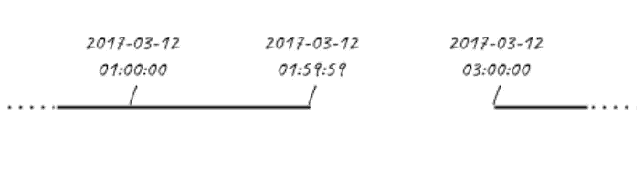
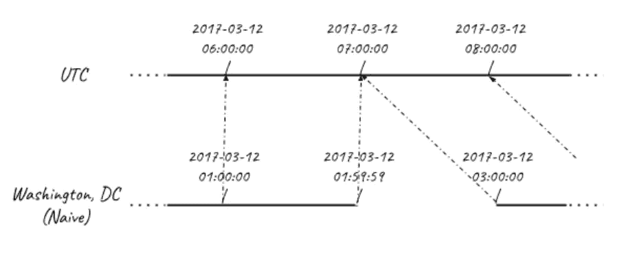

# 日光节约时间和数据科学中的相关问题和解决方案！

> 原文：<https://medium.com/analytics-vidhya/day-light-saving-time-and-associated-problems-and-solutions-in-data-science-f4fac678f828?source=collection_archive---------16----------------------->

日光节约是政府用来增加一个国家日光照射量的一个小把戏，通过在一个特定的时间间隔内改变时区来增加一个国家的日光照射量，而我们大多数人并不知道这个时间间隔。


标题

为了创造更长的夏夜，他们一年要调两次钟。

1.  美国大部分地区在三月的第二个星期天的凌晨 2:00 开始实行夏令时，并在十一月的第一个星期天恢复标准时间。在美国，每个时区在不同的时间转换。
2.  在**欧盟**，夏令时在世界时(格林威治标准时间)凌晨 1 点开始和结束。它开始于三月的最后一个星期天，结束于十月的最后一个星期天。在欧盟，所有时区都在同一时刻改变。

> 这些国家基本上使用一个被称为**向前跳跃，向后倒退**的通用规则

意识不到这一现象对于普通人来说没什么大不了的，但是对于数据科学爱好者和研究人员来说，它会给你的结果带来巨大的误差。

举例来说，如果你正在**处理与时间相关的数据**，计算持续时间之间的总间隔，以了解时间和你的项目的一些变量之间的一些趋势，你*遇到一个时间差*，它与你的预期相比**是负的或者非常大的**，并且你对为什么会发生这种情况感到困惑。

# 问题示例

让我们考虑这样一种情况，时钟在春天被向前移动了**。**

2017 年 3 月 12 日**华盛顿 DC** 时钟从*凌晨 1:59:59 直接跳到了凌晨 3:00:00*(即时钟向前跳动),华盛顿 DC 时区之后的整个地区都没有正式的凌晨 2 点。



DC 华盛顿的春天

现在你一定已经猜到了，当你处理大量相关数据时，这会是一个很大的问题！
你能想到的一个基本解决方案就是让它与 UTC 时间相同，这样我们就可以进行比较，但是**将这个春季向前跳跃与 UTC 时间进行比较，我们看到如下:**



与 UTC 相比

正如我们在这里看到的，当我们试图通过与 UTC 进行比较来寻找共同点时，另一个问题出现了。这里，它与 UTC 早些时候的时间偏移也发生了变化！
在 DC 华盛顿的**凌晨 1:00:00，我们处于东部标准时间** *(UTC 偏移= -ve 5 小时)* **而在 DC 华盛顿的凌晨 3:00:00，我们处于东部夏令时(EDT)** *(UTC 偏移= -ve 4 小时)*

如果您确切知道这是何时发生的，这个问题很容易解决，但是如果您正在处理世界各地的数据，那么准确找出每个国家的时钟何时向前跳动以及何时向后跳动将非常繁琐！

> 许多国家在同一个国家也有多个时区，例如俄罗斯就有 12 个时区！

# 用 PYTHON 代码解释的问题

首先查看在处理日期 2017 年 3 月 12 日时会出现什么样的一般性错误，并找出在凌晨 1:59:59 和 3:00:00 之间经过的总时间。

```
time_before_2am = datetime(2017, 3, 12, 1, 59, 59) #setting time to 1:59:59 on 12/03/2017 [dd/mm/yyyy]time_before_2am.isoformat()**'2017-03-12T01:59:59'**
```

这里我们制作一个普通的**日期时间对象**来存储日期，然后以普通的 ISO 格式
**打印它所包含的内容，并添加第二次时间**

```
time_ahead_3am = datetime(2017, 3, 12, 3, 0, 0)time_ahead_3am.isoformat()**'2017-03-12T03:00:00'**
```

**计算时差**

```
(time_before_2am - time_ahead_3am).total_seconds()**3601**
```

据信答案是 3601 秒。1 小时 1 秒
但实际上只过了 1 秒！

# **解决方案**

现在，如果您只处理一个时区，您可以手动更改时区偏移量来解决这个问题，但是如果您无法根据各个地区政府的命令手动找到偏移量更改的确切时间，该怎么办呢？

包裹来拯救我们了。这个包让我们不用记住夏令时规则。它有一个名为`tz`的类:

1.  根据政府不断变化的规则，每年自动更新其数据库两次
2.  自动检查传入的时间是否在夏令时之下，并自动给出正确的结果，无需您担心偏移的变化！

例如，同一问题的**代码将为**:

```
# Import tzfrom dateutil import tz# Create eastern timezone for washinton DC eastern = tz.gettz('America/New_York')# 2017-03-12 01:59:59 in Eastern Time (EST)time_before_2am = datetime(2017, 3, 12, 1, 59, 59,tzinfo = eastern)# 2017-03-12 03:00:00 in Eastern Time( dateutil automatically figures out this time the eastern time zone is in EDT)time_ahead_3am = datetime(2017, 3, 12, 3, 0, 0,tzinfo = eastern)
```

**计算时差**

```
(time_before_2am - time_ahead_3am).total_seconds()**1**
```

**正如我们所看到的，它正确地得到了 1 秒的结果！**

感谢阅读到最后！这是我的第一篇媒体文章。