# 第 2 天:Python3 入门

> 原文：<https://medium.com/analytics-vidhya/day2-getting-started-with-python3-67516525ade2?source=collection_archive---------33----------------------->

## 适用于初学者的 MLops

## 对 python3 在交互式 shell、Jupyter 笔记本、程序文件(。py 文件)

在我的前一篇文章中，我已经介绍了一些操作系统的基本概念和使用 anaconda 安装 python。
这篇文章将帮助你建立一些 Python3 语言的基本技能。

既然你在这里，你心中应该没有疑问 ***为什么是 python？*** 相反问题应该是 ***哪个 python？？***

在 python 世界中，到目前为止，有两大类 python，即 Python2 和 Python3。阅读 [Python 组织](https://wiki.python.org/moin/Python2orPython3)的这篇小文章。他们推荐 Python3 有几个原因。

那就是 python3 了！！

因此，打开 CMD 并确保您已经激活了我们在上一篇文章中创建的虚拟环境。然后我们将通过键入 *python 来启动 python 解释器。*

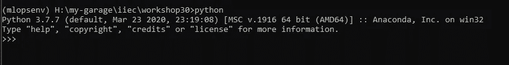

Python 解释器(如果你以前没见过:P)

在开始之前，有一件关于这个解释器的事情你应该知道。它是一个交互式 shell，或者你可以说是一个 REPL(读取、评估、打印、循环)。正如它的名字所说，它会阅读你输入的任何内容。然后将其作为 python 表达式进行计算，然后打印该表达式的输出。然后重复做同样的事情，直到我们退出这个循环。

Python 中有很多东西，但现在我们将重点关注在我们以后的旅程中需要开始和休息的东西。

所以让我们从打印一些东西开始…

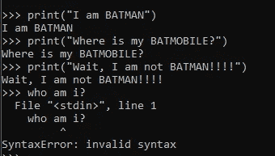

这里你可以看到一系列的读取、评估、打印和循环。

这就是翻译的工作…

但是为什么结尾会有错误呢？？那是因为 python 不知道如何处理它。我们还没有告诉它打印它，或者评估它，或者把它保存在一个变量中，或者用它做任何事情。于是他糊涂了，说:*“嘿，我不知道你在说什么？这个我不能理解？我的语言不是这样写的。这是完整的* ***语法错误！***

*现在，上面的讨论让我想起了我们可以在 python 中做的另一件大事…**变数！！***

*为什么如此强调变量？它们难道不是每一种编程语言中常见的东西吗？*

*是的，他们是。但是，因为 python 是一种松散类型的语言，它不需要你初始化变量。您可以随时分配它们。*

*让我们看看变量在 python 中是如何工作的。*

*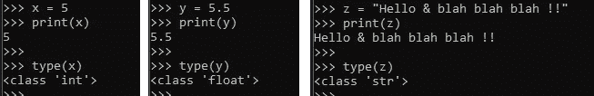*

*这里有 3 个例子来说明如何给 python 变量分配不同的值。*

*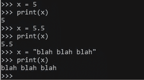*

*您也可以使用同一个 python 变量来分配不同类型的值。但是这将覆盖以前的值。所以当你不需要变量的前一个值的时候就这么做。创建新变量会占用一些内存，这种做法可能会有所帮助。*

*好..*

*但是还有一个问题。*

## *如何保存我们用解释器写的程序？？？*

*所以答案是，**我们不能。**是的，我们不能保存用解释器写的程序。但是有一些很酷的解决方案。 [*朱庇特笔记本*](https://jupyter.org/) *。**

*没有更多的交谈，只是退出这个解释器，并从您的 CMD 启动 jupyter 笔记本。*(确保你在一个你想要创建和保存程序的专用文件夹中)**

*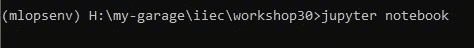*

*推出 jupyter 笔记本*

*很简单。这将在您的默认浏览器上启动一个网页。*

*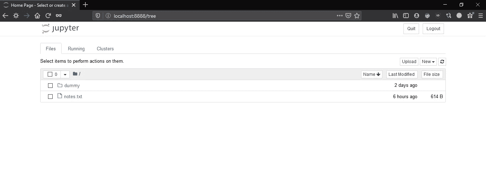*

*类似这样的东西；但是你不会看到这两个文件；*

*启动后，进入右上方的*新建*，然后选择*笔记本下的 *python3* 。**

*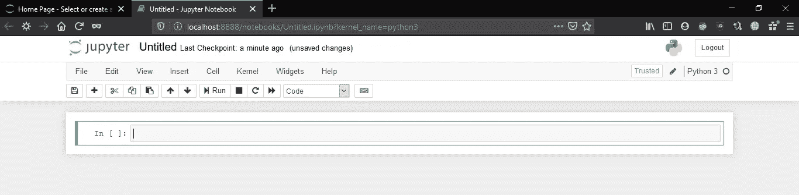*

*你现在会看到这个。*

*这将提示您编写一些 python 代码。虽然这有点类似于解释器，但它是完全不同的东西。
但幸运的是，Python 语法是相同的。这对我们来说足够了。*

*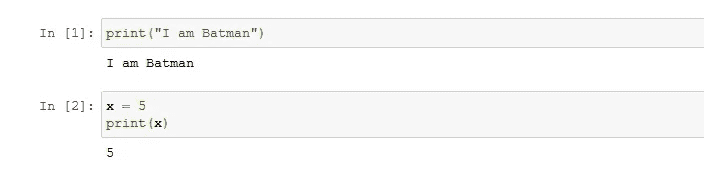*

*一些例子*

*网上有很多博客和文章可以告诉你如何有效地使用 jupyter，比如[这个](https://www.dataquest.io/blog/jupyter-notebook-tutorial/)和[这个](https://www.codecademy.com/articles/how-to-use-jupyter-notebooks)；但是请随意搜索您自己的来源。*

*还有一些你会经常看到的其他数据类型。列表和元组。*

*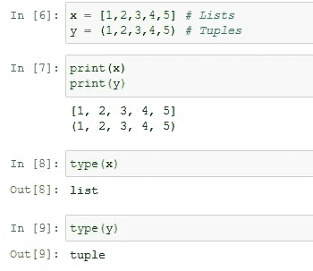*

*我想，你能理解这里发生了什么。在这里阅读更多关于列表和元组的内容→([https://realpython.com/python-lists-tuples](https://realpython.com/python-lists-tuples/)/)*

*变量和数据类型讲够了，我们来学习一些条件语句。*

*当我们想在一种情况下执行一些代码，而在另一种情况下执行另一个代码时，就会用到条件语句。这听起来有点像 IF 和 ELSE 条件。*

*让我们看看代码。*

*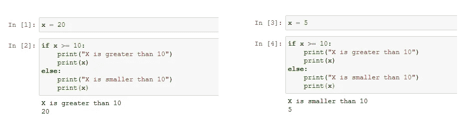*

*上面的代码检查 x 变量是否大于等于 10。如果条件为*真*，则如果程序块运行，或者如果条件为*假*或*假*，则程序块运行。*

*重要的是要注意 if 块和 else 块的缩进。在 Python 中，不支持花括号来开始和结束块。每个块由 4 个空格或 1 个制表符定义。关于 python 中块的工作方式，有一个很好的来源。念[这个](https://mtomassoli.wordpress.com/2012/04/20/code-blocks-in-python/)。*

*到目前为止，我们已经看到了翻译和 jupyter 笔记本。但是他们不允许我写代码，也不允许我一键运行。这个可以通过*解决。py 程序文件。**

## ***那些怎么写？？***

*它们非常简单。打开你选择的文本编辑器(我用的是记事本),在里面写下下面的代码。*

```
*x = 15if( x >= 10 ):
    print("X is greater than 10")
    print(x)
else:
    print("X is smaller than 10")
    print(x)*
```

*现在将您的文件保存为 ***first_code.py****

*要执行这个，我们需要 python 解释器来读取这个文件，执行每个语句，并给我输出。在 CMD 中键入下面的代码，看看其中的神奇之处。*

```
*python first_code.py*
```

*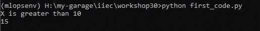*

*输出*

*但是这个程序有一些限制。x 的值是固定的。我们需要用户为此提供他的输入。这可以通过 python 的 [input()](https://docs.python.org/3/library/functions.html#input) 函数来实现。*

*如果你已经阅读了上述输入功能链接的解释。您必须知道 input 函数接受输入并将其转换为字符串。这是需要记住的重要事情。*

*现在让我们用下面的例子来修改我们的代码。*

```
*x = int(input("Enter the number: "))if( x >= 10 ):
    print("X is greater than 10")
    print(x)
else:
    print("X is smaller than 10")
    print(x)*
```

*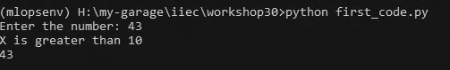*

*输出*

*在上面的例子中，*

1.  *我们正在听取用户的意见*
2.  *将输入转换为整数类型*
3.  *然后将它保存在一个变量中*
4.  *然后用 if 条件检查它，得到我们的输出。*

*但是我们能不能以某种方式编码，让用户可以一次又一次地提供输入并检查？是啊！在这种情况下，我们可以使用循环。*

*有两种类型的循环→ for 循环和 while 循环。*

*让我们看一个例子*

*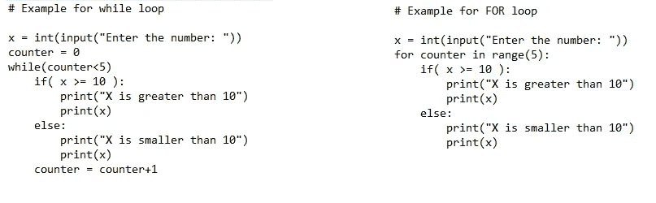*

*for 循环和 while 循环*

*这两个代码将给出相同的输出。我们有时使用 for 循环，有时使用 while 循环。你可以[阅读这篇文章](https://www.guru99.com/python-loops-while-for-break-continue-enumerate.html)了解它们的区别和用法。*

*在这里，我们已经经历了很多关于 python 的不同事情。但这还不是全部。python 里还有很多东西。上述主题将为您提供基础知识，帮助您理解简单的 python 代码，并为您的 python 编程打下基础。*

*无论我们去哪里，我们都需要对数据结构有相当的了解。在 python 中，它们很容易学习和使用。你可以[阅读本教程](https://python.swaroopch.com/data_structures.html)来深入理解 python 中数据结构的工作方式。*