# 第三天:图像处理基础

> 原文：<https://medium.com/analytics-vidhya/day3-basics-of-image-processing-9696817c77b9?source=collection_archive---------25----------------------->

## 适用于初学者的 MLops

## 图像是如何工作的？怎样才能对图像进行操作？

我们都熟悉什么是图像，以及如何执行一些基本操作，如裁剪、将其转换为黑白图像或放大颜色。

当相机点击图像时，我们看到图像。但是我们的计算机不知道什么是颜色。我们的计算机使用颜色模型来映射带有颜色强度的数字，这些数字的组合定义了它是什么颜色。

在数字世界中，图像不过是矩阵形式的若干像素的组合，其中每个像素表示颜色组合值。

在 python 中，列表显然被称为 list。但是嵌套列表也称为列表。

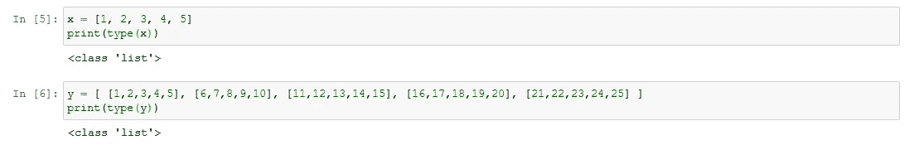

列表和嵌套列表

为了创建数组，我们需要另一个名为 numpy 的 python 模块。如果您还没有安装 numpy，请安装它。

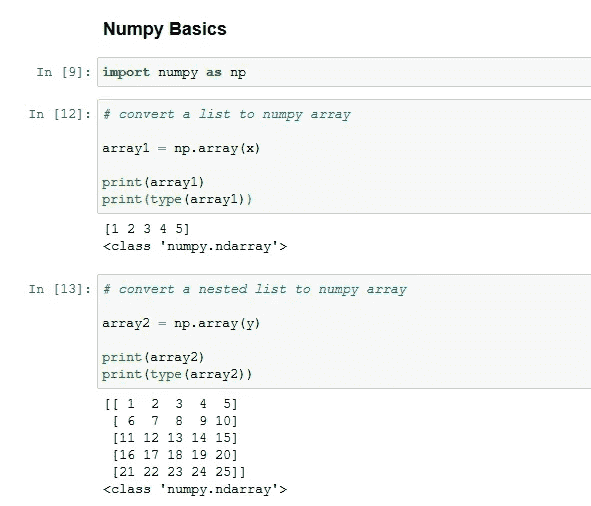

将列表转换为 numpy 数组

列表的类型改成了 *numpy.ndarray.* 这里 ndarray 的意思是 N 维数组。'

所以我们现在知道如何创建一个数组(或者我们可以说是一个矩阵)。让我再给你举几个关于 numpy 的例子，让你明白不同的运算是如何影响 numpy 矩阵的。

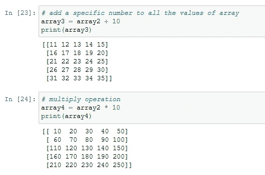

一些基本的数学运算

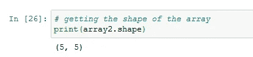

数组形状=行 X 列

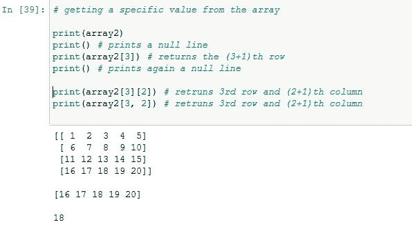

更多的数组操作

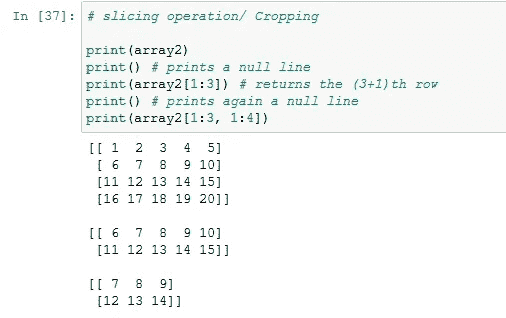

裁剪数组

让我们在这里跳跃一下。无论我们在这里学到了什么，现在我们将把这些概念应用于基本的图像处理。

在开始之前，你需要另一个模块来理解什么是图像，并帮助我们处理它。幸运的是，有许多 python 库可以为我们做同样的事情。在这里，我们将使用**和 *opencv。***

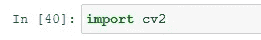

这就是我们如何从 opencv 库中导入这个模块

如果没有错误，我们就可以开始处理图像了。如果你正面临一些错误，那么你可能还没有安装这个库。快速谷歌搜索，用康达安装。

是时候从我们的 python 代码中读取一个图像并进行查看了。简单的步骤。

1.  在工作目录中保存图像。
2.  写出下面给出的代码。

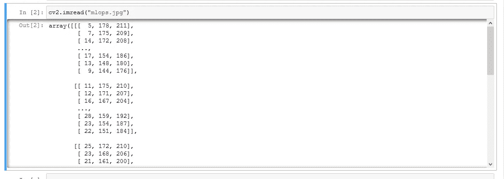

cv2 . im read(" imagename . extension ")

这就是我们在 python 中读取任何图像的方式。令人惊奇的是，我们有了与图像相关的数组值。换句话说，我们有一个数组来显示图像的每个像素，包括图像的蓝色、绿色和红色通道值。

现在让我们看看如何以图像的形式查看同一个数组。

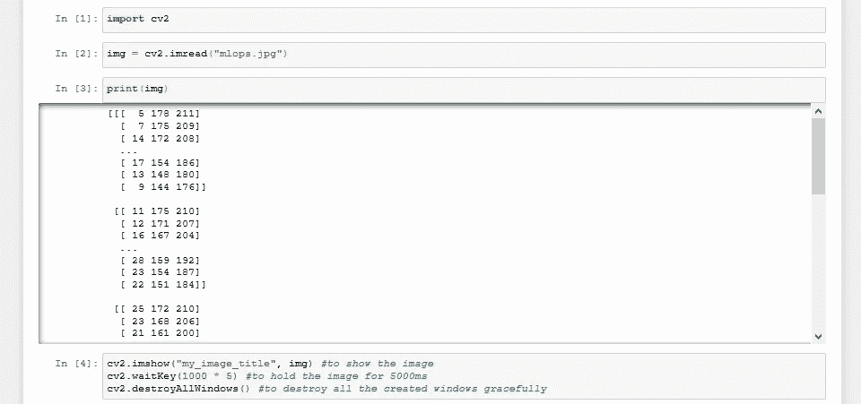

上面的代码会给出如下所示的输出。

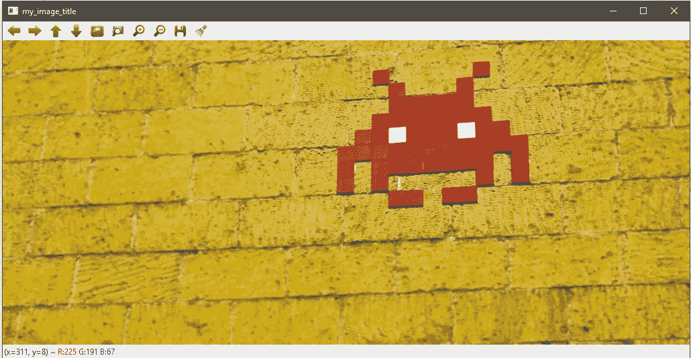

你肯定会看到你读过的图像，而不是这个。

在图片标题栏可以看到，我在 ***imshow()*** 函数中提供的标题在这里有所体现。

这是一个简单的任务，我们将在图像处理中做很多。

现在让我们对这个图像应用经典的 numpy 数组操作，看看我们能得到什么。

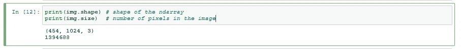

形状和大小很重要

这是我们能做的最基本的 numpy 数组操作。这揭示了一些关于图像→大小和形状的有趣信息。

现在让我们试着分割这个数组的一部分。我从 windows 画图工具中获得了一些帮助，并计算了分割数组的像素范围。

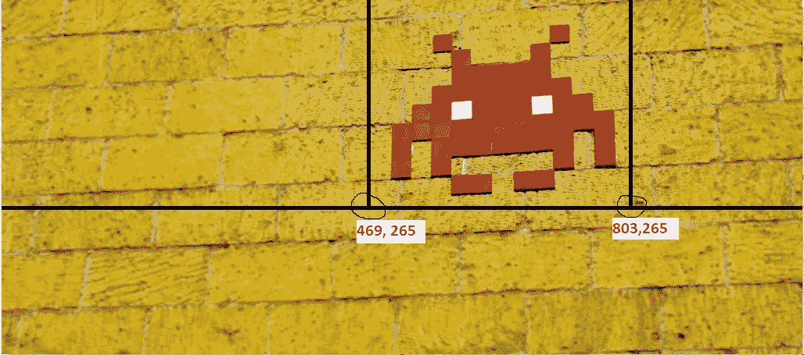

大概是这样…因为我想切掉这张外星人的脸

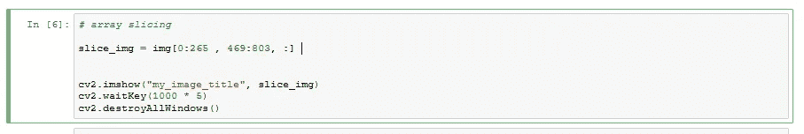

在我看来，代码是这样的

因为我已经计算了图像的形状，它是一个 3D 数组。在我计算出要分割的部分(使用绘画工具)后，我像这样分割我的数组/图像。

```
slice_img = img[0:265 , 469:803, :]
```

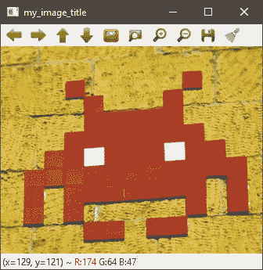

输出

恭喜你！！现在，您已经编写了一段代码，为您裁剪了一幅图像。现在让我们将它保存在一个文件中，这样我们就可以与其他人共享它。

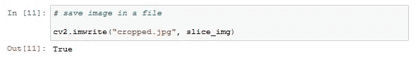

如果为真，则图像保存成功。

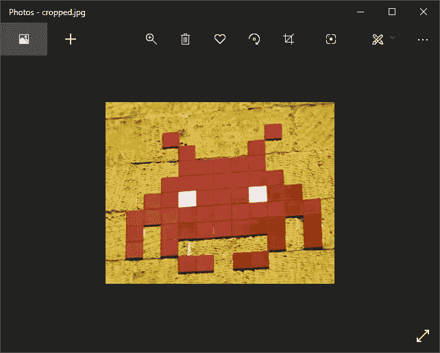

试着用一些其他的图片做同样的练习。

至此，我们已经了解了图像在计算机系统中是如何工作的，以及我们如何操纵它们。

现在让我们在图像上尝试更多的操作。

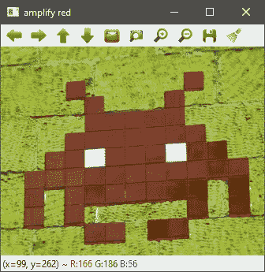

在上面的图片中，我将红色的强度降低了 50%。

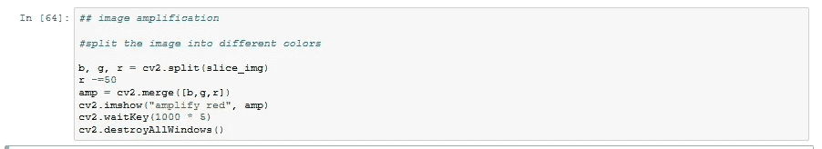

密码

您可以通过将图像分割成不同的颜色通道来更改颜色强度，然后在修改其强度值后合并它们。

cv2 模块中有许多不同的功能，可以帮助我们完成从基本操作到更高级操作的大量任务。你可以从[这里](https://stackabuse.com/introduction-to-image-processing-in-python-with-opencv/)和[这里](https://opencv-python-tutroals.readthedocs.io/en/latest/py_tutorials/py_tutorials.html)开始学习使用 opencv 对图像进行更多操作。

今天够了。我们会对图像进行更多的修补，并在需要的时候看到一些与高级图像处理相关的新概念。