# 第 4 天:基本机器学习概念 1

> 原文：<https://medium.com/analytics-vidhya/day4-basic-machine-learning-concepts-2ee3e154b8db?source=collection_archive---------30----------------------->

## 适用于初学者的 MLops

## ML 是什么？机器如何学习？我们如何训练任何机器？

根据维基百科，

> 机器学习是对通过经验自动改进的计算机算法的研究。它被视为人工智能的一个子集。

根据定义，很明显，我们只需为计算机算法提供经验，使其能够自我改进。

不要纠缠于大量的理论，让我们跳到一些实际问题上。

和往常一样，python 中有很多库，有一些我们可以使用的基本算法。这减少了从头开发我们自己的算法的痛苦；这包括大量的数学工作。

但首先让我们了解这里每件事背后的概念。

主要有两种机器学习类别:监督的和非监督的。
顾名思义有监督的意思就是模型/机器在某种东西(主要是标签)的监督下进行训练。而无人监督的情况下会自己学习。在这里，机器必须自己与数据建立关系和模式(没有监督)。

在这两个项目下还有更多的分部。但是我们现在从线性回归开始。

每个人都应该熟悉线性回归。这是很常见的。

```
y = (m)x
```

从技术上讲，线性回归给出了两个变量之间的线性关系，如图所示。

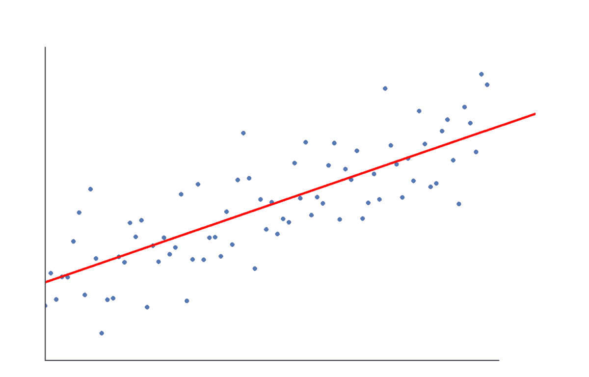

线性回归的典型例子

我们已经决定了算法，现在我们需要一些数据，以便我的算法可以通过学习这些数据来获得经验。

让我们在 excel 表格中创建一些数据，并在我们的 python 代码中使用它们。

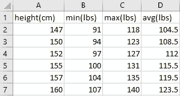

体重-身高的一些自定义数据

上面的图片是我用 excel 表格生成的 csv 数据。现在我用同一个表做一个线性回归机器学习模型。

第一步是在一些 python 变量中加载这些数据。我们有一个图书馆叫做 ***熊猫馆。*** 这有助于我们交互和操作 excel 表格和类似的数据。(和往常一样，如果你没有它，你必须安装它)

现在，我们将用 python 代码导入该模块，并读取我们之前创建的 csv 文件。

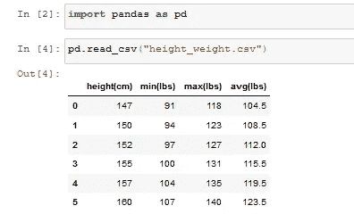

正如所料，我们已经成功地在 python 程序中加载了 csv 文件。现在提取**高度(厘米)**和**平均值(磅)的值。**这里，我们将尝试根据提供的体重预测一个人的身高。

我们将使用 avg(lbs)作为我们的 X 或自变量，高度(cm)作为我们的 Y 或因变量；因为 Y 取决于 x 的值。

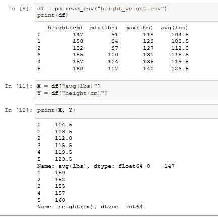

第一步完成！我们的 python 变量中有我们的数据，我们可以随心所欲地使用它们。现在，我们希望一起将这些数据发送到我们的线性回归模型中。但是等等！我们的代码中还没有模型。我们将创建它，然后将我的数据输入到模型中。

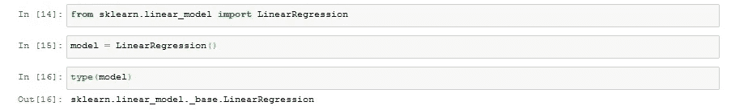

再次感谢 python 社区对这么多库的支持

现在我们有了数据和模型…让我们来训练它吧！！

现在有一些数据类型转换，我们在执行训练模型的任务时会记住这些转换。所以我一步一步来解释。

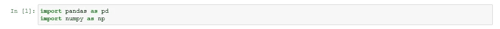

1

第一步总是导入所需的模块。这里我们已经导入了熊猫和 numpy 模块。Pandas 将帮助我们阅读数据手册，numpy 将帮助我们执行阵列操作。

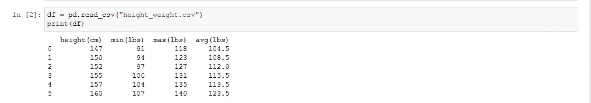

2

第二步是读取 csv 文件或数据表，并将值存储在名为 dataframe 的 python 变量中。

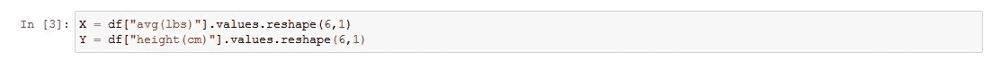

3

第三；从数据帧中提取数据列；从中提取值(这些值的数据类型为 numpy ndarrays)。然后，我们正在重塑这个 numpy 数组，并将其转换为 6 行 1 列的 2D 数组。

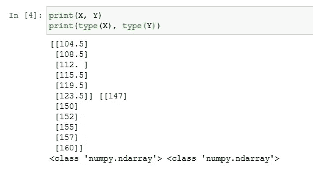

4

我们的数据现在看起来像这样。

接下来的几个步骤涉及到线性回归模型的创建。

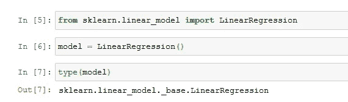

现在到了最期待的时刻 ***如何训练一个模特。***

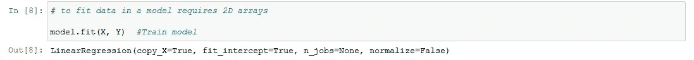

模特培训

值得庆幸的是，训练的大部分魔法都是由 sklearn 模块本身完成的。

现在是时候根据我们教给我们的模型做一些预测了。

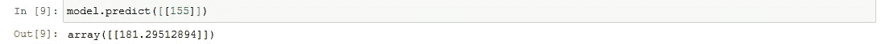

预言；预测；预告

请记住，根据 [SciKit 学习文档](https://scikit-learn.org/stable/modules/generated/sklearn.linear_model.LinearRegression.html#sklearn.linear_model.LinearRegression.fit)，我们需要一个 2D 阵列来进行训练和预测。

这是机器如何从一些数据中学习的基本概述。

训练机器并不总是像上面例子中那样简单；在训练真实生活模型之前，我们需要做很多事情，比如数据清理(删除不需要的数据)、数据可视化(在图形上绘制数据)等。因为这是第一篇关于 ML 的文章，所以我尽量让它简单。在接下来的几个故事中，我们将涵盖更多的 ML 算法以及更多的概念。

继续学习！接下来还有很多。