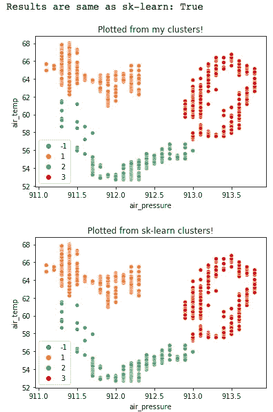

# 从头开始扫描数据库(几乎)

> 原文：<https://medium.com/analytics-vidhya/dbscan-from-scratch-almost-b02096600c14?source=collection_archive---------5----------------------->

[Scikit-Learn —聚类比较](https://scikit-learn.org/0.15/auto_examples/cluster/plot_cluster_comparison.html) s

## 什么？为什么？怎么会？

# 第一部分:什么？

DBSCAN(含噪声应用的基于密度的空间聚类)是一种数据聚类算法，最初由 [Ester 等人](https://www.aaai.org/Papers/KDD/1996/KDD96-037.pdf)于 1996 年提出。

## 定义

*   ε(ε):以给定点为中心的邻域的半径
*   核心点:如果一个给定点在其ε邻域内至少有*个 minPts* 个点，包括其自身，则该点被认为是核心点
*   边界点:如果一个给定点的ε邻域(包括其自身)内的最小点少于*个，则该点被视为钻孔点*
*   噪声:不是核心点或边界点的任何点
*   直接密度可达:一个给定点是从另一个点直接密度可达的(ε可达的),如果第二个点是一个核心点，并且第一个点位于第二个点的ε邻域内
*   密度可达:一个给定的点是从另一个点密度可达的，如果有一个点链，直接密度可达的彼此，连接他们
*   密度连通:一个给定点与另一个点是密度连通的，如果有第三个点，两个点都是密度可达的——这些点被称为连通分量

## 方法

给定一组点 *P* ，邻域半径ε，以及最小点数 *minPts:*

1.  找出每个点的ε邻域内的所有点；
2.  识别具有至少*个最小点*个邻居的核心点；
3.  找到每个核心点的所有连通分量-这种密度连通的点分组是一个聚类
4.  如果聚类是密度可达的，则将每个边界点分配给该聚类，否则边界点被认为是噪声

任何给定的点最初可能被认为是噪声，随后被修正为属于一个聚类，但是一旦被分配给一个聚类，该点将永远不会被分配。

# 第二部分:为什么？

Martin 等人给出了使用 DBSCAN 的以下理由:

*   "*领域知识的最低要求*"
*   *“任意形状团簇的发现”*
*   *“大型数据库的良好效率”*

对此进行扩展:

*   DBSCAN 在执行过程中发现集群；期望的集群数量不是任意指定和应用的
*   DBSCAN 考虑噪声
*   DBSCAN 受益于使用可以加速区域查询的数据库

这些使得 DBSCAN 成为最常用的聚类算法之一，也是科学文献中最常引用的算法之一。

# 第三部分:怎么做？

在这一节中，我将简要概述 DBSCAN 在 Python 中的简单实现，并将我的结果与来自 [scikit-learn](https://scikit-learn.org/stable/modules/generated/sklearn.cluster.DBSCAN.html) 的结果进行并排比较。

第一，进口！我使用 [scipy.spatial.distance](https://docs.scipy.org/doc/scipy/reference/spatial.distance.html) 子模块处理距离计算，使用 [Pandas](https://pandas.pydata.org/) 处理我的数据集，使用 [Seaborn](https://seaborn.pydata.org/) 和 [MatPlotLib](https://matplotlib.org/) 进行可视化。我还抓取了用于预处理的[标准缩放器](https://scikit-learn.org/stable/modules/generated/sklearn.preprocessing.StandardScaler.html)、用于可视化的 [t 分布随机邻居嵌入](https://scikit-learn.org/stable/modules/generated/sklearn.manifold.TSNE.html)以及用于比较的 [DBSCAN](https://scikit-learn.org/stable/modules/generated/sklearn.cluster.DBSCAN.html) ，这些都来自 scikit-learn。

现在，代码。首先，我们有这个算法的驱动程序:

在其中，我们有几个函数可以进一步探索。首先，为每个点生成邻域图的函数:

这是上面第一步发生的地方；我们正在寻找给定点的ε邻域内的每个点。驾驶员然后使用该信息来确定该点是否被认为是噪声；如果没有，那么我们继续下一个功能:

在这里，我们从原点向外扩展，找到它的邻居，然后是它的邻居的邻居，等等。，直到我们到达邻居的边界；我们用完核心点的边界，边界点让位于噪音。

重复该过程，直到没有被分配给聚类或作为噪声的每个点都被标记。最后，我们可以将所有这些封装在一个类中，并开始测试它！

对于这个例子，我使用了来自 Kaggle 的数据集[的子集。
它包含加利福尼亚州圣地亚哥的一个气象站三年来报告的分钟级天气数据。我将用以下任意参数实例化该类:ε = 0.3， *minPts* = 30，以及默认的欧几里德距离度量。我还加入了一个简短的函数来帮助我们比较结果。](https://www.kaggle.com/julianjose/minute-weather)

## 结果！

对于第一个测试，我们只对数据集的两个要素运行 DBSCAN 气温和气压。缩放数据后，我们调用。fit_predict()，并对 scikit-learn 实现进行同样的操作(注意:我选择从 1 开始标记集群，其中 sk-learn 从 0 开始—为了比较，我将它们的集群标签增加了 1)。最后，我们绘制两组聚类图，从视觉上确认我们得到了相同的结果。

成功！相同的集群！

为了进一步探索 DBSCAN 的功能，让我们再次尝试，但是使用数据集中的全部功能！我将稍微调整ε和 *minPts* 。

看起来不错！

我们的结果再次与 sk-learn 一致。研究表明，随着数据维度的增加，DBSCAN 可以继续有效，尽管在极高的维度上，为了更好地应对不稳定性和低效率，已经提出了[对](https://link.springer.com/chapter/10.1007/978-3-319-31750-2_20) [DBSCAN](https://arxiv.org/abs/1801.06965) 的[变更](https://ieeexplore.ieee.org/document/7823505)。

让我们进一步探讨这个问题；仅查看 9 个特征数据集的两个维度可能无法让我们更好地了解这些特征的聚类情况。毕竟，这个形象肯定是比以前更乱一点。为此，我们将应用 [t-SNE](https://scikit-learn.org/stable/modules/generated/sklearn.manifold.TSNE.html) 的 sk-learn 实现来将我们的维度减少到 2，以便于可视化。

[ensū？](https://en.wikipedia.org/wiki/Ens%C5%8D)

漂亮！在这里我们可以看到，即使跨越 9 个维度，事物也是整齐地聚集在一起的。DBSCAN 已经在科学和企业界广泛应用于模式挖掘、模式识别和推荐系统。

如果你想进一步探索我的作品，这里有一个笔记本[(GitHub)](https://github.com/austiezr/DBSCAN/blob/master/Basic_DBSCAN.ipynb)，这里有[(Google Colab)](https://colab.research.google.com/drive/1Ax4zrbdT0JDxH2uG0RwLJn3p5YCmN55L?usp=sharing)。