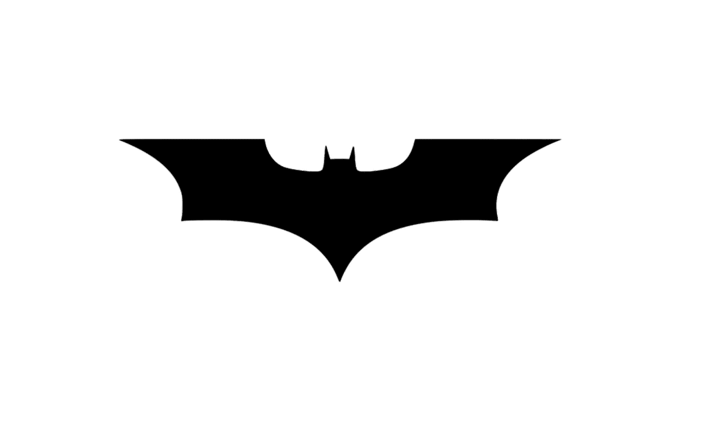
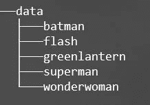
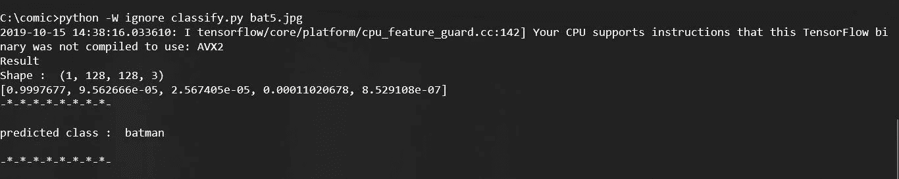

# DC 漫画标志分类器

> 原文：<https://medium.com/analytics-vidhya/dc-comics-logo-classifier-f8a42c144c25?source=collection_archive---------11----------------------->

## 使用 TensorFlow 2.0 从头开始训练图像分类器

我们将训练 CNN 对某个特定角色的标志进行分类。在这个例子中，我选择了五个不同的角色，分别是蝙蝠侠、超人、绿灯侠、神奇女侠和闪电侠。这将是一篇首尾相连的文章。它包括从收集数据到保存训练模型的所有步骤。



因此，在给出这个图像作为输入后，我们预测的类将是“蝙蝠侠”

先决条件

1.  Python 知识
2.  谷歌帐户:因为我们将使用谷歌 Colab

所以是时候把手弄脏了！

首先，我们将使用 [GoogleImagesDownload](https://github.com/hardikvasa/google-images-download) 收集数据，这是一个非常方便的 python 包，可以从 google search 下载图像。现在我们将为每个职业下载图片(这里我们有五个职业，分别是蝙蝠侠、超人、绿灯侠、神奇女侠和闪电侠)。请参考关于使用上面给定链接中提到的工具的文档。

如果你找不到的话，这里有一个 [ChromeDriver](https://chromedriver.chromium.org/downloads) 的链接。

> googleimagesdownload —关键词“蝙蝠侠标志”— chromedriver chromedrvier —限制 300

我在命令提示符下运行上述语句，通过更改搜索关键字来获取每个类的图像。现在我用。jpg 扩展名，因为它也下载其他扩展名的文件。我不得不手动删除一些无关的图片。然后我给这些图片重新命名。我每节课都这样做。仅用于重命名和选择。jpg 文件我已经在 Github 库中提供了脚本。您只需要在执行路径之前处理好它们。

最后，我创建了一个名为 data 的文件夹，其中包含每个类的图像。目录的层次结构如下图所示。



目录的层次结构

现在把这个文件夹上传到你的 google drive。将这个文件夹上传到 Google Drive 后，我们将从这个[链接](https://colab.research.google.com)创建一个新的 colab 笔记本。谷歌实验室给了我们 jupyter 环境。可以参考 Github 库中的 jupyter 笔记本。现在我们将从预处理开始，然后定义模型来训练它。

```
!pip install tensorflow==2.0
```

所以在第一个单元，我们安装了 TensorFlow 2.0。现在我们将导入我们需要的所有包。

```
**import** **cv2**
**import** **os**
**import** **numpy** **as** **np**
**import** **tensorflow** **as** **tf**
**import** **matplotlib.pyplot** **as** **plt**
**from** **sklearn.utils** **import** shuffle
**from** **tensorflow.keras** **import** layers, models
**from** **google.colab** **import** drive
drive.mount('/content/drive')
```

我们使用 *cv2* 处理图像，使用 *os* 处理路径。 *numpy* 用于 numpy 数组。 *TensorFlow* 将用于定义和训练模型。在这里，我使用了来自 *sklearn.utils* 的 shuffle 来在执行训练测试分割时对图像数据进行混洗。最后，来自 google.colab 的 drive 将用于在 colab 笔记本上安装 google drive。

上面单元格的最后一行执行后，会提供一个提供验证令牌的链接。一旦给定令牌，google drive 将被安装在 colab 笔记本上。我定义了两个函数 *loadTrain()* 和 *readData()，loadTrain()* 将帮助预处理图像。图像的预处理包括调整大小、归一化和给相应的图像分配标签。

```
validationSize = 0.2
imageSize = 128
numChannels = 3
dataPath = "/content/drive/My Drive/comic/data"
classes = os.listdir(dataPath)
numClasses = len(classes)
print("Number of classes are : ", classes)
print("Training data Path : ",dataPath)
```

注意:注意数据文件夹的路径。我把它放在漫画下面。

这里 *validationSize* 的给定值为 0.2，所以 80%是我们的训练数据，20%是测试数据。 *imageSize* 将指定将输入模型的图像的尺寸。 *numChannels* 被赋予值 3，因为我们的图像将被读入 RGB 通道。

```
data = readData(dataPath,classes,imageSize,validationSize)

X_train,y_train,names_train,cls_train = data.train.getData()
X_test,y_test,names_test,cls_test = data.valid.getData()

print("Training data X : " , X_train.shape)
print("Training data y : " , y_train.shape)
print("Testing data X : ",X_test.shape)
print("Testing data y : ",y_test.shape)
```

现在我们已经准备好了训练和测试数据。是时候定义我们的模型并训练它了。

```
model = models.Sequential()
model.add(layers.Conv2D(32, (3, 3), activation='relu', input_shape=(128, 128, 3)))
model.add(layers.MaxPooling2D((2, 2)))
model.add(layers.Conv2D(64, (3, 3), activation='relu'))
model.add(layers.MaxPooling2D((2, 2)))
model.add(layers.Conv2D(64, (3, 3), activation='relu'))
model.add(layers.Flatten())
model.add(layers.Dense(64, activation='relu'))
model.add(layers.Dense(5, activation='softmax'))
```

有一个 Conv 层，然后是最大池层。当我们将图像调整到 128*128 分辨率时，这里的输入形状是 128*128*3，3 是通道数。然后，我们再次有一个 Conv 层，其次是最大池。然后又是 Conv 层，现在张量在下一层变平。我们现在有一个密集层连接到我们的输出层。这里，输出层由 5 个单元组成，因为我们有 5 个分类类别。

```
model.summary()
```

我们得到了我们定义的模型的概要。现在该训练了。

```
history = model.fit(X_train,y_train, epochs=4, 
                    validation_data=(X_test,y_test))
```

我还提到了图表和准确性指标。你可以在我的笔记本上查一下。

```
model.save("comic.h5")
```

我们将模型保存在. h5 文件中，但这是 colab 的本地文件，所以我们将它保存在 google drive 中。

```
!pip install -U -q PyDrive
**from** **pydrive.auth** **import** GoogleAuth
**from** **pydrive.drive** **import** GoogleDrive 
**from** **google.colab** **import** auth 
**from** **oauth2client.client** **import** GoogleCredentials

auth.authenticate_user()
gauth = GoogleAuth()
gauth.credentials = GoogleCredentials.get_application_default()          
drive = GoogleDrive(gauth)
model_file = drive.CreateFile({'title' : 'comic.h5'})                       
model_file.SetContentFile('comic.h5')                       
model_file.Upload()
drive.CreateFile({'id': model_file.get('id')})
```

所以现在我们训练好的模型会保存到 google drive。它可以很容易地从 google drive 下载。

现在，为了进行分类，我编写了一个名为 classify.py 的脚本。在这里，我们将把图像的路径作为 CLI 参数传递。我们的输出将是预测类。我们实际上得到每一类的概率，我们将选择一个最大的。有时模型会做出错误的分类。正在努力提高准确率，现在准确率是 80%。



这里预测了上面标志的阶级是**蝙蝠侠**。

这里有一个[链接](https://github.com/aniruddha414/DC-comics-logo-classifier)到我的 Github repo。

此外，我将尝试写下我在云平台上将它部署为 API 的经历。您还可以通过将 model 转换为 lite 版本并将其保存到来将其部署在移动设备中。tflite 文件，有关详细信息，请参考 TensorFlow Lite 文档。请随时在 LinkedIn、Github 和 Instagram 上与我联系。让我知道任何即兴创作。

**谢谢！**