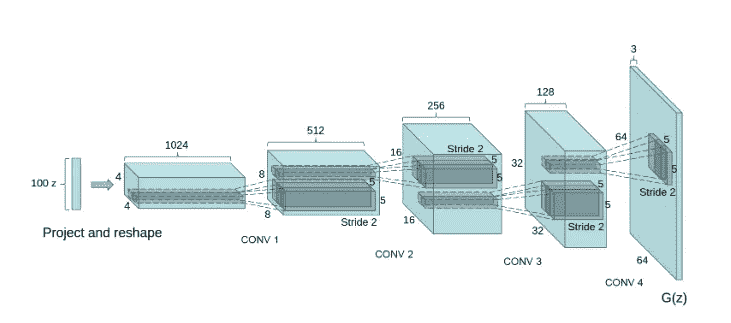
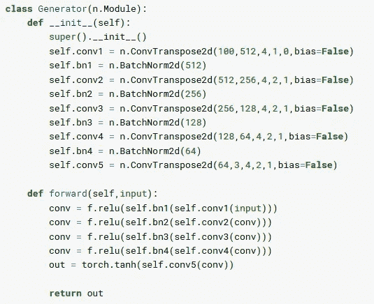
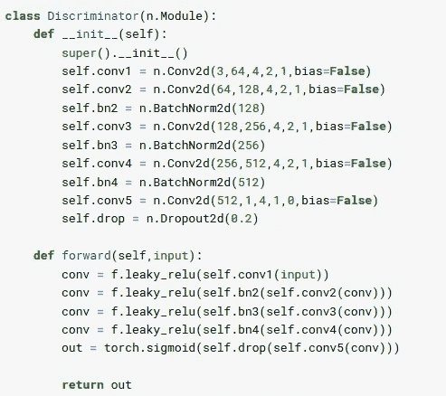
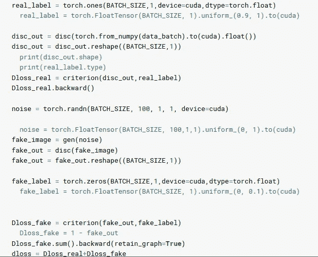
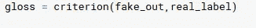

# 深度卷积 GANs

> 原文：<https://medium.com/analytics-vidhya/dcgan-447a629170ec?source=collection_archive---------17----------------------->

本文讨论深度卷积生成对抗网络及其 pytorch 实现[使用深度卷积生成对抗网络](https://arxiv.org/pdf/1511.06434.pdf)进行无监督表示学习，以使用噪声生成假图像。本文是理解甘思想和工作的一篇好文章。

## **总结**

1.  鉴别器在真实图像上被训练，并且被馈送这些是真实图像。
2.  随机噪声被传递到生成器以生成一些图像，然后这些图像被传递到鉴别器，并被告知这些是假图像。
3.  上述各点是鉴别器的工作，从而训练鉴别器。
4.  同时，生成器认为它生成的图像是真实图像，并以此训练生成器。
5.  这样，发生器和鉴别器之间的冲突，它被称为极大极小博弈。

## **网络架构**

发电机

[来源](https://arxiv.org/pdf/1511.06434.pdf)

在该网络中，1 X 1 X 100(100 个通道)的随机噪声作为输入馈入网络。然后，该输入通过 CT-BN-R(conv transpose-batch normalization-Relu)的四个模块，每个模块中的参数明显不同。在最后一个模块中，使用转置卷积，然后激活 tanh。

发电机网络

这是上面提到的生成器架构的 pytorch 实现。转置卷积用于对每个块中的图像进行上采样。这是一个简单的生成器架构，易于实现。1 X 1 X 100 的随机噪声被上采样以产生 64 X 64 X 3 的图像。

**鉴别器**

鉴别器网络

这是参考文献中给出的鉴别器的 pytorch 实现。在第一个块中，图像仅通过卷积和泄漏 relu，然后通过 only 巴奇诺姆-泄漏 relu 的 3 个块。在最后一个块中，它通过卷积和 sigmoid。还增加了下降，以便鉴别器不会支配发生器

# 损失函数

## **对抗性损失(歧视性损失)**

对抗性损失

真实图像被传入鉴别器，其输出被认为是盘输出，然后计算真实标签和盘输出之间的交叉熵。之后，噪声被送入发生器，生成的图像被进一步送入鉴别器，鉴别器的输出被称为伪输出。然后计算伪标签和伪标签之间的交叉熵。这两种损失统称为对抗性损失。

## **发电机损耗**

在这种损失中，生成的图像被认为是真实图像，这就是为什么要计算假冒标签和真实标签之间的交叉熵。这样，在对抗性损失中被认为是假的，现在在生成性损失中被认为是真实的。这就是原因，它通常被称为极大极小博弈或零和博弈。

为了优化，Adam optimizer 以 0.0002 的学习率使用。

关于代码，请访问下面实现部分提到的 github 页面。

# 参考

[DCGAN 纸](https://arxiv.org/pdf/1511.06434.pdf)

# 履行

[Github](https://github.com/vishal1905/DCGAN)