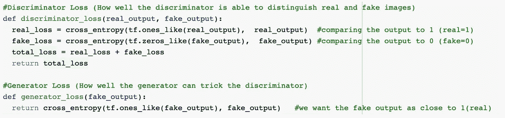
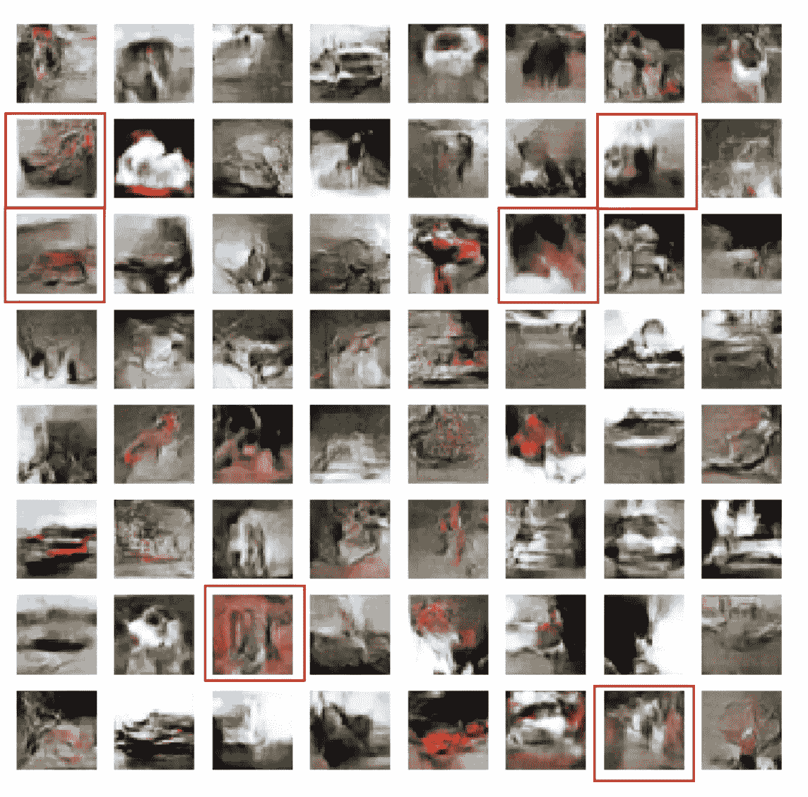

# DCGAN、CGAN 和 SAGAN & CIFAR-10 数据集

> 原文：<https://medium.com/analytics-vidhya/dcgan-cgan-and-sagan-the-cifar-10-dataset-206cbb851327?source=collection_archive---------7----------------------->

来自 CIFAR-10 数据集的图像。图片来源:[http://cs231n.github.io/classification/](http://cs231n.github.io/classification/)

在我的[上一篇博客](/@shrutibendale/intro-to-generative-adversarial-networks-ca1b14e524f4)中，我谈到了生成性对抗网络。今天，我将谈论深度卷积 gan、条件 gan 和自我关注 gan，以及我如何在 [CIFAR-10 数据集](https://www.cs.toronto.edu/~kriz/cifar.html)上实现这些模型。

## 深度卷积生成对抗网络；

DCGAN 引入了一系列架构指南，目标是稳定 GAN 训练。它提倡使用交错卷积，而不是合用层。此外，它对生成器和鉴别器网络都使用批量归一化(BN)。最后，它在发生器中使用 ReLU 和 Tanh 激活，在鉴别器中使用泄漏 ReLU。

DCGAN 架构。[来源](https://arxiv.org/pdf/1511.06434.pdf)

在 DCGANs 中，**发生器**由一系列转置卷积运算组成。这些操作接受随机噪声向量 z，并通过逐渐增加其空间维度同时减少其特征体积深度来对其进行变换。**鉴别器**基本上是一个卷积神经网络。它的任务是对图像进行真伪分类。我们将生成器生成的图像与真实图像一起提供给鉴别器，鉴别器将图像分类为真实或伪造。我们计算鉴频器和发生器的损耗，并反向传播损耗，以改善发生器和鉴频器的性能。

**型号:**

发生器使用 Conv2DTranspose(上采样)层从种子(随机噪声)生成图像。我们使用一个密集层，将这个种子作为输入，然后向上采样几次，直到我们达到所需的 32x32x3 的图像大小。我们对每一层使用 LeakyReLU 激活，对最后一层使用 tanh 激活函数。

鉴别器是基于 CNN 的图像分类器。我们使用鉴别器对生成的图像进行真假分类。该模型将被训练为对真实图像输出正值，对虚假图像输出负值。

我们用于实现 DCGAN 的生成器和鉴别器架构如下:

发电机网络(左)和鉴别器网络(右)

我们使用**二元交叉熵损失函数**来计算发生器和鉴别器的损失。
**亚当优化器**用于生成器和鉴别器。我们使用 SA-GANs 论文中实现的双时标学习率更新规则( **TTUR** )，将生成器的学习率设置为 0.0001，将鉴别器的学习率设置为 0.0004。

**训练:**

我们将来自 CIFAR-10 数据集的训练图像以 64 个为一批传递给训练循环中的生成器。生成器生成的图像与真实图像一起被传递到鉴别器。

鉴频器和发电机损耗使用以下代码片段计算:

我对模型进行了大约 3200 个时期的训练，并记录了每个时期的发电机损耗和鉴频器损耗。我们还计算每 10 个时期的 FID 分数。3200 个时期的损失图和 FID 分数图可在下图中看到。

3200 个时期的模型损失图(左)；3200 个时期内模型的 FID 分数图

**结果:**

DCGAN 在 3190 年的**时段生成的图像如下，我们在该时段获得了最好的 FID 分数 **69.09** :**

DCGAN 生成的图像

**模式崩溃:**

观察到 DCGAN 产生许多相似的图像。这可以在下图中清楚地观察到。由于模式折叠，高亮显示的图像看起来非常相似:

DCGAN 中的模式崩溃

## 自我关注生成对抗网络；

生成对抗网络的自我注意是对生成对抗网络的一种改进。自关注 gan 具有允许生成器模拟远程依赖性的架构。主要思想是使生成器能够产生具有全局细节信息的样本。

**架构:**

自我注意生成对抗网络。[来源](https://arxiv.org/pdf/1805.08318.pdf)

我们在生成器和鉴别器中的卷积层之后添加了注意层。前一卷积层的输出输出维度(高度 x 宽度 x 通道)的卷积特征图。

给定卷积层 L 的输入特征，第一步是将 L 变换成 3 种不同的表示。我们使用 1x1 卷积来卷积 L，以获得三个特征空间:f、g 和 h。特征向量 f 和 g 与 h 具有不同的维数。f 和 g 使用的卷积滤波器比 h 少 8 倍。这里我们用 f 和 g 来计算关注度。为此，我们使用矩阵乘法线性组合 f 和 g，并将结果送入 softmax 层。从这个操作中得到的张量就是‘注意力地图’。

**为什么要用注意力？**

传统的深度卷积 gan 无法捕捉图像中的长程相关性。这些传统的 GANs 适用于不包含大量结构和几何信息的图像。它们未能忠实地代表全球关系。这些非本地依赖关系始终出现在某些类别的图像中。例如，GANs 可以用逼真的毛皮绘制动物图像，但往往无法绘制单独的脚。

在 SAGAN 中，自我注意模块与卷积网络结合使用，并使用键值查询模型(Vaswani 等人，2017)。该模块采用由卷积神经网络创建的特征图，并将其转换成三个特征空间。这些特征空间被称为键 f(x)、值 h(x)和查询 g(x)，它们是通过将原始特征映射通过三个不同的 1x1 卷积映射来创建的。然后将关键字 f(x)和查询 g(x)矩阵相乘。接下来，对乘法结果的每一行应用 softmax 运算。从 softmax 生成的注意力地图识别网络应该关注图像的哪些区域。

**型号:**

SAGAN 架构类似于 DCGAN 架构，但在发生器的“conv2d_transpose_4”层和鉴频器的“conv2d_11”层之后添加了一个自定义“注意层”。

我尝试使用**铰链损耗**函数和**二元交叉熵损耗**函数来计算 SA-GAN 论文中指定的发生器和鉴别器的损耗。

我还对生成器和鉴别器使用了 **RMSprop 优化器**和 **Adam 优化器**。

**我发现，当使用 BCE 损失和 Adam 优化器的组合时，我的模型给出了最佳输出和更好的 FID 分数。**我们还使用 SA-GANs 论文中实现的双时标学习率更新规则( **TTUR** )，将生成器的学习率设置为 0.0001，将鉴别器的学习率设置为 0.0004。

**培训:**

在对 SAGAN 模型进行 200 个时期的训练后，我们获得了以下损失和 FID 分数的图表。

200 个时期内模型的损失图(左)；200 个时期内模型的 FID 分数图

**结果:**

SAGAN 在 **epoch 198** 生成的图像如下，我们在那里获得了最好的 FID 分数 **84.83** :

萨根产生的图像

## 条件生成对抗网络；

在 GAN 中，创造始于白噪声。然而，在现实世界中，需要的可能是一种转化形式，而不是创造。例如，黑白图像的彩色化，或者天线到地图的转换。对于这样的应用，**我们以额外的输入为条件**:因此命名为条件对抗网络。

这意味着向生成器传递的不是(或不仅仅是)白噪声，而是某种输入结构的数据，如边缘或形状。然后，它必须生成具有这些形状的真实物体的逼真图片。鉴别器也可以接收形状或边缘作为输入，此外还有辨别真假物体的任务。

由于 cGAN 基于条件层来调节输出数据分布，因此在 GAN 的目标函数中，log(1-D(G(z))和 D(x)将被 log(1-D(G(z | y))和 D(x|y)代替。其余的将由各自的网络负责，即创建潜在的表示和管理权重。这里的主要目标保持不变，只有少许修改:

## 条件自我注意生成对抗网络；

我们修改我们的萨根模型，以包括额外的投入，y，该模型可以条件。CIFAR10 数据集包含与每个图像相关联的标签。我们将这个标签转换成一个独热编码表示，用它来调节与类相关的生成图像。

**型号:**

实现 DCGAN 的发生器和鉴别器架构如下:

**训练:**

我们将随机标签和噪声向量一起传递给生成器。生成器连接这两个输入并生成图像。在训练鉴别器时，我们将生成的带有随机标签的图像传递给生成器，以生成“假输出”。我们还利用真实图像的真实标签来训练鉴别器，以生成“真实输出”。我们计算损耗，并将损耗反向传播到发生器和鉴别器。

**结果:**

cSAGAN 在获得最佳 FID 分数 **92.28** 的**历元 96** 生成的图像如下:

cSAGAN 生成的图像

## **总之……**

下表总结了所有模型的输出和使用的指标:

## 其他实验:

我尝试用 WGAN 实现光谱归一化机制，但生成器生成的图像并没有随着时间的推移而改善，FID 分数也没有降低。

我还试图用 SAGAN 实现 Wasserstein 损失，但发电机损失非常低(在负面影响中),模型似乎没有随着时间的推移而学习。每次迭代完成训练也花费了大量时间。